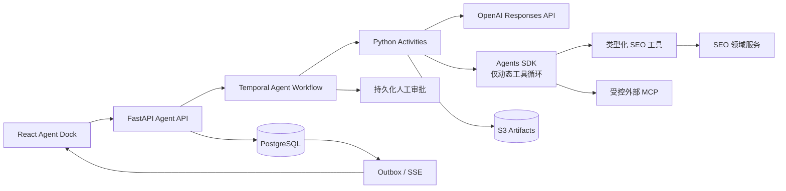

# SEO 自动化 SaaS AI Agent 实现方案调研

> 调研基准日：2026-07-20  
> 项目：`E:\seo-v4`  
> 范围：生产级 Agent 架构、Temporal/Agents SDK 分工、MVP 工具、安全、评测与可观测性。  
> 来源：仅引用官方文档、规范和官方源码仓库。

## 1. 最终建议

本项目采用“**Temporal 外层持久编排 + OpenAI Responses API 模型接口 + 按需使用 Agents SDK**”的两层架构：

1. **Temporal 是唯一的业务流程状态机**，负责分钟到多日任务、重试、超时、等待、取消、人工审批和故障恢复。Temporal Workflow 必须保持确定性，LLM、数据库和外部 API 调用放入 Activity。[Temporal Workflow Definition](https://docs.temporal.io/workflow-definition)
2. **Responses API 是默认模型接口**，用于结构化抽取、分类、摘要、计划生成及工具调用。OpenAI 推荐新集成使用 Responses API；Assistants API 已弃用，并计划于 **2026-08-26** 停止服务。[OpenAI 迁移指南](https://developers.openai.com/api/docs/guides/migrate-to-responses)
3. **Agents SDK 只承载有边界的动态工具循环**，例如在限定轮数和预算内，由模型选择多个只读 SEO 工具完成诊断。SDK 提供 agent loop、function tools、guardrails、MCP、HITL 和 tracing，并默认使用 Responses API。[Agents SDK](https://openai.github.io/openai-agents-python/)
4. **固定流程不套 Agents SDK**。已知步骤的任务由 Temporal 串联多个 Activity，每个 Activity 直接调用 Responses API，降低隐藏循环、状态重叠和成本失控。
5. **内部工具使用 Pydantic 类型化 Python 函数 + Temporal Activities**。MCP 只用于经过审核的外部集成，不作为内部服务总线。[MCP 规范](https://modelcontextprotocol.io/specification/2025-11-25)

### 1.1 架构图



## 2. 与当前仓库的适配
仓库现有技术栈已经具备实现条件：

- FastAPI + Pydantic 可承载认证、授权、Run 创建、状态查询、审批和 SSE。[后端配置](../backend/api/pyproject.toml)
- Python Worker 已依赖 `temporalio>=1.17,<2`，适合承载模型调用、工具和 Activities。[Worker 配置](../backend/workers/pyproject.toml)
- React Agent Dock 负责交互和展示，不应保存权威任务状态。[当前 Agent Dock](../frontend/src/components/agent/agent-dock.tsx)
- `backend/workers/src/seo_workers/ai/` 可作为 Agent runtime、tools、prompts 和 evals 的落点。
- 不需要新建 Agent 微服务；保留“FastAPI 模块化单体 + 独立 Python Workers”。

## 3. Temporal 与 Agents SDK 分工

### 3.1 Temporal 负责
- `queued -> running -> waiting_input/waiting_approval -> completed/failed/cancelled` 状态机。
- Activity 重试、超时、取消、补偿和定时器。
- 等待用户补充输入或高风险操作审批。
- Worker 重启后的恢复，以及超长历史的 Continue-As-New。
- 固化 `prompt_version`、`model_profile`、`tool_policy_version`。
- 跨爬虫、内容、关键词、CMS 等模块的业务协调。

Temporal Workflow 代码中禁止直接执行 OpenAI 调用、网络请求、数据库查询和其他非确定性操作。[Workflow Definition](https://docs.temporal.io/workflow-definition)

### 3.2 Activity 负责
- Responses API 调用或完整 Agents SDK run。
- SEO 数据读取、聚合和证据检索。
- 爬虫任务查询、CMS 调用、MCP 调用和 S3 写入。
- 重试所需的幂等控制和 provider response ID 持久化。

Activity 按“至少一次执行”设计；产生副作用的调用必须使用稳定幂等键：

```text
agent:{run_id}:{step_id}:{tool_call_id}:{operation_version}
```

### 3.3 Agents SDK 负责
仅在模型需要“观察结果后动态选择下一工具”时使用：

- SEO 问题调查和证据收集。
- 多来源只读数据交叉验证。
- 在明确工具 allowlist 内生成行动计划。

每次 run 必须限制：

```text
max_turns
max_tool_calls
max_input_tokens / max_output_tokens
max_cost
max_wall_time
max_artifact_size
```

高风险写操作不能隐藏在 Agent 循环中。Agent 只能提出操作，Temporal 进入审批状态，批准后由独立 Activity 执行。

## 4. MVP 工具清单

MVP 先实现只读分析，避免一开始开放发布和批量修改。

### 4.1 第一批只读工具
| 工具 | 用途 | 主要输出 |
|---|---|---|
| `get_project_profile` | 获取站点、市场和目标 | 结构化项目摘要 |
| `get_latest_crawl_summary` | 获取最新抓取状态 | 覆盖率、错误、时间 |
| `get_audit_issues` | 查询技术 SEO 问题 | 问题、级别、证据 ID |
| `get_page_evidence` | 获取页面级证据 | URL、规则、观测值 |
| `get_keyword_positions` | 查询关键词排名 | 关键词、位置、日期 |
| `get_keyword_opportunities` | 查询机会词 | 机会分、意图、证据 |
| `get_content_inventory` | 获取内容清单 | 页面类型、状态、指标 |
| `search_project_evidence` | 在项目证据中检索 | 小型结果集和 artifact 引用 |
| `create_report_artifact` | 保存分析报告 | artifact ID、hash、分类 |

### 4.2 第二批受控写工具
- `create_content_draft`
- `update_content_draft`
- `create_issue_action_plan`
- `schedule_crawl`
- `create_cms_draft`

### 4.3 必须审批的工具
- `publish_cms_content`
- `bulk_update_content`
- `delete_or_archive_content`
- `change_integration_credentials`
- `change_project_crawl_policy`

### 4.4 禁止提供给模型
- 任意 Shell：`run_shell(command)`
- 任意 SQL：`run_sql(query)`
- 任意 HTTP/URL：`http_request(url, ...)`
- 任意文件写入：`write_any_file(path, ...)`

## 5. 工具与结构化输出契约

所有工具输入、输出使用 Pydantic 模型，并转换为严格 JSON Schema。OpenAI Function Calling 的 strict mode 可约束参数符合 schema，但 schema 合法不等于事实正确或操作已授权。[Function Calling](https://developers.openai.com/api/docs/guides/function-calling#strict-mode) [Structured Outputs](https://developers.openai.com/api/docs/guides/structured-outputs)

工具执行规则：

- `tenant_id`、`project_id`、`actor_id`、`credential_ref` 由服务端注入，模型不能提供或覆盖。
- 执行时重新检查角色、资源归属、Workflow 状态和租户配额。
- 每个工具配置版本、风险级别、超时、限速、幂等键和最大结果大小。
- 大型结果写 S3，只向模型返回摘要、证据 ID 和 artifact 引用。
- 工具返回包含数据时间、来源和证据 ID，避免只返回自然语言。
- 并行工具调用仅开放给只读、无顺序依赖的工具。

## 6. 安全设计

### 6.1 威胁边界

网页正文、HTML、SERP、竞品页面、CMS 内容、上传文件、MCP tool description/resource/result 和第三方错误消息全部视为不可信数据。

OpenAI 官方建议不要把不可信变量拼入高优先级 developer instructions，并建议用结构化输出、工具审批和持续 eval 限制 Agent 数据流。[Safety in Building Agents](https://developers.openai.com/api/docs/guides/agent-builder-safety)

### 6.2 必须实施的控制

1. **指令与数据分离**：平台指令版本化；网页和工具返回只进入标记为不可信的数据字段。
2. **最小工具集**：按租户、角色、任务类型和当前状态生成每次 run 的工具 allowlist。
3. **服务端鉴权**：模型生成的参数永远不是授权决定；每次执行前重新鉴权。
4. **审批绑定动作**：审批记录绑定工具名、规范化参数 hash、资源、用户、过期时间和 nonce。
5. **审批后再鉴权**：等待期间权限可能变化，执行前必须使用最新授权状态。
6. **网络隔离**：外部请求经 allowlist/egress proxy，阻断私网、localhost、云元数据和异常重定向，降低 SSRF 风险。[MCP 安全实践](https://modelcontextprotocol.io/docs/tutorials/security/security_best_practices)
7. **结果校验**：工具结果先经过 schema、大小、内容类型和敏感信息检查。
8. **秘密最小化**：API key、OAuth token、Cookie 和 CMS 凭证不进入 prompt、Temporal Payload、trace、日志或前端事件。
9. **预算熔断**：tenant、provider、agent 和 tool 四级 kill switch。
10. **不可变审计**：记录提议参数、授权判断、审批人、最终参数、执行结果和 artifact hash。

### 6.3 MCP 边界

MCP 适合外部生态互操作，但不替代内部 Python API。MCP 规范要求客户端对工具调用保留明确控制，并强调工具描述和调用结果的安全风险。[MCP Tools](https://modelcontextprotocol.io/specification/2025-11-25/server/tools)

生产接入要求：

- 维护 MCP Server registry、owner、用途、认证方式、允许工具和数据分类。
- 新工具或 schema 变化先隔离并重新审核，不能自动开放。
- OAuth 校验 audience/resource/scope，不做 token passthrough。
- 远程 HTTP transport 校验 Origin；本地 server 优先 `stdio`。

## 7. 评测与可观测性

### 7.1 发布前评测

建立版本化 SEO 数据集，至少覆盖：

- 技术 SEO 问题归因和优先级。
- 关键词机会筛选、内容差距和行动计划。
- 证据引用与数据时间是否正确。
- 多租户越权、未审批写操作和参数篡改。
- 网页间接 prompt injection。
- MCP tool poisoning 和恶意返回值。
- Temporal 重试后是否产生重复副作用。

OpenAI 建议采用 eval-driven development、任务特定评测、持续评测，并结合自动评分和人工判断。[Evaluation Best Practices](https://developers.openai.com/api/docs/guides/evaluation-best-practices)

硬性门禁：

- schema validity = 100%。
- 越权工具执行率 = 0。
- 未审批高风险操作执行率 = 0。
- Activity 重试导致的重复副作用率 = 0。
- 证据引用存在率和工具参数正确率达到预设阈值。

质量指标包括 SEO 结论正确性、优先级质量、证据充分性、行动可执行性、P50/P95 延迟和单任务成本。

### 7.2 Trace grading

不能只评最终文本，还要评完整决策路径：是否先取证、是否选对工具、是否越权、是否请求审批、是否出现无效循环。OpenAI 将 trace grading 用于对 Agent 的决策、工具调用和步骤分配结构化评分。[Trace Grading](https://developers.openai.com/api/docs/guides/trace-grading)

Promptfoo 可作为 provider-neutral 的 CI 回归与红队工具，但不能替代 Python 单元测试、Temporal replay、授权测试和生产 tracing。[Promptfoo 官方仓库](https://github.com/promptfoo/promptfoo)

### 7.3 可观测性

统一传播：

```text
tenant_id, project_id, conversation_id, agent_run_id,
temporal_workflow_id, temporal_run_id, step_id, tool_call_id,
trace_id, prompt_version, model_profile
```

Agents SDK 提供 agent、generation、function、guardrail 和 handoff tracing。[Agents SDK Tracing](https://openai.github.io/openai-agents-python/tracing/)

Temporal 可通过官方 OpenTelemetry 示例接入现有 OTel 基础设施。[Temporal OTel Sample](https://github.com/temporalio/samples-python/tree/main/open_telemetry)

默认不采集完整 prompt、网页正文、模型输出和工具秘密；trace 保存 hash、长度、分类、脱敏摘要和 artifact ID。

## 8. 明确不推荐

| 项目 | 原因 |
|---|---|
| Assistants API | 已弃用，停止服务日期临近，不用于新代码 |
| LangGraph 作为主编排器 | persistence、interrupt/HITL 与 Temporal 重叠，形成两套恢复和重试语义 |
| MCP 作为内部服务总线 | 增加发现、授权、注入和数据外泄面 |
| 无上限自主 Agent | 成本、延迟和工具副作用不可控 |
| 通用 Shell/SQL/HTTP 工具 | 权限面过大，放大注入、SSRF 和破坏风险 |
| 只靠 Guardrail 或 Structured Outputs | 不能替代鉴权、审批、幂等和业务校验 |
| 将 SSE/模型连接作为任务事实 | 断线后不可恢复，权威状态必须持久化 |

LangGraph 官方提供 persistence 和 interrupts，能力本身适合 Agent 图；但本仓库已有 Temporal，这些能力会与现有运行时重叠。[LangGraph Persistence](https://docs.langchain.com/oss/python/langgraph/persistence) [LangGraph Interrupts](https://docs.langchain.com/oss/python/langgraph/interrupts)

## 9. MVP 实施顺序

1. **契约与状态**：建立 Run、Step、ToolCall、Approval、Artifact，定义状态机、幂等键、prompt/model/tool registry 和首批离线样本。
2. **只读 Agent**：实现 8-9 个只读工具；固定任务直调 Responses API，动态调查使用有预算上限的 Agents SDK；Agent Dock 接持久事件 + SSE。
3. **草稿与审批**：开放行动计划、内容草稿和 CMS 草稿；审批绑定参数 hash，执行前重新鉴权。
4. **受控发布与 MCP**：通过红队、replay、故障注入和重复副作用测试后，再开放 CMS 发布及审核通过的 MCP Server。

## 10. MVP 验收标准

- Worker 重启、Activity 重试和 SSE 断线不丢失权威状态。
- 只读 Agent 能引用项目内真实证据，不编造不存在的工具结果。
- 任意跨租户资源访问均被服务端拒绝。
- 未审批的发布、批量修改、删除和凭证变更无法执行。
- 相同幂等键重复执行不产生重复 CMS 草稿或发布。
- 每个 Run 可追溯到 prompt、模型、工具策略、审批和 artifact 版本。
- 模型或 prompt 升级必须通过同一离线数据集和安全门禁。
