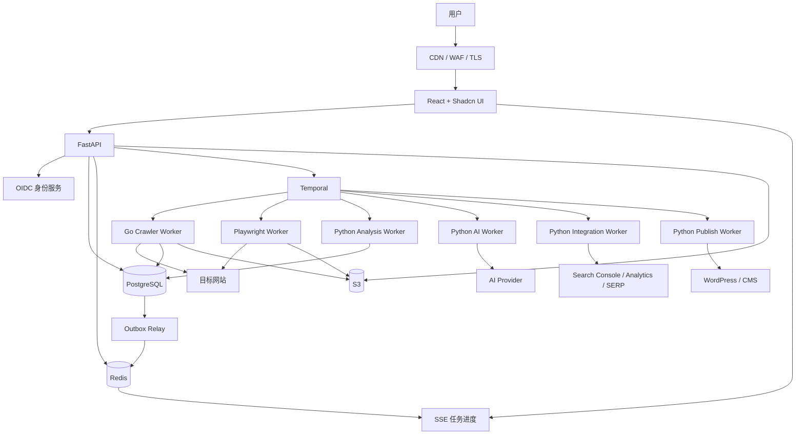
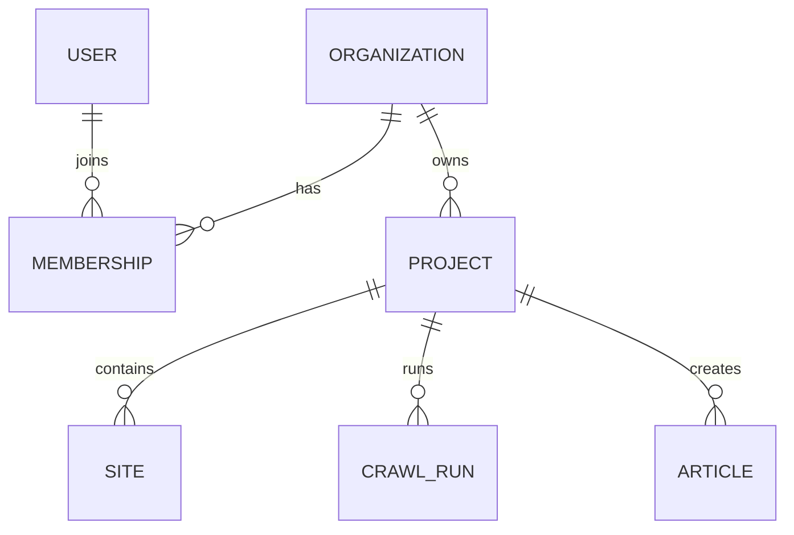
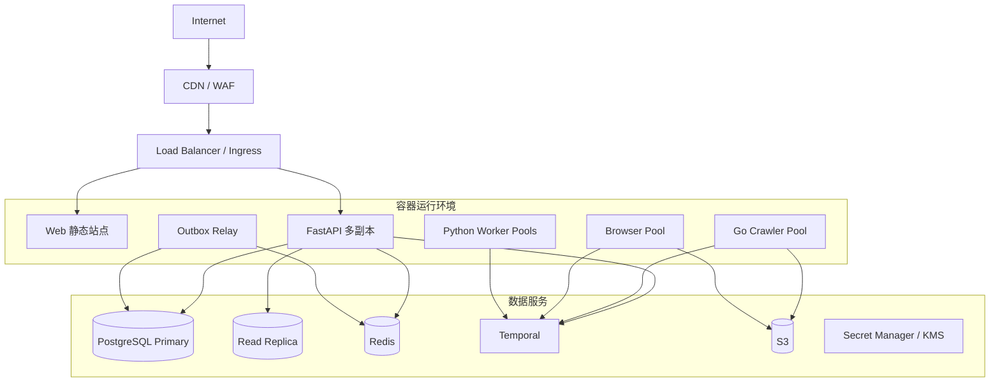

# SEO 自动化平台生产级技术架构文档

| 项目 | 内容 |
|---|---|
| 文档版本 | V1.0 |
| 文档日期 | 2026-07-20 |
| 系统形态 | 多租户 SaaS |
| 核心技术栈 | React、Shadcn UI、FastAPI、Go、PostgreSQL、Redis、Temporal、S3 |

## 1. 架构目标

系统需要支持：

- 多组织、多成员、多项目的数据隔离。
- 网站抓取、技术审查、内容生成和 CMS 发布等长任务。
- API、爬虫、浏览器和 AI Worker 独立扩缩容。
- Worker 重启后任务继续执行。
- 抓取、生成和发布操作可追踪、可重试、可审计。
- PostgreSQL 主库故障后的数据恢复。
- 大量项目同时运行时的配额、限速和背压。
- 面向全球用户，前端静态资源通过 CDN 分发，应用接口保持无状态。

初期采用“FastAPI 模块化单体 + 独立 Worker”，不拆分大量业务微服务。

## 2. 技术栈

| 层级 | 技术 |
|---|---|
| Web | React + TypeScript + Vite |
| UI | Shadcn UI + Tailwind CSS |
| 路由 | React Router |
| 服务端状态 | TanStack Query |
| 表单 | React Hook Form + Zod |
| 业务 API | FastAPI + Pydantic |
| Python 数据访问 | SQLAlchemy + Alembic + psycopg |
| 普通网页抓取 | Go |
| JavaScript 渲染 | Node.js + Playwright Worker |
| 工作流 | Temporal |
| 数据库 | PostgreSQL |
| 缓存与限速 | Redis |
| 文件存储 | S3 兼容对象存储 |
| 可观测性 | OpenTelemetry |
| 容器运行 | OCI 标准容器 |

## 3. 总体架构



### 3.1 核心边界

| 模块 | 负责 | 不负责 |
|---|---|---|
| React | 页面、交互、表单、查询状态 | 权限事实、长任务执行 |
| FastAPI | 认证、授权、业务接口、任务创建、结果查询 | 抓取、浏览器渲染、同步等待 AI |
| Go Worker | URL 发现、普通 HTTP 抓取、限速、重试 | 用户业务接口、AI、数据库迁移 |
| Browser Worker | JavaScript 渲染、截图、渲染 DOM | 普通 API 请求 |
| Python Worker | SEO 分析、AI、第三方接入、发布 | 保存工作流状态 |
| PostgreSQL | 业务事实、权限、结果、用量、审计 | HTML 和截图文件 |
| Redis | 缓存、限速、短期锁、实时通知 | 唯一任务状态和业务数据 |
| Temporal | 长任务编排、重试、等待、恢复 | 业务查询和大文件保存 |
| S3 | HTML、DOM、截图、报告、附件 | 事务数据 |

## 4. 前端架构

### 4.1 推荐目录

```text
frontend/src/
  app/
    router/
    providers/
    auth/
  api/
    generated/
    client.ts
    errors.ts
  components/
    ui/
    shared/
  features/
    organizations/
    projects/
    audit/
    issues/
    pages/
    keywords/
    content/
    publications/
    integrations/
  lib/
  test/
```

### 4.2 前端规范

- `components/ui` 保存 Shadcn UI 基础组件。
- 业务功能按 `features` 拆分，避免按页面堆放全部逻辑。
- FastAPI OpenAPI 自动生成 TypeScript 客户端。
- TanStack Query 管理服务端数据和缓存。
- URL 保存分页、筛选、排序和标签页状态。
- 权限控制必须以后端结果为准，隐藏按钮不能代替授权。
- 大表使用服务端分页、筛选和排序。
- 路由按功能模块进行代码分割。
- 所有页面提供加载、空数据、失败和无权限状态。

### 4.3 实时进度

任务创建接口返回：

```json
{
  "workflow_run_id": "019...",
  "status": "queued"
}
```

前端通过以下方式获得进度：

1. 查询 PostgreSQL 中的任务状态快照。
2. 通过 SSE 接收增量事件。
3. 断线重连后重新查询状态快照。

Redis 只负责低延迟通知，通知丢失不能导致任务状态丢失。

## 5. FastAPI 架构

### 5.1 模块划分

```text
backend/app/
  api/
  platform/
    auth/
    database/
    observability/
    outbox/
    storage/
    temporal/
  modules/
    identity/
    organizations/
    projects/
    crawling/
    site_audit/
    issues/
    pages/
    keywords/
    opportunities/
    content/
    publications/
    integrations/
    usage/
    audit_log/
  workers/
    analysis/
    ai/
    integration/
    publish/
```

### 5.2 API 规范

- API 路径使用 `/api/v1`。
- 长任务接口返回 `202 Accepted`。
- 创建任务、生成内容和发布接口支持 `Idempotency-Key`。
- 时间统一使用 UTC。
- ID 统一使用 UUIDv7 或 ULID。
- 错误统一使用 `application/problem+json`。
- 列表默认使用游标分页。
- 文件通过签名 URL 直接上传 S3。
- API 不等待抓取、AI 或发布任务完成。

### 5.3 请求上下文

每个请求必须包含：

- `request_id`
- `user_id`
- `organization_id`
- 可选 `project_id`
- `trace_id`

数据库事务设置租户上下文：

```sql
SET LOCAL app.current_user_id = '...';
SET LOCAL app.current_organization_id = '...';
SET LOCAL app.current_project_id = '...';
```

## 6. Go 爬虫架构

### 6.1 职责

Go Crawler Worker 负责：

- robots.txt 获取、解析和强制执行；Sitemap 发现。
- URL 发现、规范化、范围判断和去重。
- HTTP 连接复用、超时、重试和重定向。
- 每组织、项目和目标 Host 的并发限制。
- 响应状态、Header、链接和基础页面信号提取。
- 原始 HTML 写入 S3。
- 抓取元数据批量写入 PostgreSQL。
- Activity 心跳和失败分类。
- SSRF 和 DNS Rebinding 防护。

### 6.2 抓取准入与 robots.txt

- 允许抓取任意公开网站，基础公开分析不要求域名所有权验证。
- 只允许 HTTP/HTTPS，默认只访问 80/443 端口。
- 不绕过登录、验证码、付费墙或其他访问控制。
- 使用固定、可识别的 User-Agent，并提供平台名称和投诉联系方式。
- 所有 URL 在进入抓取队列前必须完成安全检查和 robots.txt 判断。
- robots.txt 明确禁止时不发起页面请求，URL 状态记为 `blocked_by_robots`。
- robots.txt 暂时不可用时状态记为 `robots_unavailable`，退避重试并保持禁止抓取；不能直接放行。
- Sitemap、重定向目标和 JavaScript 渲染请求不能绕过上述检查。
- robots.txt 规则按目标 Origin 和 User-Agent 缓存，同时保存规则版本、获取时间、过期时间和内容 Hash。
- 基础公开分析不要求域名验证；提高抓取上限时支持 DNS TXT、指定文件和 Meta 标签验证，优先 DNS TXT。

执行顺序固定为：

```text
URL 规范化
-> DNS、IP、协议和端口检查
-> robots.txt 检查
-> 组织和项目配额检查
-> 平台级目标 Host 限速
-> 执行抓取
-> 保存结果和审计记录
```

### 6.3 并发控制

并发限制分为：

1. Worker 全局并发。
2. 组织并发。
3. 项目并发。
4. 全平台目标 Host 并发和速率。

遇到 `429`、`503`、连接失败或响应延迟上升时动态退避。

### 6.4 批次执行

- 一个 Activity 只处理一个有限 URL 批次。
- 批次大小通过压测确定。
- URL 结果使用唯一约束保证重试幂等。
- 失败 URL 单独重试，不重复抓取成功 URL。
- 大型网站使用 Temporal Continue-As-New 控制历史大小。
- Activity 返回计数和游标，不返回完整 HTML 或大批 URL。

### 6.5 数据库权限

Go 使用 `pgx/v5` 和 `pgxpool`。

Go 只写入抓取相关表，不执行数据库迁移。所有 DDL 由 Alembic 管理。

## 7. JavaScript 渲染

默认使用独立 Node.js + Playwright Worker，监听 `browser-node` Task Queue。

只有满足以下条件的页面才进入浏览器：

- 初始 HTML 缺少主要内容。
- Canonical、链接或结构化数据需要脚本执行。
- 项目配置要求渲染指定路径。
- 普通抓取和渲染结果存在明显差异。

浏览器输出：

- 渲染后 DOM 的 S3 引用。
- 截图的 S3 引用。
- 最终 URL。
- 控制台错误摘要。
- 关键网络失败摘要。
- 渲染耗时。

浏览器 Worker 必须设置：

- CPU、内存和并发上限。
- 页面和网络超时。
- 单任务资源大小限制。
- 独立 Cookie 和浏览器上下文。
- 浏览器进程定期回收。
- 非 Root 用户、Chromium Sandbox 和只读根文件系统。
- 不挂载业务凭证，不允许直接访问 PostgreSQL、Redis 和云元数据服务。
- 浏览器出站请求复用与 Go 爬虫相同的 SSRF、robots.txt 和 Host 限速策略。

## 8. Temporal 工作流

### 8.1 Task Queue

| Task Queue | Worker | 用途 |
|---|---|---|
| `workflow-python` | Python | Workflow 编排 |
| `crawler-go` | Go | 普通抓取 |
| `browser-node` | Node.js | JavaScript 渲染 |
| `analysis-python` | Python | 页面分析、规则和聚合 |
| `ai-python` | Python | AI 分析和内容生成 |
| `integration-python` | Python | 第三方数据接入 |
| `publish-python` | Python | CMS 发布 |
| `maintenance-python` | Python | 清理和归档 |

### 8.2 Workflow ID

```text
site-audit:{crawl_run_id}
content-generation:{article_version_id}
publication:{publication_id}
fix-validation:{validation_run_id}
```

Workflow ID 不包含域名、邮箱或凭证。

### 8.3 Payload

Temporal Payload 只允许传递：

- 资源 ID。
- 配置版本 ID。
- 对象存储文件 ID。
- 小型版本化 DTO。

禁止传递：

- 完整 HTML。
- 渲染 DOM。
- 截图。
- 大批 URL。
- 凭证。
- 大模型完整上下文。

### 8.4 幂等

所有 Activity 必须允许重复执行：

- 数据库写入使用业务唯一键。
- S3 对象使用确定 Key 或内容 Hash。
- CMS 发布使用 `publication_id` 作为幂等标识。
- 用量账本使用来源 ID 唯一约束。
- 通知使用 `event_id + channel` 唯一约束。

### 8.5 重试

- Workflow 不执行网络请求。
- 网络和外部调用全部位于 Activity。
- Activity 设置 Timeout 和 Retry Policy。
- 长 Activity 定期 Heartbeat。
- 配置错误、权限拒绝和 robots.txt 明确禁止属于不可重试错误。
- robots.txt 暂时不可用属于可重试错误，达到重试上限后保持禁止抓取。
- `429`、网络错误和供应商 `5xx` 使用退避重试。
- Workflow 代码升级必须兼容正在运行的实例。

## 9. PostgreSQL 数据架构

### 9.1 核心表

| 领域 | 表 |
|---|---|
| 租户 | `organizations`、`users`、`memberships`、`projects` |
| 站点 | `sites`、`site_verifications`、`crawl_configs`、`crawl_runs`、`crawl_urls`、`robots_policies` |
| 页面 | `pages`、`page_snapshots`、`link_edges`、`stored_files` |
| 审查 | `audit_rules`、`rule_versions`、`issue_instances`、`issue_groups` |
| 修复 | `fix_tasks`、`validation_runs` |
| 关键词 | `keywords`、`keyword_snapshots`、`opportunities` |
| 内容 | `content_plans`、`content_briefs`、`articles`、`article_versions` |
| 发布 | `publications`、`external_connections` |
| 平台 | `workflow_runs`、`usage_ledger`、`audit_logs`、`outbox_events` |

### 9.2 通用规则

- 租户数据表包含 `organization_id` 和适用的 `project_id`。
- 所有时间使用 UTC。
- 核心查询字段使用结构化列。
- JSONB 只保存可变扩展数据。
- 所有外键建立索引。
- 租户查询索引以 `organization_id` 或 `project_id` 开头。
- 大表只有在真实数据规模需要时才分区。
- 页面使用规范化 URL Hash 建立项目内唯一约束。
- 规则、Prompt、模型和抓取配置必须保存版本。

### 9.3 页面与快照

`pages` 表示稳定 URL，`page_snapshots` 表示某次抓取结果。

建议唯一约束：

```text
pages(project_id, normalized_url_hash)
page_snapshots(crawl_run_id, page_id)
crawl_urls(crawl_run_id, normalized_url_hash)
robots_policies(origin, user_agent, content_hash)
publications(project_id, idempotency_key)
```

### 9.4 抓取前沿与 robots 状态

`crawl_urls` 是可恢复的持久化抓取队列，至少包含：

```text
status
priority
depth
next_attempt_at
lease_owner
lease_expires_at
attempt_count
robots_policy_id
blocked_reason
discovered_from_page_id
```

状态至少包括 `pending`、`leased`、`fetched`、`failed`、`blocked_by_robots` 和 `robots_unavailable`。

`robots_policies` 保存目标 Origin、User-Agent、获取状态、规则版本、过期时间和内容 Hash。原始 robots.txt 可写入 S3，并通过 `stored_files` 引用。

### 9.5 事务一致性

- 领域命令在单个数据库事务中完成。
- 数据变更和 `outbox_events` 在同一事务提交。
- Outbox Relay 负责发送实时通知和后续事件。
- 跨网络调用不占用数据库事务。
- 编辑内容和配置使用版本号进行乐观锁控制。

## 10. Redis 和对象存储

### 10.1 Redis

允许：

- API 缓存。
- 用户、组织、项目和平台级目标 Host 限速。
- 短期分布式锁。
- 幂等结果短期缓存。
- SSE 实时通知。

要求：

- 除平台级目标 Host 限速外，Key 包含环境和租户前缀。
- 缓存设置 TTL 和版本。
- 限速使用原子命令或 Lua Script。
- 目标 Host 限速 Key 只包含环境和规范化 Host，确保不同组织共享同一目标站限额。
- Redis 不可用时，公开网站抓取采用保守本地限速或暂停，不允许无限制放行。
- 锁具有 TTL、唯一 Token 和安全释放逻辑。
- 关键正确性由 PostgreSQL 约束保证。

### 10.2 S3

保存：

- 原始 HTML。
- 渲染 DOM。
- 截图。
- 报告。
- 导入和导出文件。
- 内容附件。

对象必须在 `stored_files` 中记录：

- 租户和项目。
- Bucket 和 Object Key。
- Content-Type 和大小。
- SHA-256。
- 加密和保留策略。

生产 Bucket 默认私有，开启服务端加密、版本控制和生命周期规则。

保留策略：

- 原始 HTML、渲染 DOM 和截图默认保存 30 天，由对象存储生命周期自动删除。
- PostgreSQL 中的结构化分析结果、问题状态和历史趋势长期保存。
- 删除原始文件后保留 Hash、抓取时间、HTTP 状态和分析证据摘要，不保留原文。

## 11. 多租户和安全

### 11.1 租户模型



角色建议：

- Owner。
- Admin。
- Editor。
- Analyst。
- Viewer。

管理凭证、正式发布、删除项目和完整数据导出使用独立权限。

### 11.2 RLS

- PostgreSQL 租户表启用 Row-Level Security。
- Policy 从数据库会话读取组织和项目上下文。
- 不信任前端传入的 `organization_id`。
- Worker 从可信业务记录解析租户。
- 后台跨租户角色单独配置并记录审计日志。
- 自动化测试覆盖跨租户读取和写入。

### 11.3 SSRF 防护

爬虫和浏览器 Worker 必须：

- 只允许 HTTP 和 HTTPS。
- 默认只允许 80 和 443 端口。
- 禁止私网、Loopback、Link-local、保留地址和云元数据地址。
- DNS 解析后、连接前和每次重定向时都校验目标 IP。
- 限制端口、响应体大小和压缩解码大小。
- 防止 DNS Rebinding。
- 使用独立网络和受控出站策略。

### 11.4 爬虫滥用治理

- 按用户、组织、项目、目标 Host 和出口 IP 设置配额与限速。
- 同一目标 Host 的限速在全平台共享，不能通过创建多个组织绕过。
- 限制单任务页面数、跳转次数、响应大小、失败重试和 Browser 渲染量。
- 检测大量不同 Host、异常路径枚举、持续失败和集中攻击单站等行为。
- 保存任务创建者、目标 Host、抓取量、robots.txt 决策和封禁操作审计日志。
- 支持目标域名封禁、组织暂停、投诉处理和全局停止抓取开关。

### 11.5 凭证

- CMS、AI 和搜索平台凭证使用 KMS 加密。
- 数据库只保存密文和密钥版本。
- 解密只发生在指定 Worker 内存。
- 凭证不进入日志、Trace、Temporal Payload 和前端响应。
- 支持轮换、撤销和使用审计。

### 11.6 AI 安全

- 网页和用户上传内容均视为不可信输入。
- 外部内容不能直接授权模型调用工具。
- 工具调用经过服务端白名单和参数校验。
- 保存证据、Prompt 版本、模型版本和输出版本。
- 医疗、法律和金融内容设置额外人工审核。

### 11.7 AI 模型接入

- 所有第三方模型调用通过统一 `AIProvider` 接口。
- 供应商 SDK、认证、限速和错误转换封装在各自 Adapter 内。
- Workflow 和业务模块只使用模型别名，不依赖具体供应商模型 ID。
- 保存供应商、模型版本、Prompt 版本、调用量和响应状态。
- 后续接入其他 API 或自托管模型时新增 Adapter，不修改业务流程。

## 12. 扩缩容和可靠性

### 12.1 部署拓扑



### 12.2 扩容指标

| 模块 | 扩容指标 |
|---|---|
| FastAPI | CPU、并发、P95 延迟、连接池等待 |
| Go Worker | Queue Lag、抓取吞吐、网络和 CPU |
| Browser Worker | Queue Lag、内存、任务时长 |
| Analysis Worker | Queue Lag、CPU、数据库写入延迟 |
| AI Worker | Queue Lag、供应商限速、调用量 |
| PostgreSQL | CPU、连接、锁等待、复制延迟 |

### 12.3 背压和配额

- API 创建任务前检查安全配额和并发上限。
- 超额任务保持排队，不直接丢弃。
- Worker 设置最大并发 Activity。
- 抓取按平台级目标 Host 限速，所有组织共享同一目标站限额。
- Browser 和 AI 使用独立 Task Queue。
- 队列积压时暂停低优先级定时任务。
- 外部供应商持续异常时熔断。

初始压测基线：

- 100 个活跃组织。
- 20 个并发抓取任务。
- 每日 100,000 URL。
- JavaScript 渲染比例不超过 5%。

初始安全上限：未验证目标单次最多 1,000 URL，已验证目标单次最多 10,000 URL。压测和运行数据达到瓶颈后再调整。

### 12.4 降级

- AI 不可用：规则审查继续。
- Browser Worker 不可用：普通抓取继续，渲染页面进入待处理状态。
- Redis 不可用：缓存和实时通知降级；公开网站抓取切换到保守本地限速或暂停。
- 第三方数据不可用：展示最后成功同步时间。
- S3 暂时不可用：Activity 重试，不改存数据库。

### 12.5 备份

- PostgreSQL 开启持续归档和 Point-in-Time Recovery。
- 每日备份并定期执行恢复演练。
- S3 开启版本控制和生命周期规则。
- 关键对象根据要求跨区域复制。
- Redis 数据必须可以从 PostgreSQL 或任务状态重建。

初始恢复目标：

| 指标 | 目标 |
|---|---|
| PostgreSQL RPO | 不超过 5 分钟 |
| 核心业务 RTO | 不超过 60 分钟 |

## 13. 可观测性和 SLO

### 13.1 统一上下文

所有语言使用 OpenTelemetry，并记录：

- `trace_id`
- `request_id`
- `workflow_id`
- `organization_id`
- `project_id`
- `crawl_run_id`
- `worker_build_id`

### 13.2 核心指标

- API 请求量、错误率和 P95/P99。
- Temporal Queue Lag、失败率、重试率和最老任务年龄。
- 抓取成功率、状态码、超时、吞吐、robots.txt 拒绝率和 Host 限速等待。
- 按目标 Host 统计请求量、并发、429、封禁和投诉。
- Browser 任务耗时、内存和失败率。
- PostgreSQL 连接、锁、慢查询、复制延迟和磁盘。
- Redis 延迟、内存和 Eviction。
- S3 写入错误和存储增长。
- AI 调用成功率、延迟、调用量和 Token。
- CMS 发布成功率和重复发布保护触发次数。

### 13.3 初始 SLO

| 指标 | 目标 |
|---|---|
| API 月可用性 | 99.9% |
| 普通读取 API | P95 < 500 ms |
| 普通写入 API | P95 < 800 ms |
| 长任务创建 | P95 < 2 s |
| 进度可见延迟 | P95 < 5 s |
| 跨租户数据泄漏 | 0 |
| 重复 CMS 发布 | 0 |

任务完成时间受网站规模、目标站速度、渲染比例和第三方服务影响，不设置统一固定值。

## 14. CI/CD 和测试

### 14.1 CI

前端：

- ESLint、TypeScript、单元测试、构建和 Playwright。

Python：

- Ruff、类型检查、pytest、Alembic 检查和 Workflow Replay。

Go：

- gofmt、go vet、go test、Race Test 和 Staticcheck。

全仓库：

- 密钥扫描。
- 依赖、许可证和容器漏洞扫描。
- OpenAPI 和跨语言 DTO 契约检查。
- SBOM 生成。

### 14.2 发布

- 数据库迁移由独立 Job 执行。
- 数据库变更使用 Expand/Contract。
- API 和 Worker 独立滚动或金丝雀发布。
- Worker 发布必须兼容运行中的 Workflow。
- 发布后自动执行健康检查和关键流程冒烟测试。

### 14.3 必测场景

- 跨组织读取和写入被拒绝。
- Go Activity 重试不产生重复页面。
- Worker 重启后任务继续。
- Redis 清空后业务状态仍可恢复。
- CMS 请求超时但远端成功时不重复发布。
- Browser Worker 故障不阻塞普通抓取。
- SSRF 覆盖 IPv4、IPv6、重定向和 DNS Rebinding。
- robots.txt 禁止的 URL 没有产生页面请求。
- robots.txt 不可用时保持禁止抓取并按策略重试。
- Sitemap、跨 Host 重定向和 Browser 请求不能绕过 robots.txt。
- 多个组织抓取同一目标 Host 时共享限速。
- Alembic 可从空数据库升级到最新版本。
- PostgreSQL 备份能够恢复并通过一致性检查。

## 15. 推荐仓库结构

```text
seo-v4/
  frontend/
  backend/
  crawler/
  browser-worker/
  contracts/
    temporal/
    events/
    json-schema/
  deploy/
    compose/
    kubernetes/
    terraform/
  docs/
    architecture/
    adr/
    runbooks/
  tests/
    contract/
    e2e/
    performance/
```

### 15.1 GitHub 轻量协作

- 使用一个仓库，所有模块统一放在 `main`。
- 团队成员可以直接提交到 `main`，不强制 Pull Request、代码审核、CODEOWNERS 或复杂分支规则。
- 提交前先执行 `git pull --rebase`，完成本地构建或相关测试后再推送。
- 只有改动时间较长、暂时不能运行或风险较高时，才创建短期功能分支。
- 各成员主要修改自己负责的模块，跨模块修改时在团队群中简单说明。
- 前端公共代码统一放在 `components/ui`、`components/shared`、`app` 和 `styles`，业务代码放在各自的 `features` 目录。
- 修改公共组件、主题、导航或 API 契约时，需要同步其他成员，但不设置强制审核流程。
- GitHub Actions 在提交后执行基础构建和测试；失败时由本次提交者及时修复。
- 提交信息写清楚模块和改动，例如 `feat(crawler): add robots cache`。

## 16. 实施阶段

### 阶段 1：平台基础

- PostgreSQL、Redis、Temporal 和 S3 开发环境。
- FastAPI 基础模块。
- Alembic。
- 身份认证接口和组织权限。
- 组织、成员、项目和 RLS。
- OpenAPI 前端客户端。
- OpenTelemetry 和 CI。

### 阶段 2：Go 抓取链路

- robots.txt 强制执行、Sitemap 和 URL 规范化。
- Go Temporal Worker。
- 持久化抓取队列、平台级 Host 限速、重试、批量入库和 S3。
- SSRF 防护。
- 滥用检测、域名封禁和全局停止开关。
- 任务进度和 SSE。

### 阶段 3：技术审查

- 页面快照和链接关系。
- Playwright 按需渲染。
- SEO 规则、问题聚合和优先级。
- 修复验证。

### 阶段 4：内容和 AI

- 业务证据、关键词、机会和内容计划。
- 文章版本和 AI Worker。
- Prompt、模型、证据和调用量追踪。
- 人工审核。

### 阶段 5：发布和规模化

- CMS 发布和重复发布保护。
- 第三方数据接入。
- 自动扩缩容。
- SLO、告警、备份和灾备演练。
- 上线压测和安全测试。

## 17. 上线门禁

上线前必须满足：

- 跨租户自动化测试通过。
- SSRF 和凭证安全测试通过。
- robots.txt、平台级 Host 限速和滥用治理测试通过。
- Worker 重启和 Workflow Replay 通过。
- CMS 重复发布测试通过。
- PostgreSQL 恢复演练通过。
- API 和抓取压测达到容量目标。
- Dashboard、告警和 Runbook 可用。
- 数据库迁移和应用回滚流程完成演练。

## 18. 关键决策

| 决策 | 当前方案 |
|---|---|
| 目标网站 | 允许抓取任意公开网站 |
| robots.txt | 强制遵守，不可用时禁止抓取并重试 |
| 域名验证 | 基础公开分析不强制；DNS TXT 优先，指定文件和 Meta 标签备用 |
| 浏览器 Worker | Node.js + Playwright |
| ID | UUIDv7 |
| 搜索 | MVP 使用 PostgreSQL，达到瓶颈后评估 OpenSearch |

## 19. 最终架构

```text
React + TypeScript + Vite + Shadcn UI
FastAPI + Pydantic + SQLAlchemy + Alembic
Go Crawler Worker
Node.js Playwright Worker
Python Analysis / AI / Integration / Publish Workers
PostgreSQL + Redis + Temporal + S3
OpenTelemetry
```

职责划分：

- FastAPI 管理业务接口和权限。
- Go 负责高并发普通抓取。
- Playwright Worker 负责 JavaScript 渲染。
- Python Worker 负责 SEO、AI、接入和发布。
- PostgreSQL 保存业务事实。
- Redis 提供缓存、限速和实时通知。
- Temporal 负责编排长任务。
- S3 保存大文件。
