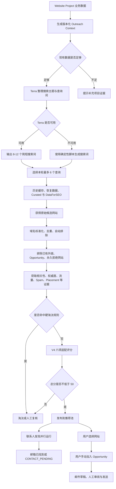
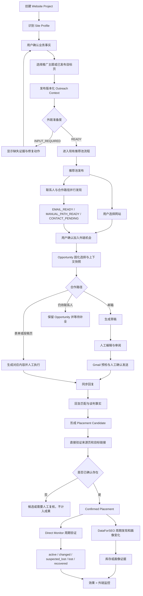

# 外链后推荐池完整项目价值链优化与后续实施方案 V1.1

> 状态：`DESIGN_COMPATIBLE`，仅完成方案确认，尚未执行后续业务代码实施或融合验收
>
> 日期：2026-08-22
>
> 适用范围：Website Project 准备、用户选站并加入 Opportunity、邮件与人工合作动作、回复与谈判、Placement、效果板块中的外链监控
>
> 前置结论：用户已确认推荐池代码完整打通；后续工作将其视为已验收、冻结的上游产品能力
>
> 明确排除：推荐池候选获取、搜索词、V4 评分、阈值、联系人并行发现、发布、库存恢复及推荐池前端实现
>
> 当前动作边界：本文只确认和修订后续实施方案；现在不执行 merge、rebase、cherry-pick、迁移应用、运行时接线、业务代码融合或 Provider 调用

## 0. 后续执行 Start Card

| 项目 | 约束 |
|---|---|
| Task ID | `BACKLINKS-POST-RECOMMENDATION-VALUE-CHAIN-E2E-001` |
| 唯一目标 | 在不改变推荐池行为的前提下，打通 `Website Project -> Opportunity -> 邮件/人工合作 -> Reply -> Negotiation -> Placement -> Direct Monitor -> 效果 > 外链监控` 的真实项目价值链 |
| 权威方案 | `docs/architecture/backlinks-post-recommendation-flow-optimization-and-coding-plan-v1.md` |
| 唯一结果文档 | `backend/core/docs/execution/BACKLINKS-POST-RECOMMENDATION-VALUE-CHAIN-E2E-001-result.md` |
| 推荐池输入 | 后续实施开始时记录的冻结 handoff baseline；只允许消费，不允许回改 |
| 停止点 | 一个真实项目完成整链运行、刷新/重连/重放和项目切换验证，或者因真实外部输入缺失而如实停在 `INPUT_REQUIRED` / `BLOCKED` |
| 允许所有权 | Platform Project readiness；Backlinks Opportunity、Draft、Mail、Reply、Negotiation、Placement、Monitoring；Platform Performance 只读效果投影；Gateway、OpenAPI、生成客户端和对应测试 |
| 禁改所有权 | Recommendation 生成、准入、评分、发布、库存、联系人发现及推荐池页面 |
| 默认 Provider 上限 | 开发和本地门禁阶段：DataForSEO `0`、Gmail send/sync `0`、AI `0`、外部 Direct Monitor `0`、部署 `0`；真实 UAT 前必须另行记录精确授权和上限 |
| 提交权限 | 本方案不授权 commit、push、merge 或部署 |

`P0-P8` 是同一个 Task ID 下的实施检查点，不是九个可以分别宣布“产品完成”的任务。检查点可以记录 `IMPLEMENTED` 或 `TESTED`，但只有整条价值链满足第 9.10 节和真实 UAT 证据后，唯一结果文档才可以写 `COMPLETE`。

## 1. 文档目的

本方案按照当前代码、最新项目权威边界和下列业务流程，重新定义推荐池之后的一个完整项目目标。实施原则不是重新建设已有模块，而是逐段确认现有能力、修复真实断点、接通前后板块，并让同一 Project Context 和业务 lineage 贯穿全链：



本方案不重新定义 `A-S` 的推荐池实现，只规范两个边界：

1. 推荐池之前，Website Project 怎样形成可追溯、可版本化的 Outreach Context。
2. 推荐池之后，用户怎样把网站转为 Opportunity，并经过邮件或人工合作路径、回复、谈判、Placement 和监控，最终在“效果”中看到真实结果。

本文同时提前规定各检查点的单一所有权、共享契约、文件边界、实施顺序和融合验收。目的不是现在融合代码，而是保证未来每一段代码都服务于同一个端到端产品结果，避免出现单模块显示完成、整条业务路径仍中断的情况。

## 2. 与现有方案的关系

| 现有方案或任务 | 本方案的处理 |
|---|---|
| 已完成的推荐池代码 | 作为冻结上游能力；不修改、不重排、不增加范围，只消费其稳定公开契约 |
| `backlinks-core-value-chain-remediation-implementation-plan-v1.md` 的 Phase 6-10 | 复用已有安全、lineage、幂等和证据实现；历史任务状态不能替代本方案的整链验收 |
| `backlinks-integrated-remediation-coding-master-plan-v1.md` | 保留 Project 权威、租户、成本、Provider 和真实证据约束；本文补充面向用户的完整业务闭环 |
| `效果板块实施方案-V1.0.md` | 文章效果和 GSC 方案继续有效；“第一版不做外链监控”和“外链不进入本次实施”仅对新排期失效 |
| Backlinks 现有“外链监控/指标报告”页面 | 后端业务所有权不变；用户结果展示逐步迁移到“效果 > 外链监控” |

本文是增补，不要求删除或重写正在并发修改的旧文档。发生冲突时，本文只对本节列出的业务范围和后续任务顺序具有优先级。

## 3. 关键假设与非目标

### 3.1 假设

- `/projects` 仍是项目创建、站点识别和业务资料补充的唯一入口。
- Website Project、Site Profile 和版本化 Outreach Context 是外链业务输入权威。
- Backlinks Core 继续拥有 Recommendation、Opportunity、Draft、Send Intent、Reply、Negotiation、Placement 和监控状态。
- “效果”是跨业务结果的读取与展示层，不复制 Backlinks Core 的可写业务状态。
- 现有推荐池已经负责联系人发现与发布的并行关系；后续链路只消费其结果。
- 所有真实发送继续要求 Gmail 就绪、固定发送身份、人工审阅和最终确认。

### 3.2 非目标

- 不修改已冻结推荐池的查询生成、候选供给、评分或准入阈值。
- 不制造联系人、候选网站、回复、Placement 或索引证据。
- 不自动提交联系表单，不绕过验证码。
- 不在效果页重新实现一套 Placement 数据库或监控 Worker。
- 不把 Indexification 的“已接受提交”描述为“Google 已收录”。
- 不在第一版做“外链导致流量增长”的因果归因。

## 4. 当前代码事实与主要问题

| 业务面 | 当前代码事实 | 主要问题 |
|---|---|---|
| 加入项目 | 创建项目后进入站点识别和业务资料确认；后端已有版本化 Outreach Profile、Promotion Target 和 generation pins | 用户看不到一个统一的“外链准备度”；Promotion Target 缺少清晰的公开操作入口 |
| 选择网站 | 推荐池已经支持邮箱、人工合作路径和空联系人三类 Opportunity 创建，并能打开已有 Opportunity | 交接后的下一步、快照、阻塞原因和后续页面定位仍分散；优化应发生在 Opportunity 入口而不是回改推荐池 |
| 邮件 | 已有草稿版本、人工审批、Gmail 就绪、发送预检、Send Intent、未知结果保护、收件同步、回复匹配和谈判事实 | 页面按技术模块分散，用户难以从一个项目级动作队列连续处理待审阅、可发送、待回复和异常项 |
| Placement/监控 | 已有 Reply/Negotiation lineage、Placement、直接验证、changed/lost/recovered、证据快照和报告指标 | 现有能力尚未以同一项目操作路径连续呈现，历史真实 UAT 也未证明从真实回复一直到效果监控 |
| 效果 | 导航当前只有总览和文章效果，Backlinks 内另有 Links/Reports | 外链成果仍藏在 Backlinks 操作页；效果板块缺少用户关心的外链成果、健康变化和回溯入口 |

## 5. 目标业务闭环



## 6. 优化方案

### 6.1 加入项目：从“创建成功”优化为“外链已准备”

#### 优化内容

1. 保持创建项目表单简短，只要求域名、国家、语言和可选竞品，不把所有外链资料塞入第一步。
2. 创建后进入统一的“项目准备度”流程：
   - 站点资料识别；
   - 用户确认企业、受众、产品和价值主张；
   - 用户选择已批准的推广主题、关键词或已发布目标页；
   - 系统发布不可变的 Outreach Context 版本。
3. 增加项目级读取模型，明确返回：
   - `READY`
   - `INPUT_REQUIRED`
   - `REFRESHING`
   - `STALE`
   - 当前 Site Profile、Outreach Profile、Promotion Target 版本和 fingerprint；
   - 唯一的主要修复动作。
4. Site Profile 或推广目标发生变化时创建新版本，不回写历史推荐、Opportunity 或草稿使用过的旧快照。
5. 推荐生成只在准备度为 `READY` 时开放；项目本身仍可先创建和保存。

#### 具体解决的问题

- 用户不再只看到“项目创建成功”，却不知道为什么不能生成推荐。
- 后续推荐、选站和邮件都能说明自己使用了哪一版项目事实和目标页。
- 网站资料变更不会让历史邮件或已选网站悄悄改变语义。
- 不需要在 Backlinks 中再创建第二个 Website Project 输入页面。

### 6.2 选择网站：从“按钮建记录”优化为“用户确认合作机会”

#### 优化内容

1. 冻结并复用推荐池现有“加入 Opportunity”交接，不修改推荐卡片、创建分流、评分展示或联系人发现逻辑。
2. 创建成功后由 Opportunity 入口提供统一的交接摘要，至少包含：
   - 网站和本轮推荐评分摘要；
   - 当前推广目标 URL；
   - 联系状态；
   - 可用合作路径；
   - 当前阻塞原因；
   - Recommendation、generation 和 Outreach Context 版本；
   - 唯一的下一步动作。
3. 将隐含的空联系人明确为只读派生字段 `engagementPathState`，不新增独立状态表或第二套状态机：
   - `EMAIL_READY`
   - `MANUAL_PATH_READY`
   - `CONTACT_PENDING`
   该字段由现有联系人发布状态、可用联系人和已验证合作路径确定，底层事实仍由各自现有模块拥有。
4. 允许 `CONTACT_PENDING` 创建 Opportunity，但在联系人或已验证合作路径出现前禁止生成可发送邮件。
5. Opportunity 创建时固化或引用：
   - recommendation ID 和 generation；
   - V4 评分与证据快照；
   - Project、Site Profile、Outreach Profile、Promotion Target 版本；
   - fingerprint；
   - 用户选择的目标 URL；
   - 联系人或合作路径版本；
   - `selectedBy`、`selectedAt` 和幂等键。
   已经存在于 generation contract、qualification fact 或 visibility fact 中的内容必须通过 ID 和版本引用，不重复复制一份可漂移的评分 JSON。
6. 同一项目、标准化域名和业务周期只允许一个活动 Opportunity。
7. 推荐池保留现有交互；Opportunity 列表和详情必须能接住新建记录，并提供返回原推荐、进入邮件或执行人工合作动作的确定性深链。

#### 具体解决的问题

- 联系人尚未找到时，用户仍可表达真实业务意图，不必等待异步联系人任务。
- 不再把 `null` 联系人误解为异常或可直接发信。
- Opportunity 能准确追溯当时的推荐依据、项目版本和目标页。
- 重复点击、并发选择和旧版本提交不会产生重复机会。
- 推荐池代码保持冻结，选站之后的产品连续性由 Opportunity 模块承担。

### 6.3 邮件：从分散工具页优化为“业务动作队列”

#### 优化内容

1. 保留现有 Draft、Approval、Send Preflight、Send Intent、Gmail Sync 和 Reply 状态机，不重写已验证的发送安全逻辑。
2. 将邮件中心组织为面向动作的队列：
   - 待生成草稿；
   - 待人工审阅；
   - 可发送；
   - 发送中或结果待确认；
   - 已发送待回复；
   - 已回复待处理；
   - 需要处理。
3. Opportunity 详情只显示一个 `primaryNextAction`，例如：
   - 等待联系人；
   - 打开合作页面；
   - 生成草稿；
   - 审阅草稿；
   - 连接 Gmail；
   - 修复发送身份；
   - 确认发送；
   - 处理回复；
   - 补充谈判事实。
4. 每个草稿绑定不可变的 Opportunity、Recommendation、Contact、Outreach Context 和目标 URL 快照。任一绑定发生变化时标记 `STALE`，要求显式重新生成或人工确认继续使用旧版本。
5. Gmail 状态在页面顶部只展示业务结论和主要修复动作；Worker、build、checkpoint、cursor 等诊断折叠到详情。
6. 邮箱路径必须显示实际 Gmail 账号和 `From` 身份，发送前重新核对收件人、已批准草稿版本和联系人版本。
7. 非邮箱路径进入同一动作队列，但使用 `FORM_MESSAGE` 或 `SUBMISSION_PITCH`，不会绕到 Gmail。
8. `DELIVERY_UNKNOWN` 或 Provider 已接受但本地结果不明时禁止自动重发，必须先对账。
9. 回复优先按线程和消息身份精确匹配；歧义项进入人工确认队列，用户更正必须可审计。
10. 谈判事实只驱动下一步和 Placement Candidate，不自动宣称合作成功。

#### 具体解决的问题

- 用户不需要在草稿页、Gmail 状态页、邮件列表和回复页之间猜下一步。
- 邮件不会因为项目资料、联系人或目标页变化而继续使用过期上下文。
- 技术诊断仍然保留，但不会遮挡业务动作。
- 邮箱和人工合作路径可以在一条 Opportunity 时间线汇合，同时不伪装成相同发送方式。

### 6.4 效果中的外链监控：从“后台操作页”优化为“成果健康页”

#### 信息架构

效果模块调整为：

```text
效果
├─ 总览
├─ 文章效果
└─ 外链监控
```

文章效果继续使用 GSC 数据。外链监控使用 Backlinks Core 的只读投影，不新增第二套可写状态。

#### 第一版页面

1. 概览指标：
   - 新增已确认外链；
   - 当前有效；
   - 内容或属性已变化；
   - 疑似丢失；
   - 已丢失；
   - 已恢复；
   - 逾期未检查；
   - 最后 DataForSEO 同步时间；
   - 最后直接验证时间。
2. 外链列表：
   - 来源域名和来源页；
   - 目标页；
   - Opportunity 和 Placement 来源；
   - anchor、rel、nofollow、sponsored、ugc；
   - 当前健康状态；
   - 最后发现、最后直接验证、下次检查；
   - 证据来源和数据截止时间。
3. 详情时间线：
   - Placement Candidate 创建；
   - 首次直接确认；
   - DataForSEO 发现或画像变化；
   - 页面状态、跳转、canonical、noindex、链接、anchor 或 rel 变化；
   - 疑似丢失、确认丢失和恢复；
   - 人工复核与重新验证。
4. 操作：
   - 请求重新验证；
   - 打开来源页面；
   - 打开关联 Opportunity；
   - 查看不可变证据；
   - 返回邮件或谈判上下文。

#### 数据和状态规则

- `Placement Candidate` 单独展示，不计入有效外链 KPI。
- 只有直接验证已确认的 Placement 才进入成果统计。
- DataForSEO 负责发现外链库存和画像变化，不单独裁定页面中的链接当前仍存在。
- Direct Monitor 负责来源页可访问性、最终 URL、跳转、canonical、noindex、链接存在、目标 URL、anchor、rel 和丢失/恢复事实。
- 首次异常进入 `suspected_lost`，不立即计入失败成果。
- 连续、满足集中版本化策略的异常才进入 `lost`。
- 丢失后再次直接确认存在进入 `recovered`。
- 阈值和连续次数由后端版本化策略统一计算，前端不得自行推导。
- Indexification 若以后启用，只能显示 `indexification_accepted`。
- 真实索引证据必须独立显示为 `index_evidence_observed`。
- 页面必须区分：
  - `discovered_by_dataforseo`
  - `directly_verified`
  - `indexification_accepted`
  - `index_evidence_observed`

#### 迁移策略

1. Backlinks Core 继续拥有 Placement、监控命令、证据和生命周期状态。
2. 新增面向效果页的只读投影或 Platform/BFF API。
3. “效果 > 外链监控”完成数据与操作对等后，再处理旧 `/backlinks/links` 和 `/backlinks/reports`：
   - 默认结果入口跳转到 `/performance/backlinks`；
   - 需要业务处置时深链到 Backlinks 的具体 Placement 或 Opportunity；
   - 保留项目、Opportunity、reply 和 placement 上下文。
4. 旧页面未达到对等前不删除，避免破坏当前操作能力。

#### 具体解决的问题

- 用户能在“效果”中看到外链是否真正获得、是否仍有效，而不是只看到流程记录。
- 候选、Provider 发现和直接验证不会混成同一种“成功”。
- 外链变化和丢失有证据、有时间线、有修复入口。
- 文章效果和外链效果可以同屏观察，但第一版不制造因果关系。

## 7. 单一端到端代码目标与实施检查点

后续实施直接以已完成推荐池的冻结 handoff baseline 为输入。`P0-P8` 只表示一个整体任务的检查点：每个检查点必须同时验证上游输入、当前模块和下游交接，不能以“本模块测试通过”代替完整产品链路。

每个检查点使用同一实施循环：

```text
读取现有代码与运行契约
-> 记录真实断点和缺失证据
-> 只修复阻断整链的产品代码
-> 接通本段的上游输入和下游 handoff
-> 运行模块回归、跨模块契约和端到端检查
-> 将证据追加到唯一结果文档
```

现有能力能满足契约时直接复用，不因任务编号存在就重写；没有接通上下游的页面、接口或测试不能单独视为交付。

### P0：Recommendation Handoff Freeze

**目标**

在任何后续代码修改前，把用户已验收的推荐池能力记录为不可回改的消费者基线。

**必须记录**

- 基线 commit SHA；如果交接时仍有未提交实现，则记录受控 worktree snapshot/fingerprint 和明确文件清单；
- Backlinks migration head、Platform Alembic heads；
- Recommendation 相关 OpenAPI operation/schema hash；
- 生成客户端状态；
- 推荐池数量、评分、联系人并行状态、Opportunity 创建分流和重复点击的回归结果；
- 当前 Provider ledger、active lease 和 `unknown_charge` 状态。

**冻结范围**

- `backend/core/src/modules/backlinks/domain/recommendations/`
- Recommendation discovery/refill/qualification/publication/inventory 的 command、workflow、service、repository 和 route
- `frontend/src/features/outreach/recommendations/`
- 会改变 Recommendation 请求或响应语义的 OpenAPI operation/schema
- 已存在的 Recommendation migration 和数据

后续生成 OpenAPI 或客户端时允许产生机械文件变化，但 Recommendation operation/schema 的语义 diff 必须为零。若发现后续需求只能通过修改冻结区实现，必须停止并单独提请变更上游契约，不能在本任务中顺手修改。

### P1：Project Outreach Readiness

**目标**

让用户在项目入口完成外链准备，并得到一个版本化、可解释的 `READY` 结果。

**主要文件边界**

- `backend/api/app/modules/projects/`
- `backend/api/app/api/routes/projects.py`
- `frontend/src/features/projects/`
- `frontend/src/api/projects.ts`

**交付**

- 项目准备度 read model 和公开 API；
- Promotion Target 或统一“准备外链”发布命令；
- 项目准备度 UI、缺失证据和主要修复动作；
- 版本、fingerprint 和 stale 处理。
- 所有 readiness 读取保持无副作用，不得在 GET、页面刷新或项目切换时创建 recommendation refill、Provider 请求、lease 或 ledger；
- 新 Outreach Context 只通过明确用户命令和现有 Project projection/outbox 语义发布，不从 Project 模块直接调用 Recommendation 内部实现。

**验证**

- 缺少推广主题或已发布目标页时为 `INPUT_REQUIRED`；
- 补齐后发布新版本并变为 `READY`；
- 项目切换、刷新和并发响应不串项目；
- 历史版本不可被后续编辑覆盖。
- readiness GET 重放前后 Recommendation 数量、generation、Provider 请求、lease 和 ledger 均不发生意外变化。

**停止条件**

只有代码和测试通过不能声明业务完成；至少要完成本地 API/UI 运行验证。

### P2：Recommendation Selection To Opportunity

**前置**

P0 已冻结推荐池公开字段和现有创建分流。本检查点从 Opportunity 侧读取和验证交接结果，不修改 Recommendation query、command 或 UI。

**主要文件边界**

- `backend/core/src/modules/backlinks/application/commands/opportunities.command.ts`
- `backend/core/src/modules/backlinks/application/commands/cooperation-path-opportunities.command.ts`
- Opportunity schema、repository 和 API route
- `frontend/src/features/outreach/opportunities/`
- Opportunity 详情、动作入口和查询缓存

**交付**

- 从现有联系人和合作路径事实派生 `engagementPathState`，不新增持久化状态源；
- Opportunity 交接摘要和唯一下一步动作；
- `CONTACT_PENDING` Opportunity；
- 选择快照、版本检查、幂等和活动机会唯一性；
- 从 Opportunity 返回原推荐、进入邮件或人工合作动作的稳定深链。

**验证**

- 邮箱、人工路径、待联系人三种路径；
- 重复点击、并发点击、旧 generation 和旧 context；
- 项目切换后拒绝旧响应；
- `CONTACT_PENDING` 不可进入发送。
- 推荐池冻结测试和 Recommendation OpenAPI semantic diff 为零。

### P3：Opportunity Action Queue And Snapshot-Bound Draft

**主要文件边界**

- `frontend/src/features/outreach/drafts/draft-page.tsx`
- Opportunity 详情和邮件中心
- Draft job、draft version、approval 的 Core command/query

**交付**

- 统一动作队列和只读派生的 `primaryNextAction`，不增加新的 Opportunity 生命周期状态；
- 邮箱、表单、投稿三类内容；
- 草稿不可变输入快照；
- `STALE` 判定、重生成和保留人工编辑；
- 非策略失败时可编辑的明确标注 fallback。

**验证**

- AI 成功、格式失败、Provider 失败、策略拒绝；
- 上下文或联系人变化后的 stale；
- 并发编辑与重试；
- 非邮箱内容不能进入 Gmail Send Intent。

### P4：Gmail Readiness, Send And Reply Workbench

**主要文件边界**

- `frontend/src/features/outreach/mail/mail-center.tsx`
- `frontend/src/features/outreach/mail/`
- Gmail readiness、send preflight、send intent、sync 和 reply projection 的 Core 模块

**交付**

- 面向业务的 Gmail 阻塞和修复动作；
- 明确账号、From 身份、收件人和批准版本；
- 队列化的待发送、待对账、待回复和歧义回复；
- `DELIVERY_UNKNOWN` 对账入口；
- 回复匹配人工确认和审计。

**验证**

- 已连接但非 Send Ready；
- 身份、scope、secret、配额和版本变化；
- 重复发送、网络断开、Provider 接受后结果未知；
- 精确线程匹配、跨项目和歧义回复。

**停止条件**

真实 Gmail 发送必须单独获得人工确认。没有真实发送授权时，只能完成到本地运行和 Send Ready 证据。

### P5：Reply And Negotiation To Placement

**主要文件边界**

- Reply、Negotiation 和 Placement 的 Core command/query
- Opportunity、Mail 和 Links 的深链与详情

**交付**

- 结构化谈判事实和用户更正版本；
- 邮箱与非邮箱路径汇合到响应和谈判时间线；
- Outreach-derived Placement Candidate；
- `projectId/opportunityId/replyId/placementId` lineage；
- 跨模块确定性返回路径。

**验证**

- 导入或不匹配外链不能满足 Outreach-derived Placement；
- 跨项目证据不能关联；
- 刷新、多标签页和项目切换保持正确上下文；
- 没有直接验证时不计入成果。

### P6：Backlink Monitoring Read Model

**主要文件边界**

- `backend/core/src/modules/backlinks/application/schemas/placement-links.schema.ts`
- `backend/core/src/modules/backlinks/application/queries/placement-links.query.ts`
- 监控策略、运行、观察和证据存储
- Platform/BFF 对外只读投影；公开 `/performance/backlinks` 路由由 Platform Performance 拥有，Backlinks 保留 `/backlinks/links` 和监控命令所有权

**交付**

- 面向效果页的项目级 KPI、分页列表和详情时间线；
- `suspected_lost` 的公开表达；
- DataForSEO 与 Direct Monitor 证据分层；
- 检查逾期、最近同步和数据截止时间；
- 请求重新验证命令保持在 Backlinks 所有权内。

**验证**

- Candidate 不进入 KPI；
- active、changed、suspected_lost、lost、recovered；
- 连续异常策略、恢复和重复运行幂等；
- 证据 hash 和项目隔离；
- Provider 超时保留历史事实，不显示假零值。

### P7：Effects Backlink Monitoring UI And Navigation

**主要文件边界**

- `frontend/src/app/platform-navigation.ts`
- `frontend/src/features/performance/performance-workspace.tsx`
- `frontend/src/api/performance.ts`
- 新增的效果外链监控组件和测试
- Backlinks 旧 Links/Reports 的兼容路由

**交付**

- “效果 > 外链监控”导航；
- 概览、筛选列表、证据详情和时间线；
- 重新验证、打开 Opportunity 和来源页；
- DataForSEO、直接验证、Indexification、索引证据的明确标签；
- 旧路由渐进跳转和深链兼容。

**验证**

- loading、无 Placement、等待首次验证、部分 Provider 失败、同步失败但有历史数据、接口失败；
- 桌面和移动端无溢出或遮挡；
- 项目切换清除旧筛选和旧请求；
- 文章效果回归不受影响；
- 不显示静态或 Mock 外链数据。

### P8：有界真实业务 UAT

**业务路径**

```text
真实 Website Project
-> READY Outreach Context
-> 现有推荐池中的真实推荐
-> 用户加入 Opportunity
-> 联系人或人工合作路径
-> 草稿和人工审阅
-> 经授权发送或人工提交
-> 回复与谈判
-> Placement Candidate
-> 直接确认
-> 效果页外链监控
```

**必须记录**

- Project、Recommendation、Opportunity、Draft、Send Intent、Message、Reply、Placement 和 monitoring run ID；
- 每个对象的版本、fingerprint 和 lineage；
- Provider request/task/ledger 和真实成本；
- 人工审批和发送或提交证据；
- DataForSEO 和 Direct Monitor 的独立证据；
- build、Worker mode、数据截止时间和已知限制。

**停止条件**

- 缺少真实联系人、人工发送授权、回复或 Placement 时，状态必须是 `INPUT_REQUIRED` 或 `BLOCKED`；
- 不允许通过手工 SQL、伪造候选、伪造回复或伪造 Placement 改成通过；
- 同一根因连续失败两轮后停止正式重放，等待新证据或新授权。
- 只有 P0-P7 全部门禁通过且整条真实 lineage 到达效果监控，唯一结果文档才可写 `COMPLETE`；任何单段验收、页面验收或任务清单完成都不是产品完成。

## 8. 任务依赖和并行边界

```text
已完成并冻结的推荐池
          |
          v
         P0
          |
     +----+----+
     v         v
    P1        P2 --------> P3 --------> P4 --------> P5
     |         |                                      |
     +---------+--------------------------------------+
                                                       v
                                                      P6 --------> P7 --------> P8
```

- P0 是所有后续实施的硬前置；没有可复查的冻结基线，不得开始修改共享契约或生成客户端。
- P1 和 P2 可以在隔离分支或 worktree 中开发，但它们必须在进入 P3 前完成 Project Context 和 Opportunity handoff 集成验证。
- P3 可在 P2 command contract 稳定后开始，不等待真实 Gmail。
- P6 可基于现有 Placement 和 monitoring 数据提前开发，但 P8 必须使用 P5 形成的真实 lineage。
- P7 不得直接读取 Core 数据库，应通过受支持的 Platform/BFF 契约。
- Indexification 是后续可选任务，不是 P0-P8 的前置条件。
- 并行只用于不共享所有权和热点文件的模块开发；最终接线严格按 G0-G7 串行进入统一集成分支。

## 9. 后续实现的兼容设计与融合验收

本节是 P0-P8 未来编码时必须遵守的设计约束，不代表现在执行代码融合。任何检查点即使自身测试通过，只要违反本节，未来就不能进入产品融合阶段。

“这些方案做完后融合没有异常”在本文中的准确处理方式是：

1. 每项业务事实只有一个写入所有者。
2. 模块之间只通过版本化 API、事件或只读投影交互。
3. 数据库迁移可以从现有数据库向前升级，也可以从空数据库完整安装。
4. OpenAPI、Gateway、生成客户端和前端消费者使用同一份契约。
5. 项目切换、重试、并发和旧版本请求不会产生跨项目数据或重复副作用。
6. 每个检查点预先给出未来融合顺序和自动化门禁。
7. 只有未来实现完成并通过门禁后，才能确认实际融合未发现异常；方案阶段不提前宣称运行结果。
8. 推荐池冻结区的源码、行为、公开契约和数据语义保持零变更。

### 9.1 单一所有权矩阵

| 业务事实 | 唯一写入所有者 | 允许的消费者 | 禁止做法 |
|---|---|---|---|
| Platform Project、生命周期和租户身份 | Platform Project | 所有模块通过精确 Project Context 读取 | Backlinks 创建第二个项目或写 Platform Project 表 |
| Site Profile 和站点识别证据 | Platform SiteProfile/SEO | Outreach Context、Recommendation | Recommendation 或邮件自行覆盖站点事实 |
| Outreach Profile、Promotion Target 和准备度 | Platform Project | Backlinks 通过版本 pins 读取 | 在 Recommendation 或 Opportunity 内维护另一份当前项目资料 |
| Recommendation、generation、评分和可见性 | 已冻结的 Backlinks Core Recommendation | Opportunity 选择和 UI | P0-P8 修改推荐池准入、重评分、发布、库存或复制评分事实 |
| 联系人和合作路径事实 | Backlinks Core Contact/Cooperation Path | Opportunity、Draft、动作队列 | 用空邮箱、猜测邮箱或前端状态替代联系人事实 |
| Opportunity | Backlinks Core Opportunity | Draft、Mail、Reply、Placement、Effects 深链 | Performance 或前端直接写 Opportunity 状态 |
| Draft、Approval、Gmail、Send Intent、Reply、Negotiation | Backlinks Core 各对应模块 | Outreach UI、Placement handoff | 前端重复计算发送安全规则或绕过 Send Intent |
| Placement、Direct Monitor、DataForSEO inventory | Backlinks Core | Links 操作页、Performance 只读投影 | Performance 创建第二套 Placement 或监控表 |
| 文章 GSC 效果 | Platform Performance | 效果总览和文章效果 | Backlinks 将其作为外链因果证明 |
| `engagementPathState`、`primaryNextAction`、效果 KPI | 所属后端 query/read model 派生 | 前端展示 | 将派生结论再持久化为新的真相源 |

### 9.2 跨模块稳定契约

#### A. Project 到 Recommendation

唯一输入是版本化 `ProjectOutreachProfile / PromotionTargetVersion` 和 generation pins。P1 只能增加准备度读取和发布入口，不能改变当前推荐池消费的版本含义。

准备度契约至少包含：

```text
websiteProjectId
status: READY | INPUT_REQUIRED | REFRESHING | STALE
siteProfileVersionId
outreachProfileVersionId
promotionTargetVersionId
fingerprint
inputRequired[]
primaryRecoveryAction
```

#### B. Recommendation 到 Opportunity

P2 消费 P0 冻结的推荐池公开事实：

```text
recommendationId
version
recommendationContextVersionId
visiblePoolGeneration
scoreModelVersion
contactPublicationState
cooperationPath
existingOpportunityId
canCreateOpportunity
```

`engagementPathState` 是这些事实的派生结论：

```text
存在合格联系人                  -> EMAIL_READY
不存在合格联系人但有验证合作路径 -> MANUAL_PATH_READY
两者都没有且发现仍可继续          -> CONTACT_PENDING
```

不得由前端根据按钮是否可点自行推断。优先在 Opportunity query/read model 派生；只有独立上游变更明确获批后，才允许修改 Recommendation query。P0-P8 默认不得增加或改变 Recommendation 响应字段。

#### C. Opportunity 到 Draft/Mail

邮件链只接受已经持久化的 Opportunity ID，并从 Core 读取联系人、合作路径、上下文版本和目标页。前端不得把 Recommendation 卡片中的临时对象直接提交给 Draft 或 Send Intent。

`primaryNextAction` 由下列现有事实派生：

```text
Opportunity engagement path
Contact readiness
Draft job and version
Approval
Gmail SEND_READY
Send Intent checkpoint
Reply match
Negotiation facts
Placement state
```

#### D. Placement 到 Effects

Platform Performance 只通过 Backlinks Gateway/BFF 读取项目级监控投影：

```text
summary
items
placement detail
lifecycle timeline
evidence metadata
data cutoff
provider/direct verification freshness
```

重新验证仍调用 Backlinks command。Performance 不直接连接 Core 数据库，也不复制 Placement、observation、policy 或 evidence 表。

### 9.3 已识别冲突与解决方式

| 冲突点 | 风险 | 强制解决方式 |
|---|---|---|
| P1 修改 Project contracts/routes 后改变推荐池输入语义 | Outreach Context 版本语义漂移 | P1 只增加准备度和发布入口；P0 的 recommendation context/generation pins 回归必须保持通过 |
| P2 为改善选站体验修改 Recommendation query/UI | 破坏已验收推荐池、引入合并冲突 | P2 只修改 Opportunity 侧 read model、页面和深链；推荐池按钮与创建分流保持冻结 |
| 邮箱 Opportunity 与非邮箱 Opportunity 已有两个 command | 为统一 UI 而破坏既有安全规则 | 保留两个 command，由一个选择服务或 UI adapter 按路径分发，不急于合并底层命令 |
| `CONTACT_PENDING` 与现有 nullable contact | 新增第三种重复持久化状态 | 先使用现有 nullable contact 和联系人任务事实，`engagementPathState` 仅做 query 派生 |
| 动作队列与现有 Opportunity/Draft/Gmail 状态 | 出现第二套生命周期 | 队列和 `primaryNextAction` 只读派生，不新增可写业务状态 |
| P3 与 P4 同时修改 Mail/Draft/Gmail 页面 | 同文件冲突和就绪规则分叉 | P3 先交付队列骨架和 Draft；P4 在其后接入现有 `gmail-readiness`，不复制 evaluator |
| P5 与 P6 同时修改 Placement query/schema | lineage 和监控字段互相覆盖 | P5 先冻结 Placement lineage；P6 只在其上扩展只读监控投影 |
| Backlinks Links/Reports 与 Effects 外链页 | 同一数据出现两套写入口 | 旧页保留操作能力；新页只读展示并深链回旧操作，达到对等后再迁移入口 |
| Platform `/performance` 与 Backlinks `/backlinks` 路由 | OpenAPI route/operationId 重复 | `/performance/backlinks` 由 Platform 拥有，operationId 使用 performance 命名；Backlinks 路由保持原路径 |
| Platform Alembic 与 Core SQL migrations | 修改错误数据库或迁移顺序断裂 | P1 只使用 Alembic；P2-P6 的 Backlinks 状态只使用 Core SQL；不得跨写 |
| 多任务同时新增 Core migration | 编号重复、manifest head 错误 | 不预留固定编号；每个任务基于最新主线 head 分配下一编号并重新生成 manifest checksum |
| 手工修改 OpenAPI 和生成客户端 | 契约漂移、类型通过但运行失败 | 先改后端 schema/route，再生成 OpenAPI，再运行客户端生成器；禁止手改 `generated/backlinks.ts` |
| 多任务同时修改组合根和 Gateway | 路由漏注册或重复注册 | 组合根、Gateway 和聚合 OpenAPI 由集成任务串行接线 |
| 旧页面提前删除 | 新页面缺少处置能力时业务中断 | 先并存和路由兼容，通过对等测试后再单独安排删除任务 |

### 9.4 共享热点文件所有权

下列文件不能由 P0-P8 多个检查点并行直接修改。业务检查点提交模块实现，集成阶段统一完成接线或生成：

| 共享热点 | 集成规则 |
|---|---|
| `backend/api/app/api/routes/projects.py` | P1 独占；任何改动都必须证明 P0 的 Project-to-Recommendation 输入语义不变 |
| `backend/api/app/api/routes/backlinks.py` | Gateway 集成任务串行增加代理路由，不由 P2、P5、P6 各自并行编辑 |
| `backend/core/src/index.ts` | Core composition 集成任务接线 |
| `backend/core/src/modules/backlinks/api/private-server.ts` | Core API 集成任务接线并运行 route 注册测试 |
| `backend/contracts/openapi/platform.v1.json` | 由 Platform OpenAPI 生成流程更新 |
| `backend/contracts/openapi/backlinks.v1.json` | 由 Backlinks OpenAPI 生成和 breaking-change 检查更新 |
| `frontend/src/api/generated/backlinks.ts` | 只由 `generate:backlinks-client` 生成 |
| `backend/database/deployment-manifest.v1.json` | 所有迁移完成后由集成任务更新 head、顺序和 checksum |
| `frontend/src/features/outreach/manifest.ts` | P7 统一处理旧 Backlinks 入口兼容 |
| `frontend/src/app/platform-navigation.ts` | P7 独占新增“效果 > 外链监控” |
| lockfile | 本方案默认不增加依赖；确需依赖时由单独任务更新，不能顺手改动 |

当前 checkout 仍包含大范围 dirty/untracked 变化。用户对推荐池的产品验收结论不等于这些变化已经形成可供后续代码可靠比较的 Git 基线。实施前必须先完成 P0：使用明确提交，或者建立只读、可复查的 handoff snapshot/fingerprint，并在独立 worktree/分支中开展后续修改；不能从未归属的工作区变化中批量挑选、覆盖或清理文件。

### 9.5 数据库向前兼容策略

所有数据库变更遵循 expand-and-contract，但本轮只实施 expand 和兼容读取：

1. 基于任务开始时的真实最新 migration head 分配新版本。
2. 不修改任何已经存在或可能已经应用的迁移文件。
3. 先增加 nullable 字段、表、索引或版本化 read model 所需结构。
4. 新 command 开始写入新事实，同时旧读取路径仍可工作。
5. 需要历史数据时只做确定性、可重复、带租户和项目边界的 backfill。
6. backfill 完成并验证后才能增加 `NOT NULL`、唯一约束或强引用。
7. 旧字段、旧路由和旧表的删除不属于 P0-P8，必须在独立兼容期后授权。
8. Core SQL migration 必须进入 deployment manifest，且文件 hash、migration ID 和 head 与实际目录一致。
9. Platform Alembic 必须同时验证空库安装、现有库升级和多 head 合并图。

### 9.6 OpenAPI 和前端客户端顺序

任何公共契约变化都必须按以下顺序进行：

```text
后端 schema / route
-> 后端契约测试
-> 生成或更新 OpenAPI 基线
-> Backlinks breaking-change / sensitive-field / unresolved-ref 检查
-> 生成前端客户端
-> generated client drift 检查
-> 前端 adapter
-> 页面
```

规则：

- 新字段第一阶段应为可选或 nullable，旧客户端仍可读取响应。
- 不删除或改名现有 enum 值、字段、route 或 operationId。
- 新 enum 值加入前，前端必须有 `unknown` 或明确 fallback 展示，不能崩溃。
- Platform OpenAPI 聚合不允许重复 route、operationId 或不一致的同名 schema。
- 内部 Provider 请求体、数据库字段、secret 和原始响应不能泄漏到公共 OpenAPI。
- 前端业务类型来自生成客户端或其窄 adapter，禁止再建立手写平行 DTO。

### 9.7 完整链路的未来融合顺序

#### G0：推荐池交接基线

- 将用户已验收的推荐池形成明确提交，或者建立受控 handoff snapshot/fingerprint；
- 记录 commit SHA 或 snapshot ID、Backlinks migration head、Alembic heads、Recommendation OpenAPI hash 和生成客户端状态；
- 确认没有未结算 Provider ledger、active lease 或 `unknown_charge` 被后续任务误接管；
- 运行推荐展示、评分、联系人并行、创建三类 Opportunity 和幂等回归；
- P1-P8 重新同步到该基线，之后所有 Recommendation semantic diff 必须为零。

#### G1：P1 Project Readiness

- 只改 Platform Project 和前端 Project；
- 保持现有 recommendation context 版本含义；
- 通过 Project、shared contract、migration 和 exact-route 测试后合并。

#### G2：P2 Opportunity Selection

- 先扩展 Opportunity query/command 契约，再生成客户端，最后改 Opportunity UI；
- 不修改推荐准入和联系人发现；
- 不修改 Recommendation workspace、公开字段或创建分流；
- 通过旧客户端兼容、重复点击、generation conflict 和推荐池冻结回归后合并。

#### G3：P3-P4 Outreach Workbench

- P3 先提供队列读模型和 Draft；
- P4 后接 Gmail readiness、Send Intent、sync 和 reply；
- 两者共享的页面和 adapter 在 P4 集成提交中统一整理。

#### G4：P5 Placement Lineage

- 先冻结 reply/negotiation/opportunity 到 Placement 的 lineage；
- 不同时引入效果页；
- 通过跨项目、导入链接和重复创建测试后合并。

#### G5：P6 Monitoring Projection

- 在现有 Placement 和监控表上增加只读投影；
- 不修改文章 Performance 表；
- Backlinks API、Gateway 和 Platform BFF 串行接线。

#### G6：P7 Effects UI

- 最后修改两个导航文件；
- 新旧 Links/Reports 入口并存；
- 新页面只消费 P6 的稳定契约。

#### G7：P8 UAT

- 只在 G0-G6 全部门禁通过后执行；
- 不用 UAT 临时脚本回写业务表修复数据；
- UAT 发现契约问题时回到对应所有者任务修复，再从该门禁重跑。

### 9.8 后续实现完成后的融合门禁

#### Backend Core

```powershell
cd backend/core
npm run verify:backlinks
```

该门禁包含 typecheck、lint、source manifest、依赖与许可证、OpenAPI、migration、unit、API、contract、integration、security 和 resilience 检查。

#### Platform API

至少运行：

```powershell
python -m pytest `
  backend/api/tests/test_projects.py `
  backend/api/tests/test_project_authority.py `
  backend/api/tests/test_project_contracts.py `
  backend/api/tests/test_shared_contracts.py `
  backend/api/tests/test_backlinks_project_projection.py `
  backend/api/tests/test_backlinks_gateway.py `
  backend/api/tests/test_database_migration_system.py `
  backend/api/tests/test_performance_api.py
```

实际执行时使用项目已配置的 Python runtime，不把本机路径写入产品脚本。

#### Frontend

```powershell
cd frontend
npm run check:backlinks-client
npm run typecheck
npm run lint
npm run test
npm run test:project-authority-source
npm run test:outreach-source
npm run build
```

#### Browser

```powershell
cd frontend
npm run test:e2e:desktop
npm run test:e2e:mobile
npm run test:e2e:keyboard-a11y
```

Browser 验证必须覆盖真实 production route 和 Gateway 响应，不使用能把缺失接口伪装成成功的 fixture fallback。

### 9.9 跨模块集成测试矩阵

| 场景 | 必须证明 |
|---|---|
| Project 从 `INPUT_REQUIRED` 到 `READY` | 产生新 Outreach Context 版本，旧 generation 不被改写 |
| Recommendation 冻结基线 | P1-P7 每次集成后推荐池数量、评分、联系人并行状态、加入 Opportunity 分流和公开契约不回归 |
| 用户加入邮箱 Opportunity | exact recommendation/version/contact/context 被固化，重复点击幂等 |
| 用户加入人工路径 Opportunity | 调用现有 cooperation-path command，不制造邮箱 |
| 用户加入 `CONTACT_PENDING` Opportunity | Opportunity 存在，但 Draft/Send 被明确阻止 |
| 联系人后续补全 | 同一 Opportunity 的派生下一步更新，不创建第二个 Opportunity |
| Outreach Context 或联系人变化 | 旧 Draft 标记 stale，已批准版本不能继续发送 |
| Gmail accepted 但结果未知 | 不自动重发，对账后只存在一个 accepted message |
| Reply 匹配 | exact thread 正确关联，歧义和跨项目进入人工处理 |
| Negotiation 到 Placement | lineage 完整，导入链接不能冒充 outreach-derived Placement |
| Placement 首次确认 | Candidate 不计 KPI，确认后 Effects 才显示成果 |
| changed/suspected_lost/lost/recovered | Backlinks 和 Effects 显示同一状态与同一 evidence ID |
| DataForSEO 失败但 Direct Monitor 有历史事实 | 页面保留历史状态并显示数据过期，不显示假零值 |
| 切换项目或快速返回 | 旧请求被取消或拒绝，所有列表和深链保持精确项目 |
| 旧 Links/Reports 路由 | 新 Effects 上线期间仍可操作，深链与返回路径不丢失 |

### 9.10 未来融合完成判定

只有同时满足以下条件，才可以写“代码已融合且未发现集成异常”：

- 推荐池、Project、Opportunity、Mail、Placement 和 Effects 各自只有一个业务事实所有者；
- P0 冻结范围没有业务源码或语义变化，Recommendation OpenAPI semantic diff 为零，推荐池回归全部通过；
- OpenAPI 聚合无重复 route、operationId、schema 和 unresolved reference；
- 生成客户端与 OpenAPI 无 drift；
- Core 和 Platform migration 均通过空库安装与现有库升级；
- deployment manifest head、顺序和 hash 正确；
- Backend Core、Platform API、Frontend 和 Browser 门禁全部通过；
- exact Project 路由、项目切换和 stale response 测试通过；
- 重试不会重复创建 Opportunity、Send Intent、Message、Reply projection、Placement 或 monitoring run；
- 新旧监控入口在兼容期读取同一 Backlinks 事实；
- 没有用 Mock、手工 SQL、伪造业务数据或跳过失败测试换取通过。
- 一个真实 Project 的持久化 lineage 已从 Opportunity 贯穿 Reply、Negotiation、Placement、Monitoring 和 Effects，并在刷新、重连、项目切换和重放后保持一致。

若仅完成文档、代码审查、单模块测试或 P0-P7 检查点，状态只能写为 `DESIGN_COMPATIBLE`、`IMPLEMENTED` 或 `TESTED`，不能写成“产品完成”或“融合无异常”。

## 10. 证据与验收分层

| 证据等级 | 能证明 | 不能证明 |
|---|---|---|
| 代码/契约 | 状态、版本、lineage、错误和幂等规则存在 | 运行时可用 |
| 自动测试/构建 | 重点分支可重复、前后端可编译 | Provider、Gmail 或真实网页成功 |
| 本地运行 | API、Worker、页面和迁移在当前 build 工作 | 真实外部服务成功 |
| 真实 Provider | DataForSEO、Gmail 或直接网页检查返回真实结果并正确记账 | 人工接受、回复或合作成功 |
| 人工审批 | 用户确认草稿、身份、收件人和最终动作 | Provider 已接受或对方已回复 |
| 完整 UAT | 一个真实项目沿 lineage 到达 Placement 和效果监控 | 长期稳定性或统计因果 |

唯一结果文档必须分别注明达到的证据层，不能用单元测试替代真实 Provider、人工审批或完整 UAT，也不能把某个检查点完成写成整体 Task 完成。

## 11. 最终产品结果

完成本方案后，用户获得的不是四个孤立页面或九个已勾选任务，而是一条连续、可恢复的业务路径：

1. 在项目中明确知道外链业务是否已经准备好，以及缺什么。
2. 在推荐池中主动选择网站，即使联系人仍在发现中也能先建立真实 Opportunity。
3. 在一个动作队列中完成草稿、审阅、Gmail 或人工合作动作、回复和谈判。
4. 只有经过直接验证的 Placement 才成为外链成果。
5. 在“效果 > 外链监控”中持续看到外链新增、变化、疑似丢失、丢失和恢复，并能回到原始 Opportunity、邮件和证据处理问题。

这条路径保留了 Project 权威、版本快照、人工审批、Provider 成本、租户隔离和真实证据边界。推荐池作为冻结上游只被消费，不被本方案修改；完成任务清单只是验收过程，完整项目价值链能够真实运行才是最终目标。
