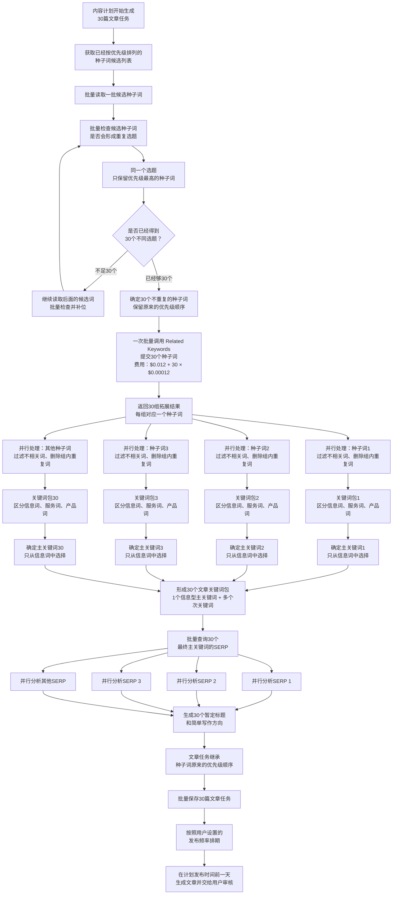
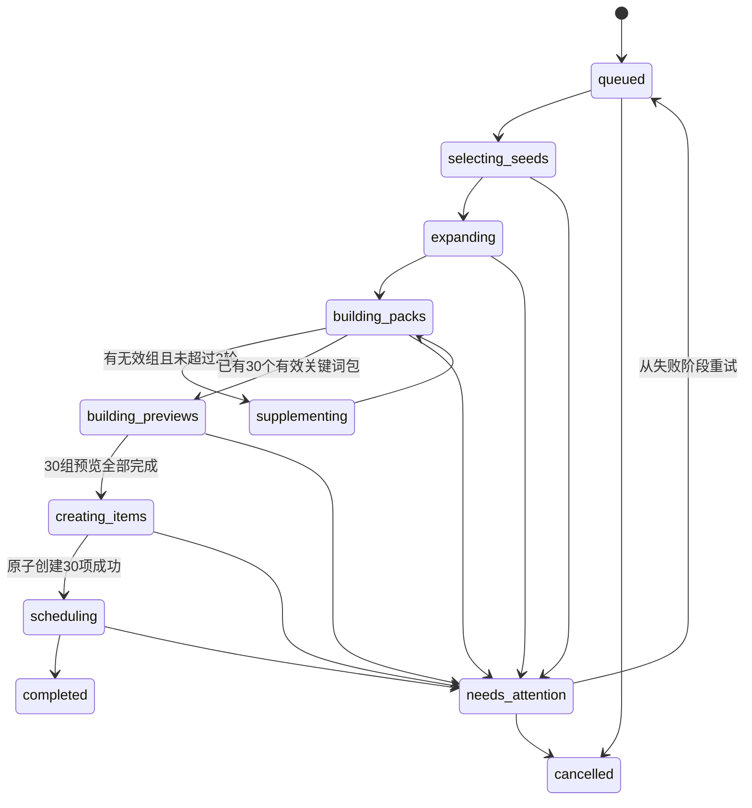
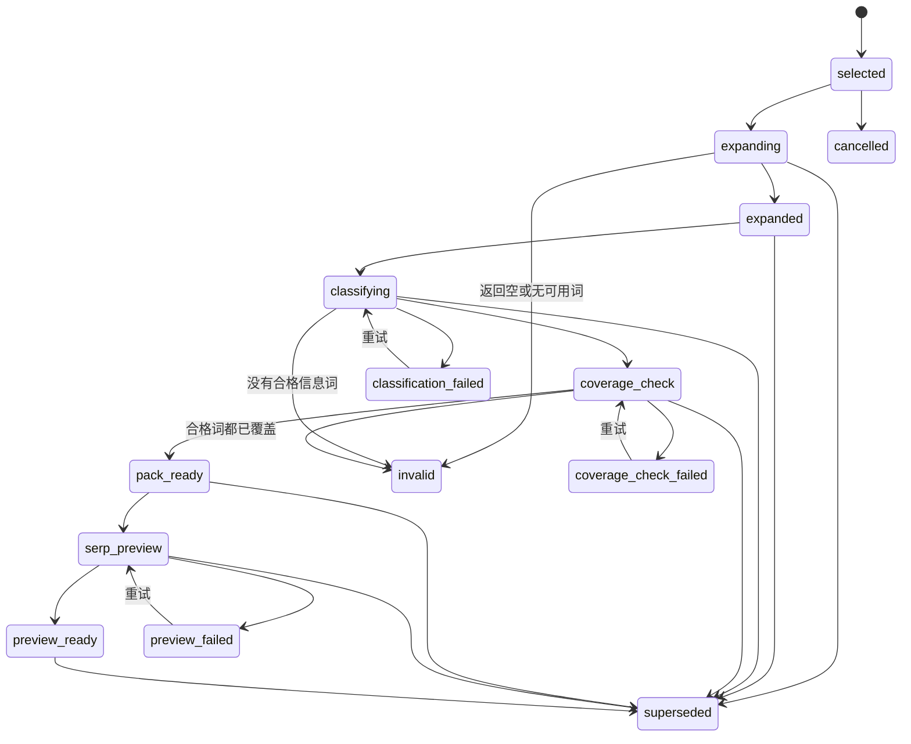
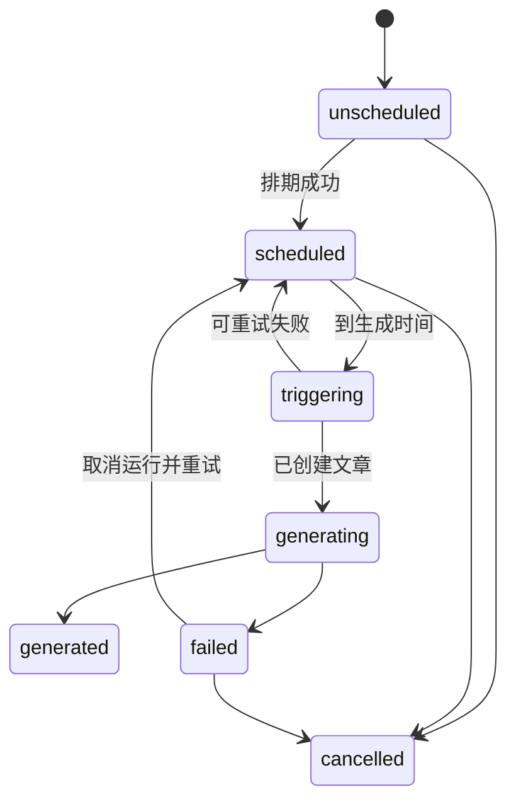

# 内容计划后端需求任务书 V1.0

> 状态：业务流程已确认，本文用于开发、测试和验收  
> 更新日期：2026-08-05  
> 当前项目代码：`F:\seo-repo`，分支 `integration/all-modules-20260804`，基线 commit `3bc86f32f30ef0289362d5423589ac0761eeed49`  
> 开源代码证据：见 `F:\seo\docs\内容计划流程-开源项目参考调研-V1.0.md`

## 1. 背景、目标和边界

### 1.1 说人话的背景

项目已经有关键词库，也已经有文章生成流程。现在缺少中间这一段：系统怎样从一大批排好优先级的关键词里，自动选出接下来要写的内容，整理成可以直接交给文章生成流程的任务，并按用户设置的频率排到日历里。

内容计划不是“让用户自己挑30个词”，也不是“现在就生成30篇文章”。它先准备30个计划项。每个计划项说明准备写什么、主要争取哪个关键词、还要覆盖哪些相关词、暂定标题和方向是什么、哪天发布、哪天开始生成。到触发时间才创建真正的文章。

### 1.2 本期目标

一次自动计划任务默认准备30篇文章计划，完成以下结果：

- 从关键词模块提供的已排序候选词中选出30个明显不重复的种子词。
- 一次批量拓展30个种子词，并保留每组结果与原种子词的关系。
- 每组形成“1个信息型主关键词 + 默认最多5个次关键词”的文章关键词包；人工调整后最多8个次关键词。
- 只查询30个最终主关键词的SERP，生成暂定标题和简单写作方向。
- 保留种子词原来的优先顺序，不在内容计划中重新打分或二次排序。
- 原子保存计划项，并按用户设置的发布频率排期。
- 默认在发布日期前一天创建文章并启动已有文章生成流程。
- 支持手动增加第31篇及以后计划，支持用户修改关键词包、标题、方向和日期。

### 1.3 明确不做

- 不修改关键词模块的优先级算法。
- 不在内容计划中重新计算关键词分数。
- 不把发布频率换算成本次生成多少篇；本次目标始终是30篇。
- 不在拓词后做30组之间的统一去重。
- 不为所有拓展词查询SERP，只查最终主关键词。
- 不在计划阶段抓取竞争文章全文、生成完整大纲或写正文。
- 不在SERP之后重新选择主关键词。
- 不在计划末尾执行第二次文章排序。
- 不把计划项和文章保存成同一个对象。
- 不实现WordPress、Ghost或其他CMS的真实发布；内容计划只负责提前生成、用户审核条件和向独立发布模块交付。

## 2. 已确认流程图

下面的主流程保持不变。失败重试、补词两轮、AI兜底、手动添加和用户编辑是各节点的处理规则，不改变主流程的先后关系。



## 3. 上下游合同

### 3.1 内容计划从关键词模块接收什么

内容计划接收所有已经被关键词模块判定为可用的关键词，不要求输入词本身必须是信息词，但必须保留类型信息。服务词、产品词不能直接成为博客文章主关键词，仍可以作为种子词，经拓展后找到信息型主关键词，也可以在与文章主题一致时成为次关键词。

每个候选词至少要提供：

| 字段 | 必填 | 用途 |
|---|---:|---|
| `keyword_id` | 是 | 全程引用原关键词，禁止AI改写ID |
| `keyword` | 是 | 种子词文本 |
| `priority_score` | 是 | 只用于在批次开始时继承关键词模块现有顺序；空值候选不进入自动计划 |
| `intent` | 否 | 现有类型信号，不作为最终主关键词的唯一判断 |
| `search_volume` | 否 | 主关键词条件相近时的选择信号 |
| `keyword_difficulty` | 否 | 随输入保留，本流程不重新打分 |
| `country`、`language` | 是 | Related Keywords与SERP市场参数 |
| `coverage_status` | 是 | `uncovered`才可进入自动计划 |
| `covered_url`或覆盖关系ID | 否 | 说明为什么已覆盖词被排除 |

关键词模块负责提供最终“网站是否已经写过”的答案。内容计划不重复爬站判断，但还要排除：

- 已进入其他未取消计划的关键词。
- 已经触发生成或已生成文章的关键词。
- 本批次AI判断为与更高优先级候选词属于同一明显选题的关键词。

#### 关键词覆盖批量查询合同

种子词已经在关键词库中，可以直接读取覆盖状态。Related Keywords和AI兜底产生的新词可能没有`keyword_id`，因此关键词模块还必须向内容计划提供按文本批量查询覆盖关系的内部合同。内容计划只调用该合同，不自行爬站或判断URL内容。

```json
{
  "project_id": "project-1",
  "keywords": [
    {"request_id": "rk-001", "keyword_id": null, "keyword": "car detailing cost"},
    {"request_id": "rk-002", "keyword_id": "kw-2", "keyword": "car wash cost"}
  ]
}
```

```json
{
  "results": [
    {
      "request_id": "rk-001",
      "normalized_keyword": "car detailing cost",
      "status": "uncovered",
      "relation_id": null,
      "covered_url": null
    },
    {
      "request_id": "rk-002",
      "normalized_keyword": "car wash cost",
      "status": "covered",
      "relation_id": "coverage-2",
      "covered_url": "https://example.com/car-wash-cost"
    }
  ]
}
```

合同规则：

- `request_id`由内容计划生成，响应必须逐项原样返回；每个输入恰好对应一个结果。
- `status`只允许`uncovered`、`covered`、`unknown`。
- `covered`必须提供覆盖关系ID或URL；`unknown`不能按`uncovered`处理。
- 查询对象是项目当前有效URL/文章覆盖关系，并包含已发布文章和已进入文章生成流程的主关键词关系。
- 一次最多查询100个文本；超过时由内容计划分批，但同一准备版本使用固定请求哈希。
- 上游整体不可用或响应缺项时，准备记录进入`coverage_check_failed`。单个候选返回`unknown`时，该候选不能成为最终主关键词；如果同组还有明确`uncovered`候选，可以继续选择，否则准备记录进入`coverage_check_failed`。任何情况下都不得把`unknown`猜成未覆盖。
- 新拓展词不需要先写入关键词库。覆盖查询以`project_id + normalized_keyword`工作，返回结果只保存在内容计划准备记录中。

该合同是内容计划开工前置依赖，验收使用关键词模块的假实现和真实集成测试各覆盖一次。

### 3.2 内容计划交给文章生成什么

到触发时间后，计划项向现有文章生成流程提供不可变快照：

- `plan_item_id`
- 信息型主关键词
- 次关键词及各自类型
- 用户最终确认的标题和写作方向
- 标题、方向是否为用户修改
- 项目、国家、语言
- 计划发布日期
- SERP预览结果引用和生成时间

系统自动生成的标题和方向只是预览，正式生成时允许文章流程重新判断。用户修改过的标题和方向是正式要求，文章流程必须读取，不能静默覆盖或丢弃。

#### 内部文章创建合同

内容计划不调用面向普通用户、只有`primary_keyword`的旧入口，而是调用扩展后的内部入口。请求保存为ArticleRun的不可变输入快照：

```json
{
  "plan_item_id": "plan-1",
  "plan_item_version": 4,
  "project_id": "project-1",
  "primary_keyword": "car detailing cost",
  "secondary_keywords": [
    {"keyword": "mobile car detailing cost", "type": "service"}
  ],
  "title": {
    "value": "How Much Does Car Detailing Cost?",
    "policy": "locked"
  },
  "writing_direction": {
    "value": "Explain the main price ranges and the factors that change the final price.",
    "policy": "locked"
  },
  "serp_snapshot_id": "serp-1",
  "country": "US",
  "language": "en",
  "planned_publish_at": "2026-08-12T02:00:00Z"
}
```

合同规则：

- `policy`只允许`suggested`或`locked`。系统预览使用`suggested`；用户改过的字段使用`locked`。
- `title.policy=locked`时，文章最终标题除首尾空白规范化外必须与输入完全一致。
- `writing_direction.policy=locked`时，原文必须原样进入写作提示词和ArticleRun输入快照；正式文章可以自然表达，但生成流程必须输出逐条约束检查。未满足时ArticleRun使用现有`completed_with_warnings`，同时设置`publication_status=complete_draft`、`review_status=pending_review`并记录`locked_requirement_failed`警告，不能标记为可发布。
- `suggested`字段允许正式生成重新判断并替换，但原预览值仍保存在输入快照中供审计。
- 一个计划项一生只对应一个Article。固定文章幂等键为`content-plan:{plan_item_id}:article`；同一计划项已经存在文章时返回原Article，不再创建第二篇。每个计划版本最多启动一个ArticleRun，运行幂等键为`content-plan:{plan_item_id}:v{plan_item_version}:run`。用户取消旧Run并修改计划后，复用同一Article，以新版本创建一个新Run。
- `plan_item_id + plan_item_version`唯一绑定一份文章运行输入；新Run必须保存新版本快照，不能覆盖旧Run的输入和审计记录。
- 创建文章前再次读取计划项版本和状态。版本不匹配、计划已取消或已被其他worker领取时返回409。
- 次关键词按保存顺序全部传入，文章模块不能只取主关键词后丢弃关键词包。
- 文章生成完成后，运行状态、系统发布质量状态和用户审核状态必须分开：运行状态回答“生成是否完成”，`publication_status`回答“系统质量是否达到发布条件”，`review_status`回答“用户是否已经审核”。系统质量合格不能代替用户批准。

## 4. 全局业务规则

1. 自动批次的目标数固定为30。所谓“30篇库存”是30个可排期的计划项，不是30个裸关键词，也不是30篇已经生成的文章。
2. 同项目同时只能有一个未结束的自动批次。重复点击必须返回现有批次，不得再次付费。
3. 候选顺序以批次开始时关键词模块的`priority_score DESC`为准，同分依次按`normalized_keyword ASC`、`keyword_id ASC`打破平局。内容计划在批次开始时把候选ID、分数和顺序固化成自己的只读快照`source_rank=1..N`；之后只会跳过不可用项，不会改分或二次排序。本批次运行期间上游分数变化和新入库关键词不进入这份快照，下次新批次再使用最新结果。
4. `candidate_window_size=50`；首次和后续每个候选窗口最多读取50个可用词，候选池末尾不足50个时按实际数量处理，不视为异常。AI只做宽松的重复选题判断；不足30时按稳定游标继续读取下一窗口。
5. AI只能返回已有关键词ID、保留/删除关系和简短原因；不得造词、改词、漏掉输入ID或重新排序。
6. 去重只合并明显会写成同一篇文章的词。`car detailing cost`、`cost of car detailing`、`how much does car detailing cost`可以合并；`car detailing cost`、`car detailing vs car wash`、`how often should you detail your car`不能在种子阶段强行合并。
7. 首次30个种子词一次批量调用Related Keywords。用户确认的费用公式为`$0.012 + 种子词数量 × $0.00012`；30词为`$0.0156`。实际结算仍以供应商响应中的cost为审计事实。
8. 拓展结果按种子分组。只做组内相关性过滤和精确去重，不做跨组统一去重。
9. 每个有效关键词包必须有且只有1个信息型主关键词。产品词和服务词不能成为主关键词。
10. 系统自动选择0至5个次关键词；只有1至2个真正合适时允许少于3个，不凑数。用户调整后的正式关键词包最多8个次关键词。
11. 只查询最终主关键词的SERP。SERP用于标题和简单方向，不用于换主关键词。
12. 30个SERP是30个单关键词逻辑任务，默认最多5个并发；这不是一个包含30个关键词的SERP HTTP请求。
13. 计划项继承种子词顺序，后面没有第二次排序。
14. 自动30篇之外，手动增加一篇后总数变成31，不挤掉自动计划。
15. 计划项和文章分开保存。触发后才创建文章，并把`article_id`写回计划项。
16. 暂停状态与发布频率分开保存。暂停不清空频率、不删除排期日期；它阻止系统按时间自动触发新文章，也阻止向发布模块提交请求，但不阻止用户明确“立即生成”草稿或把计划改到今天/明天后触发草稿生成。

关键词规范化在本模块内固定为：Unicode NFKC、去除首尾空白、连续空白折叠成一个空格、按Unicode规则转小写。V1不删除标点、不去重音、不做词干化或同义词替换。数据库精确唯一约束和请求哈希都使用该规范化结果；“是否同一选题”仍由CP-02的宽松AI判断负责。

## 5. 流程节点任务书

### CP-01 创建自动计划批次

**目标**

为一次“准备30篇计划”建立唯一、可恢复、可审计的执行批次，防止重复点击产生两批任务和两次费用。

**输入与前置条件**

- 项目存在。
- 关键词库已完成并能按优先级降序读取候选词。
- 项目已配置国家、语言；`content_plan_settings`已有有效IANA时区，例如`Asia/Shanghai`。账号时区只可用于首次初始化该设置。
- 同项目没有`queued`、各执行阶段或`needs_attention`状态的未结束自动批次。

**执行规则**

1. API接收`Idempotency-Key`。
2. 在同一数据库事务中创建`content_plan_batch`和工作流派发记录。
3. 保存目标数30、`candidate_window_size=50`、最大补词轮数2、流程版本、模型版本、市场和时区快照。
4. 启动独立的`ContentPlanGenerationWorkflow`。工作流载荷只传`batch_id`，业务输入从数据库读取。

**输出与保存**

- 返回`202 Accepted`和批次ID。
- 批次状态为`queued`，工作流启动后为`selecting_seeds`。

**失败处理、幂等和并发**

- 同一幂等键和相同请求返回原批次；同一幂等键但请求不同返回409。
- 同项目已有自动批次运行时返回409，并返回现有批次ID。
- API落库成功但Temporal启动失败时，派发记录保持`pending`，后台派发器重试。

**不做什么**

- 此时不创建文章。
- 不按发布频率减少或增加目标30。

**验收**

- 连续点击两次只产生一个批次和一次外部调用链。
- API进程在落库后宕机，恢复后仍能派发工作流。
- 不同项目可以并行创建各自批次。

### CP-02 获取候选词并宽松去重，直到选够30个种子词

**目标**

从已排序候选池中选出30个明显不重复、未覆盖、未进入其他计划的种子词，同时保持原顺序。

**上下文**

关键词入库已经做过大范围去重，本步骤不是重做关键词库。因为数据量大，仍可能有漏网的同选题词，所以只对本次即将采用的候选再检查一次。

**输入**

- 本批次开始时按`priority_score DESC`、`normalized_keyword ASC`、`keyword_id ASC`生成的不可变候选顺序。
- 关键词覆盖关系。
- 当前项目所有未取消计划项及已触发文章的关键词关系。
- 每个候选窗口最多50个可用候选词。

**执行规则**

1. 第一次进入本节点时，内容计划用一条受事务保护的内部查询读取当前所有基础合格候选：`status=active`、`review_status=approved`、`priority_score IS NOT NULL`，并排除当时已覆盖、已在未取消计划中或已触发生成的词。按`priority_score DESC`、`normalized_keyword ASC`、`keyword_id ASC`排序后，批量写入`content_plan_candidates`并分配唯一连续的`source_rank=1..N`。这份候选快照一旦完成便不再追加或重排；事务失败时不留下半份快照。
2. 第一窗口从快照读取`source_rank`最小的最多50个候选，把ID、原词、已有类型和必要业务上下文交给AI；快照总数不足50个时按实际数量提交。读取每个窗口时还要重新检查最新覆盖和计划占用，快照后变成不可用的词直接跳过并记录原因，不能因为快照旧而采用。
3. AI按“是否明显会写成同一篇文章”返回重复组。规则要宽松，不因共享核心词就合并。
4. 每个重复组只保留`source_rank`最靠前者。
5. 按原顺序得到保留列表；不足30时使用上一窗口最后一条的`source_rank`作为稳定游标，继续读取后面最多50个候选。数据库条件使用`source_rank > last_source_rank`，不能重新调用现有使用offset的关键词列表接口。
6. 后续窗口中的新候选既要互相比较，也要与已经保留的种子比较。每轮仍固定最多50个新候选，不按当前缺口只读取N个，避免一次宽松去重后仍反复缺词。
7. 重复执行，直到选够30个或候选池用完。每轮读取后只补缺口，不替换已经保留的更高优先级种子。
8. 选中的30个种子保存`source_rank`和`plan_order=1..30`；批次同时保存当前窗口号和最后读取游标，重试时从已保存位置继续。

**AI输出合同**

```json
{
  "decisions": [
    {"keyword_id": "kw-2", "action": "drop", "same_topic_as": "kw-1", "reason": "明显是同一成本问题"},
    {"keyword_id": "kw-3", "action": "keep", "same_topic_as": null, "reason": "比较型选题不同"}
  ]
}
```

程序必须校验：每个输入ID恰好出现一次；`same_topic_as`只能指向本次输入或已保留ID；AI不能增加ID、修改关键词、输出新排序。输出不合法时按同一请求键重试，仍失败则批次进入`needs_attention`，不能凭不完整结果继续付费拓词。

**失败处理**

- AI结构修正一次后仍不符合输出合同时，批次进入`needs_attention`，不采用部分结果。
- 候选池读取完仍不足30个种子时，批次进入`needs_attention`并保存缺口数，不调用Related Keywords。
- 覆盖状态为`unknown`或覆盖查询失败的候选不能按“未覆盖”保留；等待上游覆盖合同恢复后从当前候选阶段重试。

**不做什么**

- 不修改关键词模块给出的优先级，也不让AI重新排序。
- 不对整个关键词库重新做严格去重，只宽松检查本次候选是否明显会写成同一篇文章。
- 本步骤不拓词、不查SERP、不创建正式计划项。

**保存与审计**

- 每个候选逐条保存到`content_plan_candidates`，包括读取窗口、原排名、保留/跳过、跳过原因、代表词ID和AI决定版本；不能只把可恢复状态放进`decision_summary_json`。
- AI调用保存请求哈希、模型、提示词版本、token、实际费用、供应商请求ID、缓存命中和错误。

**并行边界**

一个候选窗口作为一次AI判断，不为50个词逐词调用AI。后续窗口的AI输入包括“本窗口最多50个新候选 + 已保留种子的ID、关键词和排名”，已保留词只作为比较基准，AI不能删除或重排它们。多个项目批次可并行，同一项目自动批次不可并行。

**验收**

- 前50个含5组明显同选题时，保留每组排名最高者并继续向后补足30。
- 第一窗口只保留24个时，第二窗口仍最多读取50个，不是只读取缺口6个；第二窗口从保存的`source_rank`游标继续且不重复、不跳项。
- 批次运行时上游刷新关键词分数或新增关键词，当前批次的候选顺序和范围不变；新批次才看到新结果。
- `cost`和`vs`含同一核心词但问题不同，默认均保留。
- AI改变顺序不生效，最终`plan_order`始终来自关键词模块原顺序。
- 候选池耗尽且不足30时不调用Related Keywords，批次进入`needs_attention`并给出缺少数量。

### CP-03 一次批量调用Related Keywords

**目标**

用一次供应商批量请求拓展30个种子，并可靠恢复“哪组结果属于哪个种子”。

**输入**

- 30个种子词及`plan_order`。
- 项目国家、语言。
- 固定的Related Keywords参数版本。

**执行规则**

1. 一次HTTP/API批次中放入30个种子请求项，不做30次前端调用。
2. 本地为每个请求项记录`request_index`、`seed_keyword_id`和原词；如供应商字段支持tag，则同时写入内部组ID。
3. 响应必须通过tag、回显关键词或请求索引与种子双重核对。映射不明确的结果标记失败，禁止猜测归属。
4. 每个种子最多请求150条结果。保存供应商返回的关键词、搜索量、难度和意图等原始可用字段。是否查询额外SEO指标由该接口本身返回决定，本流程不为拓展词追加Keyword Overview调用。
5. 首次30词批次不算补词轮次。

**中间结果保存**

- 发起外部请求前，30个种子各创建一条`content_plan_preparations`，状态为`expanding`。
- 每个供应商返回词逐条保存到`content_plan_preparation_keywords`，同时保存原始文本、规范化文本、供应商位置、指标、意图、请求轮次和原始响应项。
- 保存一组成功结果和将该准备记录改为`expanded`必须处于同一事务；分类activity领取后再改为`classifying`。
- 空组仍保存准备记录，状态为`invalid`、错误码`related_keywords_empty`，不能用“没有记录”表示空结果。
- 工作流恢复时先读取准备记录和外部请求账本；已经完整保存的组不再请求供应商。

**费用和审计**

- 预估费用：`$0.012 + 30 × $0.00012 = $0.0156`。
- 账单以供应商返回的实际cost为准，同时保存预估、实际、请求ID、端点、种子数和缓存状态。
- 同一`batch_id + round + request_hash`只允许一个有效外部请求。对“已提交但响应未知”的请求标记`uncertain`，人工或自动核账后再决定是否重发，避免重复扣费。

**失败处理**

- 网络超时、5xx、限流：技术失败，按退避策略重试，不占补词轮次。
- 已扣费但失败：记录`charged_failed`，不得无审计地自动重复付费。
- 返回空：数据无效组，进入CP-05补足规则。
- 仅部分种子失败：成功组继续处理，失败组统计为缺口。

**不做什么**

- 不为拓展词追加Keyword Overview或其他指标查询。
- 不把一次30种子的批量请求拆成前端逐词调用；真实端点是否支持该合同必须先通过CP-00。
- 不在本步骤分类关键词、选择主关键词或查询SERP。

**验收**

- 一次批次含30个请求项，响应能逐组还原。
- 第7组为空不会丢失其他29组。
- 同一批次工作流重放不会再次发出已完成的付费请求。
- 实际费用和供应商请求ID可以从批次详情查询。

### CP-04 并行清洗、分类、确定主关键词并形成关键词包

**目标**

把每个种子组独立整理成一篇文章可直接使用的关键词包。

**输入**

- 原种子词。
- 该种子的Related Keywords结果。
- 项目业务资料、国家、语言。
- 关键词覆盖关系和现有计划关系。

**每组处理规则**

1. 合并原种子词和拓展结果，但保留每个词的来源。
2. 删除空值、大小写/空格规范化后的精确重复；同义近似词不在这里强制删除。
3. 过滤与网站业务明显无关的词。
4. 将保留词分成`informational`、`service`、`product`。类型不确定时标记`unknown`，不能假装确定。
5. 只从`informational`中选最终主关键词。
6. 每个信息词同时标记主词适配等级：`strong`、`acceptable`或`ineligible`。能代表整篇文章、能自然覆盖多个组内词且表达自然时为`strong`；可以独立写但覆盖范围较窄时为`acceptable`；过窄、残缺、纯导航或不是文章问题时为`ineligible`。
7. 有`strong`时只在`strong`中选主词；没有`strong`时才从`acceptable`中选；两者都没有时整组无效。同一等级内依次按可覆盖的合格次词数量降序、搜索量降序、供应商原始位置升序、规范化关键词字典序确定唯一主词。搜索量为空按最低处理；供应商位置为空排在有位置的候选之后。
8. 次关键词可以包含信息词、服务词、产品词或`unknown`，但必须与该篇文章是同一问题，且能够自然成为正文中的子问题或说明内容。`unknown`不得成为主词，保存时不得伪装成其他类型。
9. 确定主关键词后，程序只在该主词的合格`secondary_candidate_ids`中选择次关键词。排序固定为：信息型子问题优先；然后按搜索量降序；再按供应商原始位置升序；最后按规范化关键词字典序。服务词、产品词和`unknown`只有在确实属于同一文章、且排在信息型子问题之后时才可入包。
10. 系统自动取排序后的前5个次关键词。合格词只有1至2个时照实保留，不补足3个；没有合格次词时允许只有主关键词。其余合格候选继续保存在准备记录中，标记`qualified_not_selected`，不进入正式关键词包。
11. 用户可在CP-11手动增删次关键词，正式包硬上限为8个。系统和用户都不能为了达到数量加入不相关词。

**AI输入与输出合同**

程序先为原种子和每个拓展词生成稳定`candidate_id`。一次AI请求处理一个准备组，最多151个输入词，不把不同种子组混在一次分类判断中。

```json
{
  "seed_keyword_id": "kw-1",
  "candidates": [
    {
      "candidate_id": "ck-001",
      "keyword": "car detailing cost",
      "search_volume": 2400,
      "provider_position": 3
    },
    {
      "candidate_id": "ck-002",
      "keyword": "mobile car detailing cost",
      "search_volume": 720,
      "provider_position": 5
    },
    {
      "candidate_id": "ck-003",
      "keyword": "average car detailing price",
      "search_volume": 590,
      "provider_position": 8
    }
  ]
}
```

```json
{
  "decisions": [
    {
      "candidate_id": "ck-001",
      "relevance": "same_topic",
      "keyword_type": "informational",
      "primary_fit": "strong",
      "secondary_candidate_ids": ["ck-002", "ck-003"],
      "reason_code": "answers_cost_question"
    }
  ]
}
```

程序必须校验：

- 每个输入`candidate_id`恰好出现一次，AI不能新增、漏掉、重复或改写ID。
- `relevance`只允许`same_topic`、`unrelated`；不确定时用`unrelated`并给出`uncertain_relevance`原因，不能为了凑词保留。
- `keyword_type`只允许`informational`、`service`、`product`、`unknown`。
- `primary_fit`只允许`strong`、`acceptable`、`ineligible`，非信息词必须为`ineligible`。
- `secondary_candidate_ids`表示“如果这个词成为主词，哪些组内词可以自然作为同一篇文章的次词”。只能引用同组输入ID、不能包含自己、不能重复，并且被引用词的`relevance`必须为`same_topic`；`ineligible`候选仍允许该字段为空，但不会参与主词选择。AI返回数组顺序没有决定权。程序先按规范化关键词去重，用剩余合格ID数量执行第7条主词排序，再按第9至10条规则确定最终次关键词及`package_position`。
- V1的`reason_code`只允许：`answers_how_to`、`answers_cost_question`、`answers_comparison`、`answers_frequency`、`answers_definition`、`same_article_variant`、`same_article_subquestion`、`service_transactional`、`product_transactional`、`navigational_or_fragment`、`too_narrow_for_primary`、`unrelated_business`、`uncertain_relevance`。展示文案由程序映射；新增值必须升级分类合同版本，不能接受不可控长文本代替结构字段。
- 格式或ID校验失败时，使用同一请求键携带校验错误修正一次；第二次仍失败，准备记录进入`classification_failed`。网络、限流和5xx按供应商重试策略处理，不把技术重试算作补词轮次。

分类完成后，程序按上述固定规则排列主词候选，再批量调用第3.1节覆盖合同检查候选。已覆盖或`unknown`的候选降为`ineligible`并继续选择下一候选；全部明确为已覆盖时整组无效；因`unknown`或覆盖查询失败而无法得出最终答案时进入`coverage_check_failed`。AI不直接输出最终主关键词，避免模型绕过类型、指标、覆盖和稳定排序规则。

**失败处理**

- AI结构修正一次后仍不符合分类合同，该准备记录进入`classification_failed`，其他组继续处理。
- Related Keywords有结果但没有合格信息型主词，或候选均明确已覆盖、与既有计划冲突时，该组记为业务无效并进入CP-05。
- 覆盖结果为`unknown`或覆盖查询技术失败时进入`coverage_check_failed`，不把该组算作业务无效，也不消耗补词轮次。

**结构化输出**

```json
{
  "seed_keyword_id": "kw-1",
  "primary": {"keyword": "car detailing cost", "type": "informational", "source": "related"},
  "secondary": [
    {"keyword": "mobile car detailing cost", "type": "service", "source": "related"}
  ],
  "excluded": [
    {"keyword": "car polish for sale", "reason": "与本组文章问题不一致"}
  ]
}
```

程序生成关键词包时校验主词必须出现在输入词集合、类型必须为信息型、覆盖状态必须为`uncovered`、主词不能同时出现在次词中。词和ID不能由AI凭空生成。

**保存与恢复**

- AI逐词判断、覆盖查询结果、程序选出的主词、排除原因和关键词包版本均写入准备表。
- 关键词包完成后准备状态为`pack_ready`。单组事务失败只回滚该组，不影响其他已完成组。
- 工作流重放只处理状态不在`pack_ready/preview_ready`的准备记录。

**并行方式**

30组可以受控并行。并发上限由worker配置控制，单组失败不取消已经完成的其他组。并行只改变执行速度，不改变`plan_order`。

**无效组定义**

- Related Keywords返回空。
- 返回词全部明显不相关。
- 没有可用的信息型主关键词。
- 合格信息词已经被网站覆盖或已进入其他计划。

这里的“其他计划”指数据库里已经存在的未取消计划或已触发文章。检查规范化种子词和最终主关键词；任一命中都算冲突。不包含当前批次的30条准备记录。已确认不做30组之间统一去重，因此本步骤不比较或合并当前批次不同组的拓展词和关键词包。

**不做什么**

- 不做30组之间统一去重。
- 不查SERP来决定主关键词。
- 不因服务词或产品词不能做主词就丢弃整个种子；先看拓展结果是否有信息词。

**验收**

- `car detailing`组可选`car detailing cost`为主词，并保留相关成本长尾为次词。
- 同组有9个合格次词时，系统按固定规则只选择前5个，其余保存为`qualified_not_selected`；用户最多可把正式包调整到8个。
- 同组只有2个合格次词时只保留2个，不加入无关词凑到3个。
- 产品购买词不能成为主词。
- AI返回一个未出现在输入中的“更好关键词”时，整组输出被拒绝。
- 30组完成顺序不同，最终计划顺序仍为1到30。

### CP-05 无效组补足30篇

**目标**

在部分种子没有有效拓展结果时，按已确认规则尽量补回30个有效关键词包，并控制额外费用。

**输入与前置条件**

- 首次30组已经完成CP-04，技术失败已单独重试，当前缺口只来自`invalid`业务无效组。
- 候选读取游标、已经保留的种子、无效准备记录及其失败原因均已持久化。
- 当前`content_plan_batches.supplement_round`为0、1或2；工作流不得根据内存计数猜测轮次。

**规则**

1. 首次30词调用结束后统一统计无效组数量N，不能发现一个空组就单独调用一次。
2. 从候选快照的当前`source_rank`游标继续向后读取，每个窗口仍最多50个；按CP-02重新检查覆盖、计划占用和宽松重复，直到得到N个新的有效种子或候选池耗尽。这里的N是“需要补上的有效种子数”，不是“只读取N条原始候选”。
3. 将本轮N个新种子一次批量调用Related Keywords，并执行CP-04。
4. 最多补2轮。每轮结束后统一统计下一轮缺口。
5. 两轮后仍有缺口，对仍缺少的组使用AI拓展信息型长尾候选。AI输入必须包含种子词、网站业务和语言，只能产出候选词，不能直接宣布任务有效。
6. AI候选仍要执行相关性、类型、主关键词、覆盖、计划重复和后续SERP检查。
7. AI仍不能形成合格包或AI调用失败时，批次进入`needs_attention`。系统保留已完成结果，但不把未经验证的假任务凑成30篇。

补位种子保留自己在关键词模块中的`source_rank`。无效种子从最终集合移除，新种子按这个原排名自然排在更后面；30个有效包形成后，将保留顺序连续编号为`plan_order=1..30`。这只是继承上游顺序，不重新计算分数，也不是内容计划的第二次排序。

每个缺口保留“当前补位种子”。第1轮或第2轮的新种子无效时，该新种子成为该缺口最新的当前种子；两轮结束后的AI兜底使用这个最新种子。若补位候选池提前耗尽，未能发出的空轮不产生DataForSEO费用，系统直接使用该缺口最后一个无效种子进入AI兜底；没有任何可用种子的缺口进入`candidate_pool_exhausted`，AI不得凭空创造种子主题。

**AI兜底输出合同**

- 每个缺口单独对应一个补位种子，AI每组最多返回50个候选长尾词。
- 输出只包含`keyword`和简短`generation_reason`。程序负责规范化、精确去重，并在保存后生成`candidate_id`；AI不得指定主关键词、类型或搜索量。
- 关键词长度为2至200字符，不接受URL、完整句子段落、空值或与输入语言不一致的词。
- AI返回词统一保存为`source=ai`、SEO指标为空，随后完整执行CP-04的分类、固定主词选择和覆盖查询。
- 同一AI请求最多进行一次结构修正；仍不合法则该组失败。AI兜底不再开启第三轮Related Keywords，也不再递归调用AI拓词。

**失败处理**

- Related Keywords技术失败按第9.1节处理，不增加`supplement_round`；只有取得明确业务结果后才统计本轮缺口。
- 候选池提前耗尽时，使用本节点前述规则确定的当前种子进入AI兜底；没有任何可用种子的缺口进入`candidate_pool_exhausted`。
- 两轮补词和AI兜底后仍不足30个有效包时，批次进入`needs_attention`并保留全部中间结果，不创建正式计划项。

**不做什么**

- 不开启第三轮Related Keywords，不无限补词，也不递归调用AI。
- 不用AI生成的词绕过分类、覆盖、计划冲突和SERP检查。
- 不因为缺口而改变已经有效的关键词包或重新排列原有顺序。

**成本说明**

补词会增加费用，因为每轮都是新的Related Keywords请求。成本上限不是固定`$0.0156`：

```text
首次费用 = $0.012 + 30 × $0.00012
第1轮补词 = $0.012 + N1 × $0.00012
第2轮补词 = $0.012 + N2 × $0.00012
AI兜底费用 = 按模型实际用量记录
```

因此批次详情必须分别显示首次、补词第1轮、补词第2轮和AI兜底费用，不能只展示首次估价。

**验收**

- 首次3组无效时，只发一次含3个新种子的补词请求。
- 第1轮补回2组后，第2轮只补剩余1组。
- 首次调用不计入“两轮”限制。
- 两轮后AI生成的词若已被覆盖，不得保存为有效计划。
- 供应商技术失败不会错误增加补词轮次；服务重启后从数据库中的原轮次和缺口继续。

### CP-06 批量查询最终主关键词SERP并生成预览

**目标**

用搜索结果确认用户对该主关键词期望看到的文章形式，并生成日历中可编辑的暂定标题和简单方向。

**输入**

- 30个已经确定、不会再由SERP替换的信息型主关键词。
- 每个关键词包的次关键词。
- 项目国家、语言。

每组AI分析输入使用结构化SERP摘要，不把未经限制的供应商原始响应直接拼进提示词。每条organic、PAA和related search都生成稳定`evidence_id`，并携带标题、摘要、URL或问题文本。

**执行规则**

1. 只为最终主关键词查询SERP，共30组。
2. 当前`DataForSEOClient.search()`每次只接收一个关键词，因此本步骤创建30个单关键词逻辑任务，不构造一个包含30个关键词的SERP HTTP请求。
3. 复用当前项目`backend/api/app/modules/content/dataforseo.py`的DataForSEO客户端、缓存、location/language转换、cost和provider request ID解析。
4. 在上层增加受控并行编排和逐组失败隔离。`CONTENT_PLAN_SERP_CONCURRENCY`默认5且产品上限为5，即同一项目同一批次最多同时发出5个SERP请求；完成一个再领取下一个。不同项目还要受worker全局并发和供应商限流共同约束。
5. 每组先查缓存。提供给预览分析的结构化摘要只保留前10条organic、最多10个PAA问题、最多10个related searches和已解析的SERP features；供应商原始响应仍按审计规则保存，但不整包进入AI提示词。
6. 分析organic标题、摘要、页面类型、SERP features、PAA和related searches，概括搜索者想解决的问题与常见内容形式。
7. 生成一个暂定标题和1至3句话的简单写作方向。方向说明文章重点覆盖什么，不生成H2大纲。
8. 预览输出保存`generated_by=system`和SERP查询时间。

**预览输出合同**

```json
{
  "title": "How Much Does Car Detailing Cost?",
  "writing_direction": "Explain typical price ranges, what changes the price, and how readers can estimate a realistic budget.",
  "evidence_ids": ["organic-1", "paa-2"]
}
```

- `title`必须是单行纯文本，1至120字符。
- `writing_direction`必须是1至3句话、最多600字符的纯文本；不能包含H2/H3、编号提纲或正文段落。
- `evidence_ids`至少1个，只能引用本组输入的SERP证据ID，用于追溯预览依据。
- AI不得修改主关键词或关键词包。格式、长度、证据ID不合法时携带校验错误修正一次；第二次仍失败，该准备记录进入`preview_failed`。

**失败处理**

- 缓存命中不产生供应商费用，但仍记录缓存命中。
- 技术错误按请求键重试。
- 技术错误超过重试上限，或SERP确实为空时，保留准备记录中的关键词包，将该准备记录标记为`preview_failed`，批次进入`needs_attention`，不生成正式计划项，也不生成假SERP结论。
- 单组失败不重复查询其他29组。

SERP原始摘要、使用的organic/PAA/related-search项目、费用、缓存状态和生成预览逐组保存到`content_plan_serp_snapshots`。重试只更新该准备记录所引用的当前SERP快照；历史快照保留审计。

**不做什么**

- 不抓竞争文章全文。
- 不生成完整Brief、完整大纲或正文。
- 不依据SERP把主关键词换成另一个词。

**验收**

- 30个主词只产生30组SERP任务，不对次关键词查询。
- 运行时观测到的同项目批次SERP并发数不得超过5；单组失败只重试该组，成功组的供应商请求数不增加。
- 每组AI输入最多包含10条organic、10个PAA和10个related searches，不能把未限制的原始响应传入模型。
- 标题和方向能追溯到使用的SERP结果。
- 同一SERP缓存命中时实际费用为0。
- 输出中出现完整大纲时应被长度和字段校验拒绝。

### CP-07 保留原顺序并原子保存30个计划项

**目标**

将完整关键词包和预览一次性保存为30个独立计划项，确保下次文章生成无需重新选词。

**输入与前置条件**

- 恰好30条当前准备记录，`plan_order`连续为1至30，状态全部为`preview_ready`。
- 每条准备记录恰好有1个合格主词、0个或多个次词、1个当前SERP快照、合法标题和方向。
- 批次尚未创建正式计划项；同项目没有与这些种子冲突的既有未取消计划。

**执行规则**

1. 每个计划项继承种子词的`plan_order`，不重新排序。
2. 此前的候选、拓词、分类、覆盖和SERP结果都保存在准备表，不是正式计划项。只有30条当前准备记录全部达到`preview_ready`后，才进入本步骤。
3. 在一个事务中创建30个`content_plan_items`，复制各自当前关键词包到`content_plan_item_keywords`，并绑定SERP快照。任何必填数据缺失时事务整体回滚。
4. 自动批次不存在“先创建29个、最后一组标记`preview_failed`”的状态。SERP失败只存在于准备记录；重试成功后再一次性创建30个正式计划项。
5. 事务开始前批次进入`creating_items`；保存成功后变为`scheduling`。重复执行时先按批次ID检查是否已经完整创建30项，已经完成则直接返回原结果。
6. 对`project_id + normalized_seed_keyword`建立跨`automatic|manual`来源的活跃计划唯一约束，防止自动和手动入口分别创建同一种子。该约束只覆盖未取消计划；同项目已存在冲突时整批回滚并返回冲突计划ID。
7. 关键词包保存当时快照；以后关键词库指标变化不能静默改掉已确认计划。

**每个计划项最少包含**

- 批次ID、项目ID、来源`automatic`。
- 当前准备记录ID、准备版本和SERP快照ID。
- 种子关键词ID、文本、原优先级和计划顺序。
- 主关键词、次关键词及类型、来源。
- 暂定标题、简单方向、是否由用户修改。
- SERP结果引用。
- 发布日期、生成时间、是否手动固定日期。
- 状态、版本号、`article_id`。

**不做什么**

- 不在30组预览全部完成前创建任何正式自动计划项。
- 不只保存主关键词或一段不可查询的关键词包JSON。
- 不在保存时重新计算优先级或改变`plan_order`。

**验收**

- 数据库只能看到0个或完整30个自动计划项，不能保存一半后显示成功。
- 第13组先处理完也不能排到第1位。
- 重新读取计划详情时可完整恢复主词、次词、标题和方向。
- 在事务提交后工作流立即重放，仍然只有原来的30项，不会因重试再创建30项。

**失败处理**

- 任一准备记录缺字段、版本已被替代或出现既有计划冲突时，整个事务回滚，批次进入`needs_attention`并返回具体准备记录或冲突计划ID。
- 数据库瞬时错误使用同一批次幂等条件重试；重试前先核对已创建数量，0项才重新创建，30项直接继续排期，其他数量视为数据完整性错误并停止。

### CP-08 按发布频率排期

**目标**

把已经准备好的计划项放到具体日期。频率只决定日期，不改变任务数量和顺序。

**输入与前置条件**

- 本批次30个`unscheduled`计划项及其固定`plan_order`。
- 项目当前`content_plan_settings`，包括频率、暂停状态、IANA时区、默认本地发布时间和2至3篇循环锚点。
- 同项目所有未取消计划占用的`publish_local_date`。

**频率规则**

| 选项 | 安排日期 |
|---|---|
| 暂停发布 | 独立开关，不改变当前频率和已有日期；阻止按时间自动生成，也阻止向发布模块提交发布请求 |
| 每周1篇 | 周三 |
| 每周2至3篇（默认） | 第一周周二、周四；第二周周一、周二、周五；之后循环 |
| 每周5篇 | 周一至周五 |
| 每周7篇 | 每天1篇 |

**执行规则**

1. `content_plan_settings.timezone`是排期计算的后端权威值，必须是有效IANA时区。首次配置优先读取认证账号的时区；账号没有时区时，创建批次返回`timezone_required`，由用户明确选择后保存。浏览器检测值只能预填，不能直接成为最终值。
2. 一天最多一篇，以项目在用户时区中的自然日为冲突范围。
3. 自动排期从第一个符合频率、未被占用且其`generation_at`仍在当前时间之后的日期开始，按`plan_order`依次分配；已占用日期和已经错过“提前一天10:00”生成点的日期都跳过。
4. 默认发布时间为用户时区当天10:00，保存为`publish_local_date`、`publish_local_time=10:00`和换算后的UTC `publish_at`。用户可以改日期，本期不提供单独修改时刻的界面。
5. 默认生成时间为用户时区发布日前一日10:00，再换算成UTC `generation_at`，不是简单从UTC时间减24小时，避免夏令时错位。
6. 用户把发布日期改到今天或明天时，`generation_at`立即设为当前时间并触发生成。
7. 修改频率只重排尚未生成且没有被用户手动固定日期的计划项。
8. 暂停发布不取消正在生成的文章，也不删除计划项；它阻止调度器按日期自动触发，并阻止未来发布模块领取文章。用户明确点击“立即生成”，或把日期手动改到今天/明天，仍按用户已确认规则立即生成草稿，但在恢复发布前不得向发布模块提交发布请求。
9. `weekly_2_3`启用或切换进入时，将用户时区中“当前日期所在周的周一”保存为`cadence_anchor_week`，该周固定为2篇周，下一周为3篇周，之后交替。普通服务重启或重新排期不得重置锚点；只有用户切换离开后再次选择该频率才创建新锚点。
10. 自动排期必须保证首次到期触发仍能提前一天进行；用户手动改到今天或明天不受该限制，仍按“立即生成”规则处理。
11. `paused`与`cadence`是两个独立设置。暂停时保留`cadence`、`cadence_anchor_week`和所有已有日期；暂停期间仍允许生成新的30项计划并按当前频率排期，供用户预览和修改。
12. 恢复发布时，未来日期仍有效的计划保持原日期。只重新安排“发布日期已经过去、尚未生成、且`date_user_pinned=false`”的计划项，并继续按原`plan_order`寻找新的空日期。
13. 发布日期已经过去但由用户固定的计划项不自动移动，保留原日期并设置`schedule_attention_reason=expired_user_pinned_date`。该标记阻止自动触发，用户必须改到新日期或点击“立即生成”。
14. 暂停和恢复都不能重置`weekly_2_3`的循环锚点。只有用户明确切换离开该频率后再次选择它，才创建新锚点。
15. 修改项目时区时，所有尚未生成的计划保留用户看到的`publish_local_date`和`publish_local_time`，只把`timezone`、`schedule_timezone`、`publish_at`和`generation_at`按新时区重新换算；已生成计划和Article输入快照保持原时区不变。换算必须在一个事务中完成，若新时区下任何计划已错过生成点，则未人工固定日期的计划按当前频率移到下一个可用日期，人工固定日期的计划保留日期并设置`expired_user_pinned_date`。时区修改不改变`plan_order`，也不重置`weekly_2_3`锚点所代表的2篇周/3篇周相位。

**并发和冲突**

- 日期分配和保存必须在事务内锁定项目排期设置及受影响计划项。
- 数据库建立“项目 + 用户本地发布日期”的活跃计划唯一约束或等价事务校验。
- 两个改期请求争抢同一天时，一个成功，另一个返回409并提供冲突计划ID。

**失败处理**

- 时区非法或缺失时不排期，返回`timezone_required`；不能退回服务器时区。
- 自动30项排期必须在一个事务中完成。计算或写入任一项失败时全部回滚，批次进入`needs_attention`，重试时重新读取最新设置和已占用日期。
- 用户同步改期只回滚该计划项；日期冲突返回`schedule_date_conflict`，不自动挤开其他人工固定计划。

**不做什么**

- 频率不决定本批次生成多少项，也不改变已有`plan_order`。
- 前端日历不负责计算或决定权威排期；后端设置、时区和日期约束才是最终结果。
- 暂停不删除计划项、不取消正在生成的文章，也不阻止用户明确发起生成；暂停期间生成的文章只能留作草稿审核。
- 修改暂停开关不触发重排；修改频率只重排未生成且未人工固定日期的计划；修改时区只按第15条迁移，三种设置不能共用一条模糊的“全部重排”规则。

**验收**

- 默认频率按2篇、3篇、2篇、3篇循环，任务顺序不变。
- 每周7篇仍然一天最多一篇。
- 暂停后到期计划不自动创建新文章，已有频率、锚点和日期不变；暂停期间新批次仍能得到可预览的排期。
- 恢复后，未来计划保持原日期；只移动已经过期、未生成且未被用户固定日期的计划。
- 恢复时遇到过期且人工固定日期的计划，日期保持不变并出现`expired_user_pinned_date`提示，自动调度器不领取；改期或“立即生成”后提示清除。
- 修改频率不移动用户手动固定日期的项目。
- 夏令时切换时仍按用户当地日期和星期排期。
- 默认发布时间在用户时区为10:00，夏令时变化只改变对应UTC时刻，不改变当地时刻。
- 修改时区后，未生成计划在日历上看到的当地日期和时刻不变，UTC时刻按新时区更新；已生成计划的历史快照不变。
- 服务重启后默认2至3篇频率不会把原来的2篇周变成3篇周。
- 30项排期在中途发生数据库错误时整次回滚，重试后仍按同一规则得到完整且无日期冲突的结果。

### CP-09 到时间创建文章并启动现有文章生成流程

**目标**

在正确时间把“计划项”转换为真正的文章任务，并且只创建一次。

**输入与前置条件**

- 自动触发：计划项处于`scheduled + edit_state=idle`、`schedule_attention_reason`为空、尚无`article_id`，且项目未暂停。
- 显式“立即生成”：计划项同样必须是`scheduled + edit_state=idle`且尚无`article_id`，但允许`schedule_attention_reason=expired_user_pinned_date`，也不受暂停开关阻断；领取成功后清除该提示。
- 用户改期到今天或明天：保存新日期并通过日期冲突校验后清除原排期提示，再使用显式触发入口立即生成。
- 当前准备版本、完整关键词包、标题/方向策略、SERP引用和当地/UTC排期均可完整读取。
- 内部文章创建入口和现有`ArticleGenerationWorkflow`可用。

**执行规则**

1. 自动调度器只领取`status=scheduled`、`edit_state=idle`、`schedule_attention_reason IS NULL`、`generation_at <= now`、项目未暂停且`article_id`为空的计划项。显式触发入口检查同样的生命周期、版本和文章唯一性，但不要求`paused=false`；`expired_user_pinned_date`允许由“立即生成”显式解决。
2. 在事务中将计划项改为`triggering`并取得租约，防止多个worker同时创建文章。
3. 使用固定Article幂等键`content-plan:{plan_item_id}:article`和版本化Run幂等键`content-plan:{plan_item_id}:v{plan_item_version}:run`调用扩展后的文章创建服务。
4. 创建或取得唯一Article，并创建或取得当前版本唯一ArticleRun后，把`article_id`写回计划项，状态改为`generating`。
5. 继续使用现有`ArticleGenerationWorkflow`及其`article-generation:{run_id}`工作流ID幂等保护。
6. 文章生成完成后计划项状态同步为`generated`，文章的`review_status`进入`pending_review`。运行状态和系统质量状态按文章模块现有规则计算，不能因为生成完成或`publication_status=publish_ready`就视为用户已批准。
7. 内容计划只负责在发布日期前一天创建文章、启动生成，并保存计划发布日期；真正发布由文章发布模块负责。交付给发布入口前必须同时满足项目未暂停、`review_status=approved`和`publication_status=publish_ready`，任一不满足都不得产生发布请求。单字段`publication_blocked_reason`按`changes_requested`、`awaiting_review`、`quality_not_ready`、`publishing_paused`的优先顺序保存当前首要原因。当前项目源码未发现CMS发布服务，因此本期若不同时建设文章发布模块，验收止于“合格文章可交付、暂停或未批准或质量不合格文章不会产生发布请求”，不把真实网站上线算作内容计划完成条件。

**需要扩展现有文章入口**

当前`CreateArticleRequest`只有`primary_keyword`。本期按第3.2节的内部文章创建合同扩展服务，保存完整不可变输入快照。不能只把主词传过去后丢掉计划成果。

**失败处理**

- 创建文章失败：释放租约并退避重试，保留失败原因。
- 文章已创建但写回超时：利用固定幂等键重新获取同一文章，不能再建一篇。
- 文章开始生成后，用户不能直接改变本次运行输入；必须取消文章运行，再修改计划并重新生成。
- `locked`标题或方向未通过文章生成后的约束检查时，ArticleRun使用现有`completed_with_warnings`，文章设置`publication_status=complete_draft`、`review_status=pending_review`并记录`locked_requirement_failed`警告；计划项仍记为`generated`，但不得进入发布入口。

**不做什么**

- 不在内容计划模块复制第二套文章生成流程。
- 不把计划项和文章合并成同一个对象。
- 不在内容计划模块实现WordPress、Ghost或其他CMS发布客户端；本步骤只负责创建文章、启动生成并向独立发布模块提供受审核条件保护的交付状态。

**验收**

- 两个调度worker同时领取一个计划项，只创建一个Article和一个活跃ArticleRun。
- 到期重试不会产生重复文章。
- 用户修改过的标题和方向出现在文章生成输入快照中。
- 新生成文章进入`pending_review`；即使系统质量为`publish_ready`，未变成`approved`也不得进入发布入口。
- 当前未接入CMS发布模块时，项目未暂停且`approved + publish_ready`只进入“满足内容交付条件”状态，不伪造已发布结果；未批准、质量不合格或项目暂停时不会产生发布请求。
- 锁定要求未满足时ArticleRun为`completed_with_warnings`，不存在项目代码未定义的`needs_review`运行状态。

### CP-10 手动添加计划

**目标**

允许用户主动增加一个种子词，同时保持自动计划相同的准备质量。

**输入与前置条件**

- 用户提交非空种子词和`Idempotency-Key`；项目国家、语言和内容计划时区已经配置。
- 关键词模块覆盖合同、Related Keywords、AI分类和SERP能力可用。
- 手动流程不要求存在自动批次，也不受自动批次目标30限制。

**规则**

1. 用户输入的是种子词，不是最终文章主关键词。
2. 手动项不占自动30篇名额。已有30篇时添加一篇，总数为31。
3. 仍执行：拓词 -> 分类 -> 确定信息型主关键词 -> 整理关键词包 -> 查SERP -> 更新预览。
4. 手动输入先检查覆盖、现有计划和已生成文章。明确重复时返回409并指出冲突项，用户不能无提示地重复创建。
5. 手动流程使用独立`manual`批次或单项工作流，拥有与自动批次相同的外部请求账本、幂等和状态显示。
6. 准备成功后原子创建一个`source=manual`计划项，并按当前频率放入下一个可用日期。用户随后可修改日期；手动项不会移动或删除已有自动计划项。

**失败处理**

- 输入种子已覆盖或命中既有计划时直接返回稳定冲突码，不发起付费拓词。
- Related Keywords为空、没有信息型主词或SERP失败时保留手动批次和准备记录供重试，但不创建空计划项。
- 手动准备不执行自动批次的两轮候选补位，也不调用AI替换用户输入的种子；用户可以修改种子后重新执行完整流程。

**不做什么**

- 不占用或替换自动批次的30篇名额。
- 不把用户输入的种子直接当成最终主关键词。
- 不在失败时由AI悄悄换掉用户输入的种子。

**验收**

- 手动添加不会挤掉自动计划中的第30篇。
- 输入服务词时，系统通过拓展寻找信息型主词；找不到时给出无有效信息选题，不直接拿服务词查SERP。
- 重复提交同一个手动请求只产生一个计划项。
- 手动项默认日期与已有计划冲突时跳到下一个符合频率的空日期，不挤掉原计划。

### CP-11 用户编辑计划项

**目标**

用户可以方便地修正系统结果，同时系统不覆盖用户明确修改的内容。

**输入与前置条件**

- 计划项属于当前组织和项目，并处于允许编辑的生命周期。
- 请求携带计划项当前`version`或等价`If-Match`值。
- 编辑页面已读取计划项详情，而不是只依赖日历列表摘要。

**字段和处理方式**

| 修改内容 | 后端动作 |
|---|---|
| 种子词 | 完整重跑：拓词 -> 分类 -> 主关键词 -> 关键词包 -> SERP -> 预览 |
| 主关键词 | 检查覆盖和计划重复，重新查SERP；未人工修改的标题/方向自动更新 |
| 次关键词 | 校验归属、类型、同篇相关性和重复后直接保存；最终最多8个，不自动查SERP |
| 标题 | 直接保存并设置`title_user_edited=true` |
| 写作方向 | 直接保存并设置`direction_user_edited=true` |
| 发布日期 | 检查一天一篇，重算提前一天时间；今天或明天立即触发 |

**用户内容保护**

- 用户修改主词或种子词后，如果标题或方向已经人工修改，不得被系统预览静默覆盖。
- 系统可以返回“根据新主词建议更新”的新预览，但必须由用户确认后替换人工内容。
- 正式生成时，系统预览可重新判断；人工标题和方向必须作为硬要求传入。

**并发规则**

- 更新接口必须携带`version`或`If-Match`。旧版本更新返回409，防止两个页面互相覆盖。
- `scheduled/failed`可编辑。自动批次的准备失败发生在准备记录上，此时还没有正式计划项，用户通过批次重试处理。
- `triggering/generating`需先取消正在执行的文章再编辑。
- 已发布内容的修改进入文章管理，不属于内容计划。

**异步重跑和版本保护**

修改种子词或主关键词不是直接覆盖当前结果，而是创建新的准备版本：

1. PATCH在事务中校验计划项`version`，将`preparation_version + 1`，创建新`content_plan_preparations`，并把计划项`edit_state`设为`repreparing`、`pending_preparation_id`指向新版本；当前关键词包、标题、方向和日期继续可见。
2. 修改种子词执行完整流程；修改主关键词以用户输入词作为唯一主词候选，先校验信息型、覆盖和计划重复，再查SERP，不重新拓词。原次关键词按原顺序保留，只删除与新主词规范化后完全相同的项；系统不在这次操作中擅自重写用户未要求修改的次词包。
3. 同一计划项再次修改种子词或主词时，再增加准备版本。旧工作流可以请求取消，但正确性不依赖取消成功。
4. 每个activity写结果前必须核对`pending_preparation_id`和`preparation_version`。旧版本晚返回只能保存自己的历史记录，不得更新计划项当前内容。
5. 新版本全部成功后，在一个事务中替换当前准备引用和关键词包。未人工修改的标题/方向使用新预览；人工修改字段保持原值和`locked`标记。事务提交后`edit_state=idle`、清空`pending_preparation_id`并增加计划项`version`。
6. 新版本失败时，旧关键词包、标题、方向和排期继续有效，`edit_state=reprepare_failed`并显示错误。用户可重试该版本或再次修改；失败版本不得触发文章生成。
7. 重跑期间原计划仍按原日期存在，但调度器发现`edit_state != idle`时不得领取。重跑成功后按原日期恢复；若此时已到今天或明天，立即触发。重跑失败则等待用户处理，不按旧内容生成。
8. 用户取消计划时同时取消当前pending准备版本；任何晚返回结果都不能恢复已取消计划。

标题、方向、次关键词和日期的普通同步修改不创建准备版本，只使用计划项`version`进行乐观锁保护。次关键词编辑还必须遵守：

- 用户提交的数组顺序就是最终关键词包顺序，后端按该顺序重建连续`position`。
- 用户新增的词保存为`source=user`；已有系统词保留原来源。
- 每个词必须通过规范化、包内精确去重、与主关键词可写在同一篇文章、以及关键词类型校验。服务词或产品词可以作为次关键词，但必须能自然服务于当前信息型文章，不能把文章方向改成产品页或服务页。
- 次关键词最终数量可以是0至8个，超过8个时整个PATCH原子失败，返回`secondary_keyword_limit_exceeded`，不能截断后静默保存。
- 只改次关键词不重新查询SERP，也不自动重写标题和方向。

**失败处理**

- 版本过期返回`stale_version`和当前版本，不覆盖其他页面已经提交的修改。
- 新准备版本失败时保留旧内容供用户查看，标记`reprepare_failed`并阻止调度器领取；用户可重试或再次修改。
- 日期冲突、主词覆盖、计划冲突和当前状态不可编辑时分别返回稳定错误码，不保存半套修改。
- 次关键词超过8个或任一项未通过校验时，整个修改不保存；不能只保存其中一部分。

**不做什么**

- 不让旧准备版本的晚返回结果覆盖当前版本。
- 不用系统新预览覆盖人工锁定的标题或方向。
- 不直接编辑正在生成的ArticleRun；已经发布的内容交给文章管理模块。

**验收**

- 改主词会产生新的SERP请求，人工标题保持不变。
- 改种子词会完整重跑准备流程。
- 两个浏览器同时编辑同一计划，后提交的旧版本请求被拒绝。
- 连续修改两次种子词时，第一个工作流晚完成也不能覆盖第二次结果。
- 重跑失败后用户仍能看到修改前的完整计划内容，但该计划不会在错误未处理时生成文章。
- 提交8个合法次关键词按用户顺序保存且不查询SERP；提交9个返回`secondary_keyword_limit_exceeded`，原关键词包保持不变。

## 6. 数据模型

### 6.1 `content_plan_batches`

一次自动30篇或一次手动准备流程的执行记录。

关键字段：`id`、`organization_id`、`project_id`、`source=automatic|manual`、`target_count`、`status`、`stage`、`selected_count`、`valid_pack_count`、`supplement_round`、`candidate_snapshot_status`、`candidate_snapshot_count`、`candidate_window_number`、`candidate_cursor_source_rank`、`country`、`language`、`timezone`、`workflow_id`、`idempotency_key`、`request_hash`、`config_snapshot_json`、`decision_summary_json`、`error_code`、`error_detail`、时间字段。

约束：同项目最多一个未结束`automatic`批次；幂等键在组织和项目内唯一；状态有检查约束。`completed`、`cancelled`为结束状态，`needs_attention`仍是未结束状态。

`config_snapshot_json`保存创建批次时的数量、市场和规则版本；`decision_summary_json`只用于快速展示统计，不能代替下面的逐条候选和准备记录。

### 6.2 `content_plan_candidates`

保存CP-02批次开始时的不可变候选队列，以及其中实际进入窗口的判断结果。这样才能稳定继承关键词模块当时的优先顺序，并解释“为什么选了这个，为什么跳过另一个”，而不是在长工作流中反复查询一个会变化的关键词列表。

关键字段：`id`、`batch_id`、`keyword_id`、`keyword`、`normalized_keyword`、`candidate_window`（尚未读取时可空）、`source_rank`、`priority_score_snapshot`、`coverage_status_snapshot`、`decision=kept|dropped|pending`、`decision_reason`、`representative_candidate_id`（重复时指向保留词）、`ai_decision_version`、`selected_plan_order`（可空）、时间字段。

约束：同一批次同一`keyword_id`只有一条；同一批次`source_rank`唯一且从1连续递增；`selected_plan_order`在自动批次中只能为1至30且唯一；AI输出只能更新本次输入中的候选ID。候选快照完成后禁止插入、删除或修改`source_rank`和分数快照。

### 6.3 `content_plan_preparations`

表示一个种子词从拓词到SERP预览的准备过程。自动批次准备完成前还没有正式计划项；用户编辑正式计划时则创建新的准备版本。

关键字段：

- 归属：`id`、`batch_id`、`plan_item_id`（编辑已有计划时填写）、`candidate_id`（可空）、`plan_order`。
- 种子：`seed_keyword_id`（可空）、`seed_keyword`、`normalized_seed_keyword`、`source_round=initial|refill_1|refill_2|ai_fallback|manual|edit`。
- 版本：`preparation_version`、`is_current`、`superseded_by_id`（可空）、`package_version`。
- 结果：`state`、`selected_primary_candidate_id`、`current_serp_snapshot_id`、`error_code`、`error_detail`。
- 恢复：`workflow_id`、`last_completed_stage`、创建和更新时间。

约束：一个自动批次的每个`plan_order`只能有一条当前准备记录；一个正式计划项只能有一个当前准备和一个待切换准备；旧版本只读保留，不得覆盖当前版本。

### 6.4 `content_plan_preparation_keywords`

逐条保存原种子、Related Keywords和AI兜底候选，以及分类、覆盖和最终角色。核心判断不得只保存在一段AI文本中。

关键字段：

- 标识与来源：`id`、`preparation_id`、`candidate_id`、`source=seed|related|ai|user`、`raw_keyword`、`normalized_keyword`。
- 供应商数据：`provider_position`、`search_volume`、`keyword_difficulty`、`provider_intent`、`request_round`、`raw_item_json`。
- AI判断：`relevance`、`keyword_type`、`primary_fit`、`reason_code`、`classifier_version`。
- 覆盖结果：`coverage_status`、`coverage_relation_id`、`covered_url`、`coverage_checked_at`。
- 关键词包结果：`selected_role=primary|secondary|excluded`、`exclusion_reason`（包括`qualified_not_selected`）、`package_position`。

约束：同一准备版本的`candidate_id`唯一；同一准备版本只有一个`primary`；只有`informational + uncovered + strong|acceptable`可以成为主词。系统自动形成的包最多选择5个次关键词；其余合格词保存为`excluded + qualified_not_selected`供审计，不为凑数量加入弱相关词。用户编辑后的正式包最多8个次关键词。

### 6.5 `content_plan_preparation_relations`

保存每个主词候选可以自然覆盖哪些次词候选，供固定主词排序、关键词包生成和审计使用。

关键字段：`preparation_id`、`primary_candidate_id`、`secondary_candidate_id`、`relation=same_article`、`classifier_version`、时间字段。

约束：三个ID必须属于同一准备版本；主词候选不能指向自己；同一主次组合唯一；只能引用`relevance=same_topic`的次词。程序按该表去重后的数量计算“合格次词数量”，AI响应校验和关系写入处于同一事务。

### 6.6 `content_plan_serp_snapshots`

保存“为什么生成这个暂定标题和方向”的证据，并允许失败重试或用户改主词后保留历史版本。

关键字段：`id`、`preparation_id`、`snapshot_version`、`primary_keyword`、`country`、`language`、`provider`、`provider_request_id`、`request_key`、`cache_hit`、`cost_usd`、`organic_summary_json`、`paa_json`、`related_searches_json`、`provisional_title`、`provisional_direction`、`generated_by=system`、`is_current`、错误和时间字段。

约束：同一准备版本只有一个当前快照；旧快照保留但不参与当前预览；缓存命中必须明确记录且费用为0。

### 6.7 `content_plan_items`

表示“准备写什么、什么时候写”，不是文章正文。

关键字段：

- 来源与内容：`id`、`batch_id`、`project_id`、`source`、`seed_keyword_id`、`seed_keyword`、`normalized_seed_keyword`、`source_priority_score`、`source_rank`、`plan_order`、`primary_keyword`、`title`、`writing_direction`、`title_user_edited`、`direction_user_edited`、`current_preparation_id`、`current_serp_snapshot_id`。
- 编辑版本：`pending_preparation_id`、`preparation_version`、`edit_state=idle|repreparing|reprepare_failed`、`version`。
- 排期：`publish_local_date`、`publish_local_time`、`schedule_timezone`、`publish_at`、`generation_at`、`date_user_pinned`、`schedule_attention_reason`。
- 执行：`status`、`article_id`、`trigger_lease_until`、`error_code`、`error_detail`和时间字段。发布阻断原因属于关联Article，计划项不重复保存。

约束：自动批次内`plan_order`唯一；同项目、同`publish_local_date`最多一个未取消计划；同项目同`normalized_seed_keyword`跨自动和手动来源最多一个未取消计划；`current_preparation_id`唯一且必填；`article_id`唯一且可空。创建和编辑时还要查询同项目既有未取消计划的规范化主词冲突；当前自动批次内部按已确认规则不做跨组主关键词强制唯一约束。

### 6.8 `content_plan_item_keywords`

保存关键词包，不使用一个无法查询的大JSON代替核心关系。

关键字段：`plan_item_id`、`preparation_keyword_id`、`keyword_id`（可空，AI或供应商新词可能尚未入关键词库）、`keyword`、`normalized_keyword`、`role=primary|secondary`、`keyword_type=informational|service|product|unknown`、`source=seed|related|ai|user`、`search_volume`、`keyword_difficulty`、`position`。

约束：每个计划项只有一个primary；最多8个secondary；同一计划项规范化关键词唯一；`position`从1开始连续且在同一计划项中唯一。系统首次创建时secondary最多5个，用户编辑后最多8个。

拓展词不要求回写关键词库。它们先属于计划项关键词包，避免把一次性长尾结果自动扩张成整个关键词库。未来若关键词模块要吸收，可另做明确同步任务，不属于本期。

### 6.9 `content_plan_external_requests`

当前关键词账本`keyword_external_requests`强依赖`keyword_build_run_id`，不能直接让内容计划硬挂到关键词建库任务。内容计划应建立同语义账本，字段至少包含：`batch_id`、`preparation_id`（可空）、`plan_item_id`（可空）、`request_key`、`provider`、`endpoint`、`request_hash`、`round`、`status`、`attempt_count`、`cost_usd`、`result_count`、`provider_request_ids`、`response_metadata_json`、错误、claim/lease和时间字段。

状态沿用当前已验证的工程语义：`prepared`、`submitted`、`completed`、`retryable_failed`、`charged_failed`、`uncertain`。

### 6.10 `content_plan_settings`

每项目一条：`project_id`、`cadence`、`paused`、`timezone`、`default_publish_local_time=10:00`、`cadence_anchor_week`（可空）、`version`、`updated_at`。

`cadence`只允许`weekly_1`、`weekly_2_3`、`weekly_5`、`weekly_7`，默认值为`weekly_2_3`。不提供单独的`weekly_2`或`weekly_3`选项。`timezone`必须为有效IANA时区。只有`weekly_2_3`使用`cadence_anchor_week`。

`paused`是独立布尔开关，修改它不能清空或重写`cadence`、`cadence_anchor_week`和已有计划日期。恢复时的过期项处理按CP-08执行，不通过修改设置字段隐式删除历史排期。

### 6.11 文章审核字段扩展

用户审核属于文章，不属于计划项生命周期。在现有Article上增加可空`review_status=pending_review|approved|changes_requested`；草稿生成前为空，生成出可审核草稿后进入`pending_review`。同时增加`review_version`、`review_note`、`reviewed_at`、`reviewed_by`和`publication_blocked_reason`。`review_version`用于并发保护；`review_note`保存当前审核说明；发布阻断原因归文章模块所有，计划详情只通过`article_id`关联读取，不在计划项上复制一份可能过期的值。

现有ArticleRun状态继续使用`queued|running|completed|completed_with_warnings|cancelled`，现有`publication_status=publish_ready|complete_draft`继续表示系统质量判断。三者不能混用：ArticleRun状态说明运行结果，`publication_status`说明系统质量，`review_status`说明用户决定。`review_status=approved`只满足用户审核条件；真正产生发布请求还必须同时满足项目未暂停、`publication_status=publish_ready`并且发布集成可用。

每次新的ArticleRun成功产出一版可审核草稿，或文章模块允许用户直接修改正文并成功保存时，Article的`review_version`加1，`review_status`重置为`pending_review`，并清空上一版的`review_note`、`reviewed_at`和`reviewed_by`；旧批准不能自动沿用到新正文。每次审核决定还要追加一条`article_review_decisions`记录，至少保存`article_id`、`article_run_id`（直接编辑时可空）、`review_version`、`decision`、`review_note`、`reviewed_by`和`reviewed_at`，历史记录不可覆盖。

### 6.12 文章审核操作合同

文章模块增加`PATCH /api/v1/projects/{project_id}/articles/{article_id}/review`，只接收`review_status=approved|changes_requested`、`review_note`和`review_version`（或等价`If-Match`）。操作者必须从服务端认证上下文读取，客户端不能提交`reviewed_by`。当前内容路由尚未接入平台认证上下文，因此这是审核接口开工前必须补齐的依赖，不得临时信任客户端传入的用户ID。

规则如下：

1. 只有已经产出可审核草稿且当前状态不是`cancelled`的文章可以审核；尚在生成时返回`article_not_reviewable`。
2. `changes_requested`必须提供去除首尾空白后仍非空的`review_note`；`approved`的说明可空。
3. 提交版本与当前`review_version`不一致时返回`stale_review_version`，不得覆盖其他人的新决定。
4. 审核决定只更新Article并追加审核记录，不修改计划项的`generated`状态，也不自动新建ArticleRun。用户要求修改后的正文编辑或重新生成由文章模块处理；新Run成功后按6.11重置为`pending_review`。
5. `approved`只代表用户接受当前正文，不会把`publication_status=complete_draft`改成`publish_ready`。只有项目未暂停且`approved + publish_ready + 发布集成可用`才可产生发布请求。
6. `publication_blocked_reason`只保存一个当前首要原因，优先顺序固定为：`changes_requested`、`awaiting_review`、`quality_not_ready`、`publishing_paused`。因此要求修改时写`changes_requested`，待审核时写`awaiting_review`，已批准但质量不合格时写`quality_not_ready`，前三项都不命中但项目暂停时写`publishing_paused`；只有项目未暂停且`approved + publish_ready`时才清除这些原因。

`publication_blocked_reason`只描述文章和项目自身为什么不满足交付条件，不表示当前系统已经具备CMS发布能力。即使该字段为空，发布集成不可用时也只能显示“满足内容交付条件，等待发布模块”，不能创建发布请求或写入已发布状态。

### 6.13 JSON字段边界

JSON只用于保存供应商原始响应、SERP证据、批次配置快照和展示统计。候选决定、准备状态、关键词角色、覆盖状态、排期、当前版本等需要查询、约束或恢复的核心状态必须使用独立字段或关系表，不能只塞进JSON。

## 7. 状态机

### 7.1 批次状态



`needs_attention`必须同时保存失败阶段和错误码。重试从持久化的最后完成点继续，不清空已完成的付费结果。

本图描述自动30篇批次。手动批次复用单条准备记录状态，达到`preview_ready`后只原子创建1个计划项，不执行“凑30个”和两轮补位。

### 7.2 准备记录状态



`invalid`表示业务上没有形成有效关键词包，进入CP-05补位；`*_failed`表示系统或外部依赖失败，应重试原准备记录，不能当成“没有关键词”消耗补词轮次。

准备记录处于任一未结束状态时都允许被批次取消或被更新版本替代。取消写为`cancelled`；被新版本取代写为`superseded`。晚返回的activity必须先检查状态和版本再写当前引用。

### 7.3 正式计划项状态



自动批次准备期间不存在正式计划项，所以正式计划项没有`preparing`或`preview_failed`状态。`edit_state`与上述生命周期正交：`repreparing`或`reprepare_failed`时调度器不得领取，即使生命周期仍为`scheduled`。

`schedule_attention_reason`也与生命周期正交。它不创造新的计划项状态；只要该字段非空，自动调度器就不得领取。当前已定义值`expired_user_pinned_date`表示“人工固定日期已过期”，只能由用户改期或明确点击“立即生成”解决。

文章审核不进入这张计划项状态图。计划项`generated`只表示文章草稿生成流程已经结束；是否达到系统发布质量看Article的`publication_status`，用户是否批准看Article的`review_status`。

## 8. API清单

| 方法 | 路径 | 用途 | 关键返回/约束 |
|---|---|---|---|
| `POST` | `/api/v1/projects/{project_id}/content-plan/batches` | 自动生成30篇计划 | `Idempotency-Key`，返回202和批次ID |
| `GET` | `/api/v1/projects/{project_id}/content-plan/batches/{batch_id}` | 查看进度、缺口和费用 | 返回阶段、各轮结果、失败原因 |
| `POST` | `/api/v1/projects/{project_id}/content-plan/batches/{batch_id}/retry` | 从可恢复阶段继续 | 已完成或运行中返回409 |
| `GET` | `/api/v1/projects/{project_id}/content-plan/items` | 日历/列表读取 | 支持日期范围、状态，不依赖前端假数据 |
| `GET` | `/api/v1/projects/{project_id}/content-plan/items/{item_id}` | 查看完整关键词包和预览 | 返回版本号、用户编辑标记、排期提示和关联文章审核状态 |
| `POST` | `/api/v1/projects/{project_id}/content-plan/items` | 手动增加计划 | 输入种子词，返回202 |
| `PATCH` | `/api/v1/projects/{project_id}/content-plan/items/{item_id}` | 修改关键词、标题、方向或日期 | 必须带版本；按字段触发不同重算 |
| `POST` | `/api/v1/projects/{project_id}/content-plan/items/{item_id}/cancel` | 取消未生成计划 | 不删除审计记录 |
| `POST` | `/api/v1/projects/{project_id}/content-plan/items/{item_id}/generate-now` | 立即生成 | 幂等，只创建一篇文章 |
| `GET/PATCH` | `/api/v1/projects/{project_id}/content-plan/settings` | 读取或修改频率、暂停和时区 | `paused`不重排；`cadence`只重排未生成且未固定项；`timezone`按CP-08迁移当地排期 |
| `PATCH` | `/api/v1/projects/{project_id}/articles/{article_id}/review` | 批准当前草稿或要求修改 | 必须带`review_version`；要求修改时说明必填；不改变计划项状态 |

所有接口都必须校验认证身份、组织和项目成员关系。GET读取接口要求`content:read`，写接口要求`content:write`；任何接口都不得跨项目读取或修改计划项。

### 8.1 创建批次和查询进度

自动创建请求除`Idempotency-Key`外不接受用户改变目标数；后端固定`target_count=30`，国家和语言从项目读取，时区从`content_plan_settings`读取。成功返回：

```json
{
  "batch_id": "batch-1",
  "status": "queued",
  "target_count": 30
}
```

批次详情至少返回：当前阶段、候选已查看数、保留种子数、各准备状态数量、有效关键词包数、缺口数、当前补词轮次、Related Keywords每轮请求项数量和费用、AI费用、SERP请求/缓存/费用、可重试错误。这样前端能说明进度，不能只显示一个百分比。

### 8.2 手动创建和编辑返回规则

- 手动创建只接收`seed_keyword`，成功返回202、`batch_id`和`preparation_id`；正式计划项要等准备和SERP成功后才创建。
- PATCH必须携带当前`version`或`If-Match`。修改种子词或主关键词属于异步重跑，返回202、`pending_preparation_id`、`preparation_version`和`edit_state=repreparing`。
- 标题、方向、次关键词或日期属于同步修改，成功返回200和增加后的`version`。
- 一个PATCH不能同时修改种子词和主关键词。含种子词或主关键词的异步PATCH不同时修改其他字段，避免无法判断哪些人工内容应绑定哪个准备版本。
- `generate-now`与调度器使用同一领取和文章幂等逻辑，不能绕过版本、编辑状态和文章唯一性校验。
- 设置PATCH按字段执行：只改`paused`时不重排、不改变日期、频率或锚点；改`cadence`时只重排未生成且`date_user_pinned=false`的计划；改`timezone`时按CP-08第15条保留当地日期和时刻并换算UTC，不能静默套用普通频率重排。如果一个请求同时修改`cadence`和`timezone`，后端用“新时区 + 新频率”在一个事务中计算一次最终排期：人工固定日期保留当地日期和时刻，其余未生成计划按新频率重排；`paused`只影响提交后的自动触发开关，不改变这次排期结果。

写接口使用以下最小请求合同；未列出的字段拒绝接收，避免前端直接写内部状态：

```json
{
  "manual_create": {
    "seed_keyword": "car detailing"
  },
  "item_patch_example": {
    "version": 4,
    "title": "How Much Does Car Detailing Cost?"
  },
  "settings_patch_example": {
    "version": 2,
    "cadence": "weekly_2_3",
    "paused": false,
    "timezone": "Asia/Shanghai"
  }
}
```

计划项PATCH只允许：`seed_keyword`、`primary_keyword`、`secondary_keywords`、`title`、`writing_direction`、`publish_local_date`和`version`。设置PATCH只允许：`cadence`、`paused`、`timezone`和`version`。API自行计算状态、用户编辑标记、UTC时间、准备版本和计划顺序，客户端不能指定。

计划项详情至少返回：当前版本、编辑状态、种子词、完整关键词包、标题/方向及其`system|user`来源、SERP快照引用、当地发布日期和时区、生成时间、生命周期状态、`schedule_attention_reason`、关联文章ID，以及通过文章关联读取的`publication_status`、`review_status`、`review_version`和`publication_blocked_reason`。待准备版本的进度和错误也必须返回。列表接口可返回摘要，但不得成为编辑页面唯一数据源。

### 8.3 稳定错误码

| HTTP | 错误码 | 含义和处理 |
|---:|---|---|
| 409 | `active_batch_exists` | 同项目已有自动批次，返回现有批次ID |
| 409 | `candidate_pool_exhausted` | 候选池无法选够种子，批次待处理 |
| 422 | `timezone_required` | 尚无权威时区，用户选择后重试 |
| 422 | `related_keywords_empty` | 该准备组无结果；自动流程按CP-05补位 |
| 503 | `external_request_uncertain` | 供应商是否已受理/扣费不明，先核账，不自动重付 |
| 422 | `classification_failed` | AI结构修正一次后仍不合法 |
| 503 | `coverage_check_failed` | 覆盖查询不能给出可靠答案，不能按未覆盖继续 |
| 422 | `primary_keyword_not_informational` | 手动主词不是信息词 |
| 409 | `primary_keyword_covered` | 主词已有URL/文章覆盖，返回覆盖关系 |
| 409 | `plan_keyword_conflict` | 与已有未取消计划冲突，返回计划ID |
| 422 | `secondary_keyword_limit_exceeded` | 次关键词超过8个；整个修改不保存 |
| 503 | `serp_preview_failed` | SERP或预览失败，保留关键词包并重试原组 |
| 409 | `schedule_date_conflict` | 用户本地日期已有计划，返回冲突计划ID |
| 409 | `stale_version` | 编辑版本过期，返回当前版本 |
| 409 | `plan_not_editable` | 当前生命周期不允许直接编辑 |
| 409 | `preparation_superseded` | 旧准备版本已经被新编辑替代 |
| 409 | `stale_review_version` | 审核版本已变化，返回当前版本和状态 |
| 409 | `article_not_reviewable` | 尚无可审核草稿、正在生成或文章已取消 |
| 422 | `review_note_required` | 要求修改时未提供有效说明 |

错误响应统一含`error.code`、可直接显示的`error.message`、`retryable`和必要的`conflict_id`；不得依靠解析自由文本决定后续动作。

## 9. 工作流和并行边界

- 新建`ContentPlanGenerationWorkflow`负责批次状态、补词轮次和恢复；不要把长外部调用放在API请求中。
- 每个种子候选窗口最多50个，是一个批量AI任务；30组清洗/分类是受控并行任务。SERP查询是30个单关键词逻辑任务，同项目同批次最多5个并发；每组查询完成后再并行或受控并行生成对应预览。
- DataForSEO付费调用全部通过持久化请求账本领取，先`prepared`，提交前转`submitted`，响应后`completed`。
- Temporal重放不能直接执行随机、当前时间或网络请求；这些都放在activity中。
- 新建到期计划派发器或计划触发工作流，只负责领取到期计划并调用现有文章创建服务，不复制文章生成逻辑。
- 现有`ArticleGenerationWorkflow`继续只接收`run_id`，计划输入通过Article/ArticleRun快照落库后由activity读取。
- 内容计划负责“何时创建文章并开始生成”，不负责把未审核文章强行发布。计划发布日期到达时文章仍未完成或未通过审核，由现有文章模块保留对应状态并交给用户处理；内容计划不得绕过文章模块的审核/发布规则。

### 9.1 统一重试和扣费规则

- 数据库读取、状态更新和工作流控制等不产生外部费用的activity最多自动执行5次，退避为2、4、8、16秒；仍失败则进入对应`*_failed`或批次`needs_attention`。
- DataForSEO和AI这类可能计费的activity在Temporal层`maximum_attempts=1`。是否再次调用只能由请求账本和供应商错误分类决定，不能让Temporal在不知道请求是否已提交时自动重发。
- 外部请求在真正发送前写`prepared`，取得唯一claim后写`submitted`。明确未发送成功且供应商返回可重试状态时记`retryable_failed`，应用层最多再提交2次，即同一逻辑请求最多3次实际提交；每次尝试、费用和供应商请求ID分开保存。
- 连接中断或超时导致“不知道供应商是否已经受理”时记`uncertain`，停止自动重发。只有通过供应商任务ID或账单核对确认未受理后，才能改为`retryable_failed`；确认已受理则回收原结果。
- 明确已扣费但无可用结果记`charged_failed`，不得自动再次付费。用户重试前必须看到已发生费用；重试会建立新attempt并单独计费。
- AI结构修正“一次”与网络技术重试分开计算：技术重试不消耗结构修正机会；收到结构完整但合同校验失败的响应后只允许再调用一次修正。每一次真实AI响应都记录模型、token和费用。
- Related Keywords的业务空结果不是技术失败，不重试同一个种子，也不占技术重试次数，直接进入CP-05。SERP业务空结果进入`preview_failed`，由批次重试决定是否再次付费查询。
- 所有逻辑请求使用稳定`request_key`，每次真实提交增加`attempt_number`。同一个已完成attempt不能再次执行；“使用同一请求键重试”指继续同一逻辑请求，不是覆盖旧尝试或复用供应商请求ID。

## 10. 当前项目接入清单

| 位置 | 当前事实 | 本期动作 |
|---|---|---|
| `frontend/src/features/content/content-plan.tsx` | `initialPlans`和React本地状态；添加、改期未持久化；`leadDays=2` | 接入真实API；改为提前1天；前端不是规则权威 |
| `backend/api/app/modules/keywords/service.py`、`models.py` | 已有`priority_score`，公开列表按优先级排序但使用offset分页；没有持久化`priority_rank`，现有平局规则也没有把`keyword_id`作为最后键 | 内容计划不修改打分算法，也不循环调用公开分页接口；批次开始时用内部查询按`priority_score DESC NULLS LAST`、`normalized_keyword ASC`、`keyword_id ASC`原子建立不可变候选快照，空分数不进入自动候选 |
| `backend/workers/src/seo_workers/keywords/domain.py` | 有ID严格校验、候选对和保留原顺序逻辑 | 复用验证方式，不原样复用候选对范围和20词限制 |
| `backend/api/app/modules/content/dataforseo.py` | `DataForSEOClient.search()`一次接收一个关键词；已有真实SERP、缓存、费用和请求ID | 直接复用单关键词客户端；上层编排30组，缓存优先，同项目同批次最多5个并发，单组失败只重试该组 |
| `backend/api/app/modules/content/schemas.py` | `CreateArticleRequest`只有`primary_keyword` | 扩展内部文章创建输入，接收计划快照和用户约束 |
| `backend/api/app/modules/content/models.py`、`schemas.py`、`repository.py` | Article/Run已有运行状态和`publication_status`，但没有独立用户`review_status`；Article也没有计划关系和次关键词字段 | 增加`plan_item_id`/输入快照或等价关联，并增加独立Article审核字段；保持计划项、运行状态、系统质量和用户审核各自独立 |
| `backend/api/app/modules/content/service.py` | 创建Article后立即启动已有工作流，工作流ID幂等 | 由计划触发器到期后调用；沿用幂等与后台派发 |
| `backend/api/app/modules/content/workflows.py` | 已有完整文章生成工作流 | 不复制、不重写；确保生成阶段读取计划输入快照 |
| `backend/api/app/api/routes/content.py`、`backend/api/app/core/authoritative_platform_context.py` | 平台已有可解析`actor.user_id`、组织和项目权限的认证基础设施，但当前内容路由只注入`ContentService`，业务调用仍使用`default_organization_id`；现有解析器还把权限写死为`backlinks:read/write` | 内容计划和审核接口接入平台认证上下文；GET要求`content:read`，写操作要求`content:write`；解析器改为由路由传入所需权限或新增内容专用依赖，不能复用写死的Backlinks权限；`reviewed_by`只写服务端解析出的`actor.user_id`。该接入完成前写接口和审核接口不得上线 |
| CMS/文章发布集成 | 当前Article只有生成质量状态；`published_at`只出现在抓取来源`ArticleSource`，未发现WordPress、Ghost或其他CMS发布服务及真实发布入口 | 内容计划只实现发布前条件和交付状态；若本期不另建发布模块，不验收真实上线，也不得伪造发布成功 |
| 用户时区 | 当前Project模型只有国家和语言，未发现可直接复用的账号时区字段 | 以`content_plan_settings.timezone`为后端权威值；账号时区仅用于首次初始化，没有则要求用户选择 |

## 11. 端到端验收场景

1. **标准自动批次**：前50个候选可得到30个不重复种子；一次Related Keywords调用；30个有效包；30次主词SERP；保存30项并按默认2至3篇排期。
2. **种子重复补位**：批次先原子生成候选快照；前50中有明显重复时保留高优先级词，下一窗口仍最多读取50个新候选，并同时与保留种子比较，按稳定`source_rank`游标继续到30或候选池耗尽，最终顺序仍按快照原排名。准备期间上游分数变化不改变本批次。
3. **拓展结果为空**：首次3组无效，第1轮通过CP-02继续按最多50词窗口读取，先取得3个新的有效种子，再一次补3组；仍缺1组时，第2轮同理取得1个有效种子后一次补1组；不发生逐个付费调用，也不把“读取N条候选”误当成“已经补到N个有效种子”。
4. **两轮后AI兜底**：AI候选必须通过类型、覆盖、计划重复和SERP检查；不合格时批次进入待处理，而不是伪造第30项。
5. **调用幂等**：工作流在Related Keywords提交后重启，不重复扣费；状态不明的请求可见并可核账。
6. **人工第31篇**：自动30项不变，手动种子完整跑准备流程后新增一项。
7. **改主关键词**：重新查覆盖、计划重复和SERP；系统标题更新，人工标题不被覆盖。
8. **改种子词**：完整重跑拓词到预览；旧关键词包保留版本审计但不再作为当前输入。
9. **改到今天/明天**：无日期冲突时立即创建文章；并发请求只创建一次。
10. **频率变化**：从默认每周2至3篇改为每周5篇，只移动未生成且未固定项；一天最多一篇；接口拒绝未提供的`weekly_2`和`weekly_3`值。
11. **暂停/恢复**：暂停不改变频率、2至3篇锚点和已有日期，期间仍可创建并排期新批次供预览，但调度器不自动触发。用户明确点击“立即生成”或把计划改到今天/明天时仍立即触发。恢复后未来日期保持不变，只重排已经过期、未生成且未固定日期的项；过期且人工固定日期的项保留原日期并显示`expired_user_pinned_date`，直到用户改期或立即生成。
12. **用户要求保护**：正式生成时能证明读取了人工标题和方向；系统不得静默替换。
13. **项目隔离**：A项目不能读取或修改B项目批次、计划和费用。
14. **失败可见**：每次外部调用能看到供应商、请求ID、批次轮次、实际费用、缓存、失败原因和是否可重试。
15. **拓展词覆盖**：Related Keywords产生的新词按文本查询后返回`covered`，该词不能成为主词，并能看到覆盖URL或关系ID。
16. **覆盖未知**：候选覆盖结果为`unknown`时不能当成未覆盖；同组没有其他明确未覆盖候选时进入`coverage_check_failed`，不消耗补词轮次。
17. **SERP原子性**：第30组SERP失败时数据库没有任何正式计划项；重试成功后一次出现完整30项。
18. **AI输出缺项**：AI漏掉一个`candidate_id`时修正一次；再次漏项则准备记录为`classification_failed`，不得保存不完整包。
19. **固定选主词**：两个候选同为`strong`时依次按合格次词数、搜索量、供应商位置和字典序选择；重复执行结果相同。
20. **人工标题硬要求**：正式文章标题除首尾空白外与锁定标题完全相同；不相同不能正常完成。
21. **人工方向硬要求**：锁定方向进入ArticleRun快照和写作提示；检查未满足时ArticleRun为`completed_with_warnings`，文章为`publication_status=complete_draft`、`review_status=pending_review`并记录`locked_requirement_failed`。
22. **编辑版本竞态**：连续编辑产生V2、V3，V2晚返回只能保存历史，当前计划仍使用V3；V3失败时保留V1内容且不触发生成。
23. **时区和夏令时**：默认本地10:00发布和前一天10:00生成；跨夏令时只改变UTC值，不改变本地日期、星期和时刻。
24. **2至3篇锚点**：启用周为2篇周；服务重启和普通重排后锚点不变；切换离开再切回才创建新锚点。
25. **时区缺失**：账号和设置都无时区时创建批次返回`timezone_required`，浏览器上报值不能让后端静默开工。
26. **系统次关键词数量**：一组只有2个合法次词时只保存2个；有9个合法次词时按固定排序选择前5个，其余保存为`qualified_not_selected`。
27. **人工次关键词上限**：用户按指定顺序提交8个合法次词可原子保存且不查SERP；提交9个返回`secondary_keyword_limit_exceeded`，旧包不变。
28. **SERP并发和隔离**：30个主词创建30个单关键词任务，同项目同批次运行中最多5个；第7组失败只重试第7组，其余成功组不增加供应商请求。
29. **审核独立**：新草稿进入`pending_review`；即使系统质量为`publish_ready`，未批准也不得进入发布入口，并显示`awaiting_review`。
30. **要求修改**：提交`changes_requested`但没有说明时返回`review_note_required`；带说明成功后计划项仍为`generated`，文章阻止发布，审核历史可追溯。
31. **审核并发和新正文**：两个审核者使用同一`review_version`提交不同决定时只有一个成功；新ArticleRun产出正文后旧批准失效，进入新的`pending_review`版本。
32. **发布能力边界**：未接入CMS发布模块时，项目未暂停且`approved + publish_ready`只标记为“满足内容交付条件，等待发布模块”；其他组合不产生发布请求，系统不得写入伪造的已发布结果。
33. **修改时区**：未生成计划的当地日期和10:00保持不变、UTC时刻按新时区更新；已生成快照不变，过期的人工固定日期出现提示而不是被自动移动。
34. **暂停期间的发布边界**：暂停时用户可明确生成并审核草稿，但即使文章已经`approved + publish_ready`也显示`publishing_paused`，不得向未来发布模块提交请求；恢复后才重新计算是否可交付。
35. **认证和权限**：只有带当前项目成员关系及`content:write`权限的操作者可以创建、编辑、立即生成或审核；`reviewed_by`等于服务端认证令牌中的`actor.user_id`，请求体伪造同名字段被拒绝。

## 12. 开工前技术验证：CP-00

本节不是新的业务流程，而是CP-03编码前必须完成的供应商合同验证。其目标是证明已确认的“一次HTTP请求提交30个种子”在真实DataForSEO端点可用。

**验证任务**

1. 使用最小真实测试数据，向实际Related Keywords Live端点发出一个HTTP请求，请求体包含30个带唯一`tag`或等价关联标识的种子请求项。
2. 保存脱敏请求、HTTP响应、30个任务ID、每项状态、返回组数、实际总费用和每项费用证据。
3. 证明响应可以通过`tag`或供应商明确保证的字段稳定映射回30个种子，不能只依赖“通常按数组顺序返回”。
4. 至少验证一项空结果或业务无效结果不会让其他成功组丢失；技术失败用可复现测试夹具验证部分失败映射和账本状态。
5. 固化成供应商合同测试：30项请求序列化、响应分组、空组、部分错误、费用和请求ID解析均有断言。

**验收门槛**

- 只有上述证据和合同测试通过后才能实施CP-03。
- 若端点不接受30项、不能可靠分组或计费与预期公式不符，CP-03保持阻塞并提交一份ADR，写明实测证据、供应商限制和可选方案，交由用户决定。
- 不得静默改成30次调用、拆成其他批次大小或加入其他拓词来源。

## 13. 完成定义

只有同时满足以下条件，内容计划后端第一版才算完成：

- CP-00通过后才开始CP-03；供应商不支持时已经停止并提交ADR，没有私自改变流程。
- 上述API、所有中间表、正式计划表、约束、状态机和工作流均已实现并有可回滚迁移。
- 自动30篇、两轮补词后AI、手动第31篇、编辑保护、频率排期和到期触发都有自动化测试。
- Related Keywords、AI分类、覆盖查询和SERP这些付费或外部边界都有“调用前崩溃、提交后崩溃、保存后重放”的恢复测试，已完成请求不会重复付费。
- 关键词模块按文本覆盖查询合同通过假实现和真实集成测试，`covered`、`uncovered`、`unknown`和响应缺项均有覆盖。
- SERP全部成功前正式计划项为0；成功后在一个事务中创建恰好30项。
- AI分类严格校验ID完整性，固定主词选择规则在并发、重试和重放后得到相同结果。
- 编辑准备版本的竞态测试证明旧结果不能覆盖新结果，失败重跑不会丢失旧计划，也不会按错误状态触发文章。
- 浏览器端不再依赖`initialPlans`作为真实数据，刷新后计划仍存在。
- 计划触发后能在文章模块看到唯一关联文章和不可变输入快照，完整关键词包没有被缩减成一个主词。
- 人工标题能严格保持；人工方向进入提示和验收检查，未满足时ArticleRun使用`completed_with_warnings`，文章保持`complete_draft + pending_review`并记录明确警告。
- 系统自动次关键词为0至5个，用户编辑后硬上限为8个；选择顺序、未选择原因和超限原子失败都有测试。
- 30个主词按30个单关键词SERP任务编排，同项目同批次并发不超过5，缓存优先且失败组单独重试。
- 排期测试覆盖默认本地10:00、夏令时、一天一篇、暂停保留频率/日期、恢复只移动过期未固定项、过期人工固定日期提示、今天/明天立即生成和`weekly_2_3`锚点重启不漂移。
- 候选快照按当前优先级稳定生成；上游在批次中途改分或新增关键词不会造成当前批次漏读、重复读取或重排。
- ArticleRun运行状态、`publication_status`和Article `review_status`独立；审核接口有版本保护和历史记录，新正文会让旧批准失效。
- 内容计划和审核接口已经接入服务端平台认证上下文；GET的`content:read`、写操作的`content:write`和项目隔离检查均生效，`reviewed_by`来自认证操作者而不是请求体。
- 当前没有CMS发布服务时，内容计划只验收发布前条件与交付状态；未批准或质量不合格的文章不产生发布请求，真实网站上线不是本期完成条件。
- 费用与外部请求可审计，工作流重试不会重复收费或重复创建文章。
- 关键词覆盖合同已经由关键词模块提供；内容计划时区已持久化为权威值，不能用前端假状态代替。

## 14. 建议开发顺序和交付门槛

开发按下面顺序提交，每一步都要先通过对应验收再进入下一步。顺序只用于降低返工，不改变第2节业务流程。

| 交付 | 实施内容 | 开工条件 | 本步验收门槛 |
|---|---|---|---|
| D1 外部合同 | CP-00、关键词覆盖假实现与真实合同测试、内部文章创建schema | 无 | 30项供应商合同实测通过；覆盖三态和文章锁定字段schema固定 |
| D2 数据底座 | 第6节全部迁移、模型、repository、唯一约束和请求账本 | D1 | 迁移可升降级；约束测试通过；中间结果可逐条读回 |
| D3 选种与关键词包 | CP-01至CP-05、AI结构校验、两轮补位和恢复 | D2 | 不调用SERP也能稳定得到30个`pack_ready`，或给出明确缺口/错误；重放不重复付费 |
| D4 SERP与正式计划 | CP-06、CP-07、SERP快照和30项原子创建 | D3 | SERP失败时0个正式项；全部成功时一次出现30项；预览证据可追溯 |
| D5 排期、触发与审核 | CP-08、CP-09、设置、领取租约、文章输入快照和审核合同 | D4 | 时区/夏令时/频率测试通过；同一计划只创建一个Article和一个当前Run；审核版本、决定历史和发布前阻断测试通过 |
| D6 手动与编辑 | CP-10、CP-11、乐观锁、准备版本和用户内容保护 | D5 | 第31篇、连续编辑竞态、人工标题/方向和日期冲突场景全部通过 |
| D7 前端接入 | 真实批次进度、列表/日历、编辑、错误和费用展示 | D6 | 刷新不丢数据；后端拒绝改期时恢复旧日期；不再依赖`initialPlans` |

每个交付的代码评审必须同时引用主需求中的CP编号和开源调研中的具体函数/文件；没有外部参考的项目专用实现要明确写“本项目实现”，不能为了贴近参考项目删掉恢复、审计或版本保护。
