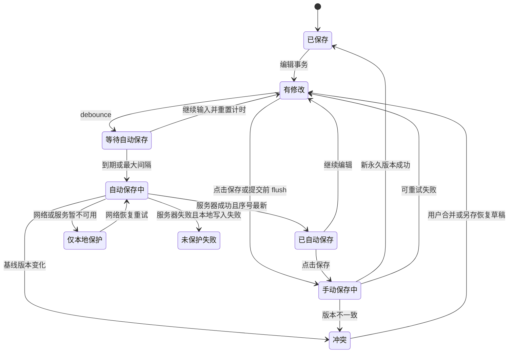
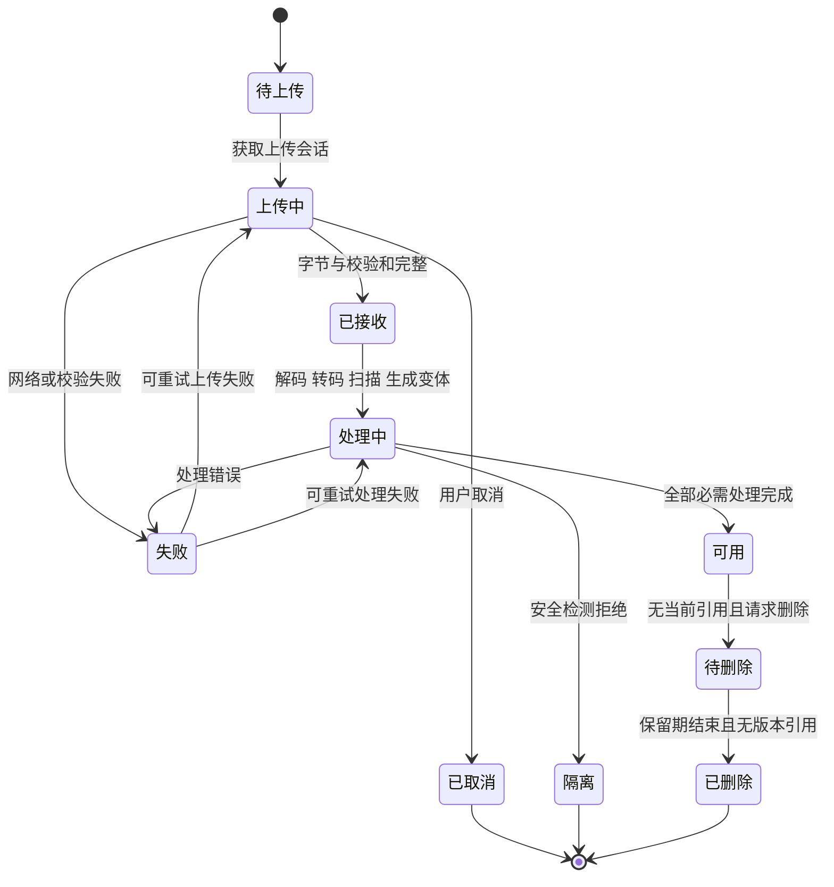
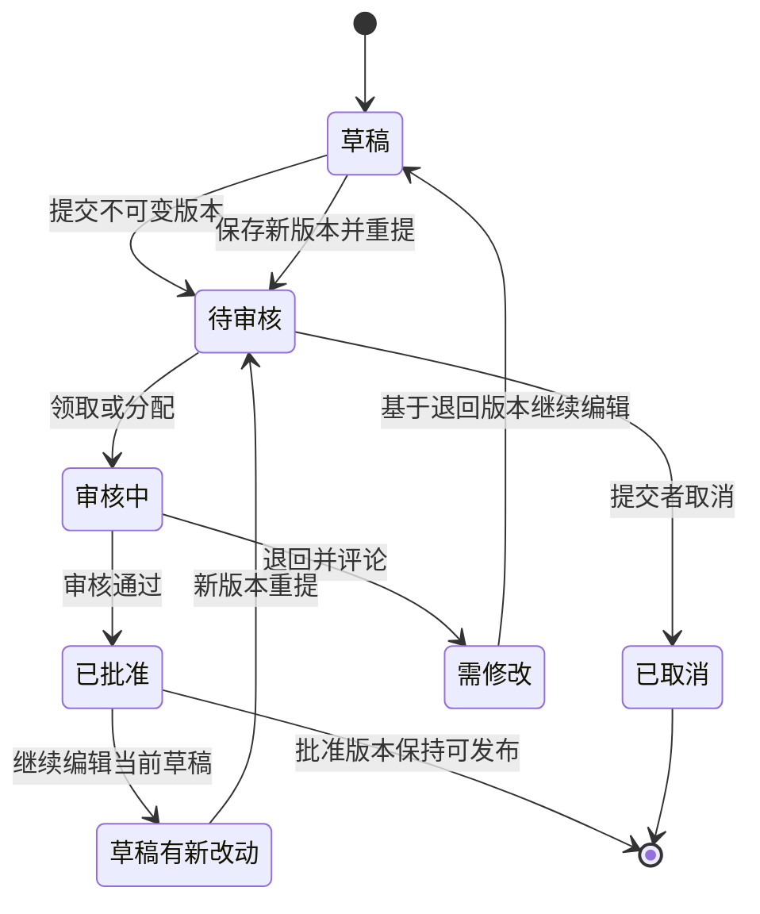
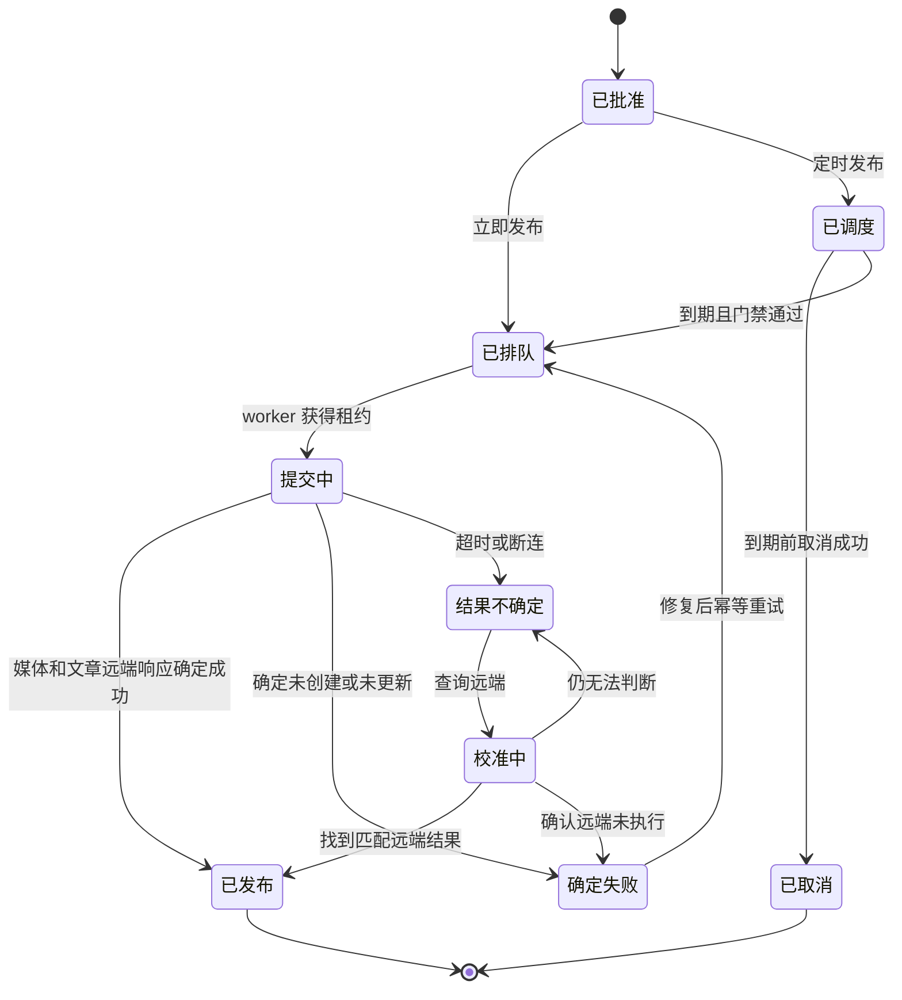
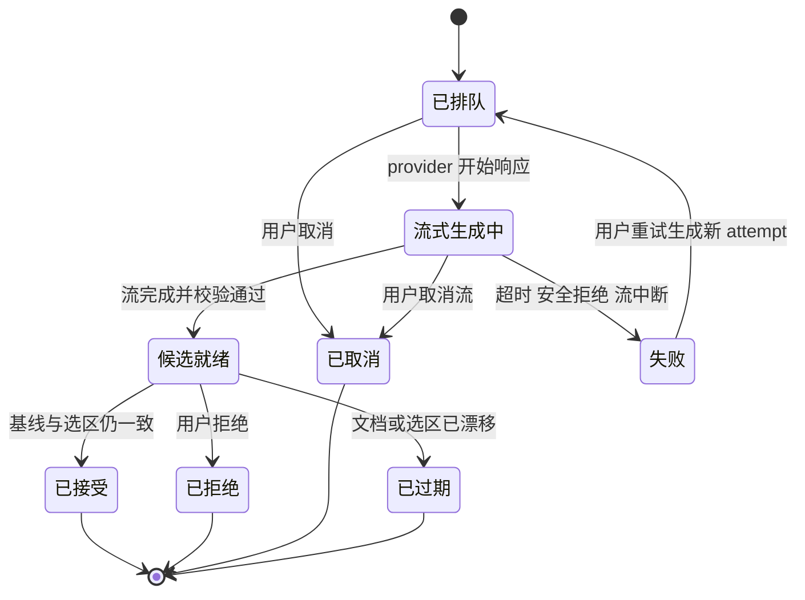

# 文章编辑器完整功能实施蓝图 V1.0

- 文档性质：开发执行合同，不是界面草图或功能建议清单
- 编制日期：2026-08-08
- 产品仓库：`F:\seo-main`
- 当前实现分支：`codex/article-production-loop`
- 开源源码：`F:\seo-open-source-references`
- 旧版业务参考：`E:\seo-v3`
- 上游审计：`docs/research/article-editor-open-source-source-audit-2026-08-08.md`
- 本文范围：文章生成完成后的编辑、保存、SEO、审核、预览和发布；内容计划不在本文范围内

## 1. 文档定位与不可变决策

### 1.1 目标

本文用于直接拆分开发任务、评审接口、编写测试和执行验收。开发人员不得把“工具栏出现按钮”“前端可以插入节点”或“接口返回成功”单独视为功能完成。一个编辑器功能只有同时满足以下八层才算完成：

1. **文档层**：节点或元数据有版本化 schema，前后端采用同一字段语义。
2. **数据层**：需要持久化的资产、版本、状态和关联有数据库约束。
3. **接口层**：读写、并发、幂等、错误码和权限形成稳定合同。
4. **交互层**：入口、编辑、只读、加载、空状态和键盘行为完整。
5. **状态层**：处理中、成功、失败、取消、重试和恢复可区分。
6. **安全层**：URL、文件、HTML、项目隔离和服务端授权均经过校验。
7. **审计层**：关键业务动作可追踪到操作者、版本和结果。
8. **测试层**：单元、接口、状态机和浏览器端主路径都有证据。

### 1.2 固定架构决策

- **保留 TipTap**。TipTap 继续作为编辑内核，不迁移到 Lexical、Gutenberg 或其他编辑器。
- **正文 JSON 是事实源**。HTML、Markdown、纯文本、阅读时长和发布 HTML 都是可重新生成的派生结果。
- **H1 只由文章标题承担**。正文只允许 H2-H6，首期界面直接提供 H2/H3，H4-H6 放在标题菜单中。
- **全屏独立工作区**。沿用当前产品的独立页面方向，并参考 `E:\seo-v3` 的主编辑区、可调整右栏和治理面板交互；不回到内容列表内嵌编辑。
- **媒体是资产，不是 URL 字符串**。图片、图库、文件、音频和视频节点必须引用平台资产；发布时再转换为目标站 URL。
- **autosave 与永久版本分离**。自动保存用于恢复，手动保存、提交审核、恢复和发布才产生永久业务版本。
- **审核和发布绑定不可变版本**。审核批准的版本发生变化后必须重新提交，发布者不能发布未批准的当前草稿。
- **SEO 分数不是发布硬门禁**。事实风险、缺失必填字段、未就绪资产等可以阻断；SEO 建议分数只用于优化提示。
- **WordPress 是首个发布适配器，不是领域模型**。编辑文档不持久化 WordPress 专属 post/media 结构。
- **AI 输出先形成候选**。未接受的流式结果不得写入正文、dirty 状态或版本历史。

### 1.3 参考方式

本文所称“参考”分三类：

| 类型 | 含义 | 执行要求 |
| --- | --- | --- |
| 机制参考 | 采用来源项目已经验证的状态、交互或领域边界 | 对齐行为颗粒度，按本项目技术栈重写 |
| 源码参考 | 可沿用 TipTap extension/API 的调用方式 | 固定到本文列出的提交和文件，不跨版本猜测 |
| 布局参考 | 参考 `E:\seo-v3` 的界面结构和业务入口 | 只参考交互，不把 localStorage/mock 当生产后端 |

任何来源项目的框架耦合代码都不能直接复制进本项目。Ghost/Koenig 使用 Lexical，Gutenberg 使用 WordPress data store，Wagtail 使用 Django model workflow；本文参考的是成熟机制，不是运行时替换。

## 2. 固定源码版本与来源索引

### 2.1 固定版本

| 项目 | 本地目录 | 固定提交 | 本项目职责 |
| --- | --- | --- | --- |
| TipTap | `F:\seo-open-source-references\tiptap` | `d18533a` | 节点、mark、命令、键盘规则、菜单扩展点 |
| Koenig | `F:\seo-open-source-references\koenig` | `4da8318` | 结构化卡片、媒体节点、上传和节点工具栏 |
| Gutenberg | `F:\seo-open-source-references\gutenberg` | `c7cdb48` | dirty/autosave、本地备份、预览、媒体导入和发布锁 |
| WordPress Core | `F:\seo-open-source-references\wordpress-core` | `cdc5934` | autosave REST、revision、恢复和保留策略 |
| Ghost | `F:\seo-open-source-references\ghost` | `5406605` | 本地修订、离开保护、自动保存收尾、发布状态 |
| Rank Math | `F:\seo-open-source-references\rank-math` | `e105b4f` | SEO 输入、逐项检查、加权评分和 SERP 预览 |
| Wagtail | `F:\seo-open-source-references\wagtail` | `fb5f684` | 审核任务、权限、锁、调度和审计 |
| Novel | `F:\seo-open-source-references\novel` | `fa95098` | AI 选区、流式候选、接受/拒绝和上传占位 |

### 2.2 来源编号

后续功能表使用以下来源编号。行号只用于快速定位；实现前应阅读完整函数和相邻测试。

| 编号 | 项目与真实源码 | 可参考机制 |
| --- | --- | --- |
| TT-01 | `tiptap/packages/starter-kit/src/starter-kit.ts:71-273` | 段落、标题、列表、引用、代码、历史等基础扩展组合 |
| TT-02 | `tiptap/packages/extension-link/src/link.ts:176-213`、`tiptap/packages/extension-link/src/link.ts:381-428`、`tiptap/packages/extension-link/src/link.ts:514-551` | 协议校验、set/toggle/unset、autolink、粘贴链接 |
| TT-03 | `tiptap/packages/extension-image/src/image.ts:94-120`、`tiptap/packages/extension-image/src/image.ts:292-301` | 图片属性和插入命令；不包含上传 |
| TT-04 | `tiptap/packages/extension-file-handler/src/FileHandlePlugin.ts:17-85` | 拖放/粘贴文件捕获和 MIME 过滤 |
| TT-05 | `tiptap/packages/extension-table/src/table/table.ts:418-508` | 插入、增删行列、合并拆分、表头和删除命令 |
| TT-06 | `tiptap/packages/extension-audio/src/audio.ts:120-174`、`tiptap/packages/extension-audio/src/audio.ts:195-207`、`tiptap/packages/extension-audio/src/audio.ts:228-248` | 音频属性、插入和安全渲染 |
| TT-07 | `tiptap/packages/extension-highlight/src/highlight.ts:67-175`；`tiptap/packages/extension-underline/src/underline.ts:97-120`；`tiptap/packages/extension-text-align/src/text-align.ts:92-134` | 高亮、下划线、对齐的属性、命令和快捷键 |
| TT-08 | `tiptap/packages/extension-horizontal-rule/src/horizontal-rule.ts:65-132`；`tiptap/packages/extension-hard-break/src/hard-break.ts:75-118` | 分割线输入规则、硬换行命令和快捷键 |
| TT-09 | `tiptap/packages/extension-code-block-lowlight/src/code-block-lowlight.ts:1-43` | 代码块语法高亮插件边界 |
| TT-10 | `tiptap/packages/extensions/src/placeholder/placeholder.ts:1-30`；`tiptap/packages/extensions/src/character-count/character-count.ts:72-198` | placeholder decoration、字符/字数统计和限制 |
| TT-11 | `tiptap/packages/extension-bubble-menu/src/bubble-menu.ts:1-50`；`tiptap/packages/extension-floating-menu/src/floating-menu.ts:1-77` | 选区浮动工具栏和空行浮动菜单挂载点 |
| TT-12 | `tiptap/packages/extension-details/src/details.ts:60-198` | 折叠内容节点、open 状态和交互 |
| KG-01 | `koenig/packages/kg-default-nodes/src/kg-default-nodes.ts:3-31`、`koenig/packages/kg-default-nodes/src/kg-default-nodes.ts:95-129` | Image、Gallery、Bookmark、Callout、Toggle、Video、Audio、File 等节点目录 |
| KG-02 | `koenig/packages/koenig-lexical/src/components/KoenigComposer.tsx:30-76`；`koenig/packages/koenig-lexical/src/utils/imageUploadHandler.ts:9-22` | 宿主注入 uploader、object URL 预览后真实上传 |
| KG-03 | `koenig/packages/koenig-lexical/src/nodes/ImageNodeComponent.tsx:88-150`；`koenig/packages/koenig-lexical/src/nodes/GalleryNodeComponent.tsx:71-97` | 图片和图库节点上传、替换及批量处理 |
| KG-04 | `koenig/packages/koenig-lexical/src/nodes/VideoNodeComponent.tsx:32-119`；`koenig/packages/koenig-lexical/src/nodes/AudioNodeComponent.tsx:24-71`；`koenig/packages/koenig-lexical/src/nodes/FileNodeComponent.tsx:34-59` | 视频/缩略图、音频和文件上传体验 |
| KG-05 | `koenig/packages/koenig-lexical/src/components/DesignSandbox.tsx:101-145`、`koenig/packages/koenig-lexical/src/components/DesignSandbox.tsx:167-210` | 文本/图片/图库上下文工具栏、加号和卡片菜单颗粒度 |
| GB-01 | `gutenberg/packages/editor/src/store/selectors.js:81-94`、`gutenberg/packages/editor/src/store/selectors.js:731-825`；`gutenberg/packages/editor/src/store/actions.js:469-543`、`gutenberg/packages/editor/src/store/actions.js:660-680` | dirty/saving/autosaving、保存种类和保存锁 |
| GB-02 | `gutenberg/packages/editor/src/store/local-autosave.js:20-82` | 本地备份、容量降级和清理 |
| GB-03 | `gutenberg/packages/editor/src/utils/media-upload/index.js:15-88`；`gutenberg/packages/editor/src/utils/media-sideload-from-url/index.js:20-34` | 上传期间锁发布、外部图片导入 WordPress media |
| GB-04 | `gutenberg/packages/editor/src/components/post-preview-button/index.js:192-222` | 同步打开预览窗口、异步保存后跳转、autosave 预览 |
| WP-01 | `wordpress-core/src/wp-includes/rest-api/endpoints/class-wp-rest-autosaves-controller.php:18-211` | autosave REST controller、权限和创建 |
| WP-02 | `wordpress-core/src/wp-includes/revision.php:130-258`、`wordpress-core/src/wp-includes/revision.php:277-476`、`wordpress-core/src/wp-includes/revision.php:812-840` | 变化检测、autosave/revision/restore 分离和保留清理 |
| GH-01 | `ghost/apps/ember-admin/app/services/local-revisions.js:7-107`、`ghost/apps/ember-admin/app/services/local-revisions.js:258-270` | 每分钟本地保存、空间不足清理、每篇保留 5 份 |
| GH-02 | `ghost/apps/ember-admin/app/controllers/lexical-editor.js:1097-1112`、`ghost/apps/ember-admin/app/controllers/lexical-editor.js:1232-1248` | beforeunload、离开前取消待办并强制保存 |
| GH-03 | `ghost/ghost/core/core/server/lib/post-revisions.ts:53-107` | 内容变化、时间间隔、发布动作与版本保留 |
| GH-04 | `ghost/ghost/core/core/server/models/post.js:40-40`、`ghost/ghost/core/core/server/models/post.js:552-602` | draft/published/scheduled 状态和调度时间校验 |
| RM-01 | `rank-math/assets/admin/src/sidebar/Assessor.js:69-103`；`rank-math/assets/admin/src/analyzer/Analyzer.js:38-71` | SEO 输入 Paper、debounce、全量/部分分析 |
| RM-02 | `rank-math/assets/admin/src/analyzer/ResultManager.js:73-103`；`rank-math/assets/admin/src/sidebar/components/General/CheckLists.js:89-125`、`rank-math/assets/admin/src/sidebar/components/General/CheckLists.js:240-320` | 加权总分、分组清单和错误数量 |
| RM-03 | `rank-math/assets/admin/src/sidebar/components/Editor/SerpPreview.js:24-55`、`rank-math/assets/admin/src/sidebar/components/Editor/SerpPreview.js:168-257`；`rank-math/assets/admin/src/sidebar/components/Editor/PreviewDevices.js:13-38` | URL/标题/描述、noindex、桌面/移动 SERP 模拟 |
| WG-01 | `wagtail/wagtail/models/workflows.py:100-137`、`wagtail/wagtail/models/workflows.py:202-301`、`wagtail/wagtail/models/workflows.py:791-897`、`wagtail/wagtail/models/workflows.py:942-1062` | workflow/task 状态、组审核、决定和评论 |
| WG-02 | `wagtail/wagtail/locks.py:73-260`；`wagtail/wagtail/models/locking.py:15-27`；`wagtail/wagtail/models/audit_log.py:132-132`、`wagtail/wagtail/models/audit_log.py:348-348` | 锁原因/持有人、统一日志动作 |
| WG-03 | `wagtail/wagtail/models/revisions.py:89-204`、`wagtail/wagtail/models/revisions.py:384-441`；`wagtail/wagtail/models/draft_state.py:35-38` | 完整 revision、从版本发布、go-live/expire 字段 |
| WG-04 | `wagtail/wagtail/management/commands/publish_scheduled.py:49-120` | 到期发布/下线和调度审计 |
| NV-01 | `novel/apps/web/components/tailwind/generative/ai-selector.tsx:29-105`；`novel/apps/web/components/tailwind/generative/ai-selector-commands.tsx:37-66` | 获取选区、AI 高亮、命令菜单、loading/流式结果 |
| NV-02 | `novel/apps/web/components/tailwind/generative/ai-completion-command.tsx:18-46` | 替换选区或在后方插入 |
| NV-03 | `novel/apps/web/app/api/generate/route.ts:1-129`；`novel/packages/headless/src/extensions/ai-highlight.ts:29-122` | 流式生成边界和独立 AI mark |
| NV-04 | `novel/packages/headless/src/plugins/upload-images.tsx:64-137` | decoration placeholder、成功替换、失败移除、粘贴/拖放 |
| V3-01 | `E:\seo-v3\src\features\editor\TipTapArticleEditor.tsx:37-99`、`E:\seo-v3\src\features\editor\TipTapArticleEditor.tsx:113-260`；`E:\seo-v3\src\features\editor\editorSerialization.ts:14-134` | 当前用户认可的编辑入口、基础工具、选区操作和多格式序列化 |
| V3-02 | `E:\seo-v3\src\features\editor\EditorPage.tsx:225-377`、`E:\seo-v3\src\features\editor\EditorPage.tsx:377-474` | 全屏框架、选区读取、候选应用和可调整右栏 |
| V3-03 | `E:\seo-v3\src\features\editor\EditorPage.tsx:2490-2690`、`E:\seo-v3\src\features\editor\EditorPage.tsx:2920-3370`、`E:\seo-v3\src\features\editor\EditorPage.tsx:3925-3978` | SEO/图片/链接/发布分组和正文更新入口；仅作交互参考 |

## 3. 当前产品基线与目标界面

### 3.1 当前基线

| 区域 | 当前状态 | 代码位置 | 本文结论 |
| --- | --- | --- | --- |
| 编辑内核 | StarterKit + Link | `frontend/src/features/content/article-editor.tsx:1-62` | 可继续扩展 |
| 当前工具 | 粗体、斜体、删除线、行内代码、H2、引用、两类列表、链接、撤销/重做 | `frontend/src/features/content/article-editor.tsx:105-192` | 只是基础文本子集 |
| 全屏工作区 | 已有主编辑区和右侧治理面板 | `frontend/src/features/content/article-workspace.tsx:535-801` | 保留布局方向 |
| 文档校验 | 仅基础文本 block/mark，未知节点拒绝 | `backend/api/app/modules/content/document.py:16-27`、`:188-222` | P0 必须扩 schema |
| 保存与版本 | 手动版本、恢复、审核版本基础已存在 | `backend/api/app/api/routes/content.py:421-579` | 在现有基础上扩展 |
| 发布 | 文章 posts API、幂等/uncertain 基础已存在 | `backend/api/app/modules/content/publication.py:58-68` | 缺媒体、预览、调度和更新 |

### 3.2 目标工作区

```text
┌──────────────────────────────────────────────────────────────────────────────┐
│ 返回文章列表 | 标题 | 草稿/审核/发布状态 | 保存状态 | 预览 | 保存 | 发布      │
├──────────┬───────────────────────────────────────────────┬───────────────────┤
│ 块拖拽柄 │ 固定正文排版宽度                              │ SEO / 媒体 / 链接  │
│ + 插入   │ 标题输入                                      │ 审核 / 版本 / 发布 │
│          │ 选区 BubbleMenu                               │ 可拖拽调整宽度     │
│          │ 空行 Slash Menu                               │                   │
│          │ 图片/表格/卡片 Node Toolbar                   │                   │
│          │ 正文                                          │                   │
├──────────┴───────────────────────────────────────────────┴───────────────────┤
│ 上传队列 | 字数/阅读时长 | 本地已保护/自动保存时间 | 冲突/失败入口          │
└──────────────────────────────────────────────────────────────────────────────┘
```

界面约束：

- 顶栏固定，正文滚动时保存、预览和发布动作始终可达。
- 正文排版宽度保持稳定，不随右侧面板开合任意拉宽；右栏宽度可调整并本地记忆，参考 V3-02。
- 右侧不是卡片堆叠首页，而是紧凑 tabs/panels；每项问题可定位到正文节点或元数据字段。
- 文本选区使用 BubbleMenu；空段落使用 `/` 和左侧加号；图片、图库、表格等使用节点上下文工具栏，参考 TT-11、KG-05。
- 移动端不显示永久三栏：顶栏保留核心动作，治理面板作为全屏抽屉，表格允许横向滚动。
- 图标按钮必须有 `aria-label` 和 tooltip；不可用动作显示 disabled 原因，不能静默无效。

## 4. 总功能来源映射

状态定义：`已有` 表示当前闭环可用；`部分` 表示仅有单点；`缺失` 表示需完整实现。

| 功能域 | 功能 | 主参考 | 补充参考 | 当前 | 阶段 | 发布门禁 |
| --- | --- | --- | --- | --- | --- | --- |
| 文本 | 段落、H2-H6、粗斜体、删除线、行内代码、引用、列表 | TT-01 | V3-01 | 部分 | P0/P2 | schema 不支持则阻断 |
| 文本 | 下划线、高亮、代码块、分割线、硬换行、清除格式 | TT-07/08/09 | TT-01 | 部分 | P2 | 否 |
| 编辑操作 | 撤销/重做、快捷键、placeholder、统计 | TT-01/10 | V3-01 | 部分 | P2 | 否 |
| 操作面 | 顶部栏、BubbleMenu、Slash Menu、Node Toolbar、拖拽柄 | TT-11 | KG-05、V3-02 | 缺失 | P2 | 否 |
| 链接 | 添加、编辑、移除、粘贴、协议和 rel/target | TT-02 | V3-03 | 部分 | P2 | 不安全 URL 阻断 |
| 链接业务 | 内链候选、事实来源候选、断链/重复/竞品提示 | V3-03 | RM-01 | 缺失 | P3 | 按事实合同决定 |
| 图片 | 选择、粘贴、拖放、URL 导入、资产库、替换、alt/caption/布局 | KG-02/03 | TT-03/04、GB-03、NV-04 | 缺失 | P0/P2 | 未 ready 阻断 |
| 图库 | 批量上传、排序、单项编辑和部分失败 | KG-01/03 | NV-04 | 缺失 | P2 | 未 ready 项阻断 |
| 表格 | 插入、完整行列操作、合并拆分、表头、粘贴 | TT-05 | V3-01 | 缺失 | P2 | schema 错误阻断 |
| 文件 | 上传、名称、描述、大小、下载和替换 | KG-01/04 | TT-04 | 缺失 | P2 | 未 ready 阻断 |
| 音视频 | 上传、处理、标题、时长、封面、替换 | KG-01/04 | TT-06 | 缺失 | P2 | 未 ready 阻断 |
| 内容卡片 | Bookmark、Callout、Toggle、Button、受控 Embed | KG-01/05 | TT-12 | 缺失 | P2/P3 | 非白名单阻断 |
| 保存 | dirty、服务器 autosave、本地备份、离开保护 | GB-01/02 | WP-01、GH-01/02 | 部分 | P1 | 未保存/冲突阻断 |
| 版本 | 手动/自动/审核/发布版本、保留、恢复 | WP-02 | GH-03、WG-03 | 部分 | P1/P4 | 审核版本不一致阻断 |
| 差异 | block/inline/media/metadata 结构化 diff | WG-03 | 当前版本基础 | 部分 | P4 | 审核必须可读 |
| SEO | 字段编辑、逐项分析、加权分和 SERP 预览 | RM-01/02/03 | V3-03 | 部分 | P3 | 分数不阻断 |
| AI | 选区命令、流式候选、接受/拒绝、漂移保护 | NV-01/02/03 | V3-01/02 | 缺失 | P6 | 否 |
| 审核 | 角色、任务、退回、重提、评论、锁、审计 | WG-01/02 | 当前审核版本基础 | 部分 | P4 | 必须批准 |
| 预览 | 不可变快照、短期 URL、目标模板 | GB-04 | GB-01 | 缺失 | P5 | 否 |
| 发布 | 即时、定时、更新、取消、reconcile | GH-04 | WG-03/04 | 部分 | P5 | 是 |
| 远端媒体 | WordPress media 上传、映射、去重、续跑 | GB-03 | 当前 publication adapter | 缺失 | P5 | 是 |

## 5. 文档模型总合同

### 5.1 规范文档

```json
{
  "type": "doc",
  "schema_version": 2,
  "content": [
    {
      "type": "paragraph",
      "attrs": { "node_id": "01J..." },
      "content": [
        {
          "type": "text",
          "text": "示例正文",
          "marks": [{ "type": "bold" }]
        }
      ]
    }
  ]
}
```

强制规则：

- 每个顶层 block 有不可变 `node_id`；复制 block 时生成新 ID，移动时保留 ID。
- 文档根必须包含 `schema_version`。服务端按版本验证并返回精确到 JSON path 的错误。
- marks 只保存内容语义，不保存工具栏状态。
- 媒体节点只保存 `asset_id` 和文章语义属性；禁止持久化 `blob:`、`data:`、临时签名 URL。
- `title`、`slug`、SEO 字段和发布设置属于版本化 metadata，不混进正文第一块。
- 客户端不得静默删除未知节点或未知字段。遇到更高 schema 版本时只读打开并禁止覆盖。
- schema 迁移必须是 `vN -> vN+1` 的纯函数，保留原快照、迁移版本和结果 hash。

### 5.2 首期支持节点与属性

| 节点/mark | 必需属性 | 可选属性 | 嵌套/约束 | 主参考 |
| --- | --- | --- | --- | --- |
| `paragraph` | `node_id` | `textAlign` | inline* | TT-01、TT-07 |
| `heading` | `node_id`,`level` | `textAlign` | level 2-6；inline+ | TT-01、TT-07 |
| `blockquote` | `node_id` | 无 | paragraph+ | TT-01 |
| `bulletList`/`orderedList` | `node_id` | `start` | listItem+ | TT-01 |
| `codeBlock` | `node_id` | `language` | text*；禁止 inline marks | TT-09 |
| `horizontalRule` | `node_id` | 无 | leaf | TT-08 |
| `hardBreak` | 无 | 无 | inline leaf | TT-08 |
| `text` | `text` | 无 | marks 白名单 | TT-01 |
| `bold/italic/strike/code/underline/highlight` | 无 | highlight `color` | 不允许任意 style | TT-01、TT-07 |
| `link` | `href` | `target`,`rel`,`title`,`link_kind` | HTTP(S) 或允许的站内相对 URL | TT-02 |
| `image` | `node_id`,`asset_id`,`alt`,`display` | `caption`,`link`,`width`,`height` | asset=image；display regular/wide/full | KG-03、TT-03 |
| `gallery` | `node_id`,`items` | `display` | 2-20 个图片 item；item 有稳定 ID | KG-01/03 |
| `table` | `node_id` | 无 | tableRow+；cell/headerCell；禁止跨表嵌套 | TT-05 |
| `file` | `node_id`,`asset_id`,`display_name` | `description` | asset=file | KG-04 |
| `audio` | `node_id`,`asset_id` | `title`,`caption`,`duration_ms` | asset=audio | KG-04、TT-06 |
| `video` | `node_id`,`asset_id` | `title`,`caption`,`poster_asset_id`,`duration_ms` | asset=video；poster=image | KG-04 |
| `bookmark` | `node_id`,`url` | `title`,`description`,`thumbnail_asset_id`,`publisher` | 服务端抓取的安全快照 | KG-01/05 |
| `callout` | `node_id`,`tone` | `icon` | paragraph+；tone 白名单 | KG-01/05 |
| `details` | `node_id`,`summary` | `open_by_default` | detailsContent+ | TT-12、KG-01 |
| `button` | `node_id`,`label`,`href` | `style`,`target`,`rel` | URL 同 link 安全规则 | KG-01/05 |
| `embed` | `node_id`,`provider`,`source_url`,`embed_id` | `caption` | provider/域白名单；禁止裸 HTML | KG-01/05 |

### 5.3 序列化与只读渲染

- JSON -> HTML/Markdown/Text 必须由共享服务或同版本 renderer 生成，不能分别维护不一致的正则转换。
- JSON round-trip 后，节点类型、顺序、ID、attrs、marks 和文本必须无损。
- Markdown 无法完整表达的 gallery、video、callout 等节点使用显式扩展语法或只作为导出降级；不能反向覆盖 JSON 事实源。
- 只读预览和发布 renderer 必须共享节点白名单与 URL sanitizer，但允许目标适配器改变最终资产 URL。
- 每种节点都要有 fixture：最小合法、完整合法、缺字段、未知字段、恶意 URL 和旧 schema。

## 6. 可见编辑功能逐项规格

本章定义用户能直接操作的功能。每一项均须在编辑态、只读态、保存恢复、版本 diff、预览和发布 renderer 中保持一致。

### 6.1 基础文本与排版

| ID | 功能 | 用户入口与完整行为 | 文档/命令 | 粘贴与键盘规则 | 来源 | 验收重点 |
| --- | --- | --- | --- | --- | --- | --- |
| TXT-01 | 段落 | 默认块；标题、引用、列表退出后回到段落；空段落显示 placeholder | `paragraph`；`setParagraph` | Enter 新段落；连续空列表项退出列表；粘贴纯文本按换行分段 | TT-01、TT-10 | 空文档、中文输入法、列表退出和 round-trip |
| TXT-02 | H2-H6 | 顶栏直接显示 H2/H3，更多菜单含 H4-H6；同一按钮切换回段落；正文禁止 H1 | `heading.level=2..6`；`toggleHeading` | `## ` 至 `###### ` 输入规则；粘贴 H1 降为 H2 或按策略转段落并提示 | TT-01、V3-01 | H1 无法进入保存结果；目录和 SEO 分析能识别层级 |
| TXT-03 | 粗体 | 顶栏、BubbleMenu、`Mod-B`；混合选区显示 mixed 状态 | `bold`；`toggleBold` | 保留可信 HTML `<strong>/<b>`；纯文本不带 mark | TT-01、KG-05 | 跨段选择、撤销、粘贴、只读渲染 |
| TXT-04 | 斜体 | 顶栏、BubbleMenu、`Mod-I` | `italic`；`toggleItalic` | 接受 `<em>/<i>` | TT-01、KG-05 | 与链接/粗体嵌套无损 |
| TXT-05 | 下划线 | 更多格式和 `Mod-U`；链接下划线视觉需可区分 | `underline`；`toggleUnderline` | 接受 `<u>`，丢弃任意 CSS text-decoration | TT-07 | 链接+下划线组合、清除格式 |
| TXT-06 | 删除线 | 顶栏或更多格式 | `strike`；`toggleStrike` | 接受 `<s>/<del>/<strike>` | TT-01 | mixed selection 和 round-trip |
| TXT-07 | 行内代码 | BubbleMenu/更多格式；不能与链接互相产生非法嵌套 | `code`；`toggleCode` | 反引号输入规则按 StarterKit；粘贴 `<code>` | TT-01 | 特殊字符按文本渲染，不执行 HTML |
| TXT-08 | 高亮 | 更多格式提供受控 5 色 swatch + 清除；颜色来自 token，不接收任意 CSS | `highlight.color`；`set/toggle/unsetHighlight` | 粘贴只映射白名单颜色，其他高亮归一为默认色 | TT-07 | 色值白名单、暗色/只读可见、导出降级 |
| TXT-09 | 引用 | 顶栏、Slash menu、`> ` 输入规则；引用内允许多段，不允许媒体卡片 | `blockquote`；`toggleBlockquote` | 保留 `<blockquote>` 并清洗 cite 之外未知 attrs | TT-01、KG-05 | 多段、退出、嵌套列表策略和发布 HTML |
| TXT-10 | 无序列表 | 顶栏、Slash menu；支持 Tab/Shift-Tab 缩进；最大嵌套 3 层 | `bulletList/listItem`；`toggleBulletList` | `- `、`* ` 输入规则；粘贴列表保持层级并截断过深嵌套 | TT-01 | 拆分/合并项、空项退出、嵌套边界 |
| TXT-11 | 有序列表 | 同无序列表；保留起始序号 | `orderedList.attrs.start` | `1. ` 输入规则；粘贴 `<ol start>` | TT-01 | start round-trip、列表类型切换 |
| TXT-12 | 代码块 | Slash menu 和更多格式；语言选择器、复制按钮、语法高亮；内容只作为文本 | `codeBlock.language`；`toggleCodeBlock/setCodeBlock` | 三反引号输入；粘贴代码不自动生成段落/链接 | TT-09 | 未知语言回退 plain text；XSS；横向滚动 |
| TXT-13 | 分割线 | Slash menu 和更多插入；插入后光标落到新段落 | `horizontalRule`；`setHorizontalRule` | `---`、`___`、`***` 输入规则 | TT-08 | 文档首尾、撤销和键盘可达 |
| TXT-14 | 硬换行 | `Shift-Enter`；用于同一段内换行，不创建新 block | `hardBreak`；`setHardBreak` | 粘贴 `<br>` 保留；连续换行按 schema 处理 | TT-08 | 文本/HTML/Markdown 导出一致 |
| TXT-15 | 清除格式 | BubbleMenu/更多格式；清除当前选区 marks，可选“转为段落”清除 block 格式 | `unsetAllMarks`、`clearNodes` | 不影响链接时需提供“保留链接”明确策略；本项目采用全部 mark 清除 | TT-01 | 混合格式、列表、标题、撤销 |
| TXT-16 | 文本对齐 | 仅段落、标题、图片 caption 支持左/中/右；首期不提供两端对齐 | `textAlign`；`set/unsetTextAlign` | 外部 HTML `text-align` 仅映射白名单 | TT-07 | 不对 listItem/tableCell 错误生效 |
| TXT-17 | 撤销/重做 | 固定顶栏和快捷键；按钮 disabled 取 `editor.can()` | ProseMirror history；`undo/redo` | AI 接受、图片替换、批量表格操作各为单一 transaction | TT-01、NV-02 | 复杂动作一步撤销；服务端刷新后历史边界明确 |
| TXT-18 | placeholder | 标题和正文分别显示；只在空块显示，非真实内容 | decoration，不入 JSON | 聚焦/输入后消失；屏幕阅读器不重复朗读 | TT-10 | 保存 JSON 无 placeholder 文本 |
| TXT-19 | 字数/字符/阅读时长 | 底部状态栏实时显示；字数按中文字符+拉丁词规则；阅读时长使用版本化算法 | 派生字段，不写正文 | 统计排除代码装饰、alt 可单列，不把 UI 标签计入 | TT-10、V3-03 | 中英混排 fixture；前后端结果容差为 0 |

补充约束：

- 不提供字体、字号、任意颜色、任意行高和粘贴 CSS。发布排版由目标主题控制，避免正文带入不可维护样式。
- H2-H6、列表、引用和表格的样式只影响编辑器呈现，不把 className 写进文档。
- 任何格式命令执行前调用 `editor.can()`；disabled 状态保留 tooltip 解释原因。
- 快捷键在 Windows 显示 Ctrl，在 macOS 显示 Cmd；中文输入法 composition 期间不得错误触发 Slash/Markdown 输入规则。

### 6.2 链接

**主参考：TT-02。业务候选与治理交互参考 V3-03。**

#### 6.2.1 用户功能

1. 选中文本后通过 BubbleMenu 或 `Mod-K` 打开链接弹层。
2. URL 输入支持站内相对路径和完整 HTTP(S)；输入域名但无协议时可预览补全结果，用户确认后再保存。
3. 弹层显示锚文本、URL、站内/站外分类、在新窗口打开、`nofollow`、`sponsored`、`ugc` 和标题。
4. 光标位于已有链接内时打开编辑态，支持修改 URL/属性、复制 URL、打开检查和移除链接。
5. 将 URL 粘贴到选中文本时直接形成链接；将纯 URL 粘贴到空位置时 autolink；将普通文本粘贴到链接内不得扩散 mark。
6. 右栏“链接”面板列出正文全部链接，显示锚文本、目标、类型、rel、来源节点和检查状态，点击可定位。
7. 内链候选由项目已索引页面提供，显示页面标题、URL、建议锚文本、目标段落和重复状态；插入时替换选区或在确认位置写入，不自动追加生硬段落。
8. 外链候选只服务需要证据的 claim；显示来源类型、claim、目标段落和域名风险，不为了数量补外链。

#### 6.2.2 文档与服务合同

```json
{
  "type": "link",
  "attrs": {
    "href": "/guides/example/",
    "target": null,
    "rel": null,
    "title": null,
    "link_kind": "internal"
  }
}
```

- 服务端规范化绝对/相对 URL，但保留有业务意义的 query；去除追踪参数的规则必须版本化，不能擅自修改用户链接。
- `javascript:`、`data:`、`file:`、协议相对 URL、控制字符和 URL 凭证一律拒绝。
- 站外 `target=_blank` 时强制加入 `noopener noreferrer`；`nofollow/sponsored/ugc` 由用户或来源策略决定，不统一给所有外链加 nofollow。
- `link_kind` 由最终 URL 与项目主域规则重算，不能信任客户端。
- 每次分析输出稳定 `link_id`、`node_id`、文本范围、状态和证据；正文变化后过期结果标记 stale。
- 链接属性属于正文版本，diff 必须展示 href、target 和 rel 的变化。

#### 6.2.3 检查与失败

| 检查 | 行为 | 是否阻断发布 |
| --- | --- | --- |
| 空 href/空锚文本 | 标红并定位 | 是 |
| 危险协议/非法 URL | 保存时拒绝 | 是 |
| 站外 `_blank` 缺安全 rel | 自动补安全值并提示 | 是，直到规范化成功 |
| 同一段重复相同目标 | 建议合并 | 否 |
| 竞品域 | 明确标记，要求确认或替换 | 按项目策略 |
| 事实 claim 缺必需来源 | 绑定 claim 的质量问题 | 是 |
| 异步断链检查失败 | 显示未知/上次检查时间，不删除链接 | 否 |
| 4xx/5xx/重定向链 | 展示最终状态和时间 | 4xx 按策略；5xx 不直接阻断 |

**完成定义**：链接从插入、编辑、粘贴、候选、保存、恢复、diff、预览到 WordPress HTML 无损；协议绕过测试通过；右栏能定位全部问题；不能以 `window.prompt` 作为最终交互。

### 6.3 图片

**主参考：KG-02、KG-03；底层节点/文件事件参考 TT-03、TT-04；占位参考 NV-04；外部导入和发布锁参考 GB-03。**

#### 6.3.1 五种入口

| 入口 | 行为 |
| --- | --- |
| 文件选择 | 支持单选/多选，选择后立即插入稳定 placeholder 并加入统一队列 |
| 粘贴 | TipTap FileHandler 捕获剪贴板图片；在当前 selection 插入；HTML 中的远端图走 URL 导入确认 |
| 拖放 | 显示准确 drop cursor；拖入文件走上传，拖动已有节点只改变位置 |
| URL 导入 | 用户输入远端 URL，服务端抓取、校验、落地为本地资产，不持久化远端裸 URL |
| 资产库 | 按项目筛选、搜索、分页、预览并复用 ready 资产；跨项目资产不可见 |

#### 6.3.2 节点内完整操作

- 上传中显示本地预览、文件名、字节进度、取消；处理中显示“正在优化”而不是假进度。
- 失败显示明确分类：网络、类型、大小、解码、安全、处理；提供重试、替换、删除。
- ready 后支持编辑 alt、caption、链接、regular/wide/full、替换、下载原图和删除节点。
- alt 是必填业务字段；纯装饰图允许显式“装饰图片”并保存 `alt=""` 与 `decorative=true`，不能把未填 alt 当装饰图。
- caption 支持基础 inline marks 和 link，不允许嵌套 block/media。
- 替换图片保留 `node_id`、caption、link 和 display；根据新图尺寸更新 width/height；alt 默认保留但提示重新确认。
- 删除节点只解除 binding；资产无其他引用后进入延迟清理，不在同一请求物理删除。
- regular/wide/full 参考 KG-05；最终发布是否支持 wide/full 由目标 renderer 映射，不能丢失语义。

#### 6.3.3 资产与节点合同

```json
{
  "type": "image",
  "attrs": {
    "node_id": "01J...",
    "asset_id": "ast_...",
    "alt": "图片实际内容说明",
    "decorative": false,
    "caption": null,
    "display": "regular",
    "link": null,
    "width": 1600,
    "height": 900
  }
}
```

- placeholder 使用客户端 `upload_id` 存在于编辑 transaction/plugin state；持久 autosave 可单独保存恢复描述，但不能伪装成 ready `image`。
- 资产保存 MIME、魔数检测结果、size、sha256、storage_key、width/height、EXIF 处理、状态、来源和操作者。
- 原图和 webp/avif/thumbnail 作为 variants；原图是否公开由存储策略决定。
- 服务端移除危险 EXIF，限制像素总量防止解压炸弹；SVG 首期不作为图片上传，除非经过独立 sanitizer。
- URL 导入必须阻止私网、环回、metadata IP、非 HTTP(S)、DNS rebinding、超限重定向和超大响应，并记录最终 URL。

#### 6.3.4 图片验收

1. 选择、粘贴、拖放、URL 导入和资产库最终产生同一规范节点。
2. 上传中刷新页面可恢复任务或明确转为失败，不出现永久空白图。
3. 网络断开后重试复用 idempotency key，不产生重复资产。
4. 替换图片后位置、caption、link 和 display 不变，版本 diff 显示 asset 变化。
5. object URL、data URL、failed/processing 资产不能保存为可审核版本或发布。
6. WordPress 发布使用远端 media URL，但本地文档仍保存 `asset_id`。

### 6.4 图库

**主参考：KG-01、KG-03。**

- Slash menu/加号插入图库，允许一次选择 2-20 张；资产库支持多选。
- 每个 item 有稳定 `item_id`、`asset_id`、alt、caption、width、height 和上传状态；图库本身有 `node_id`、display 和排序。
- 批量上传按单项显示进度；一个文件失败不撤销已成功文件，图库显示“3/5 已完成”和失败项。
- 支持拖动排序、键盘上移/下移、添加、替换、删除单项；少于 2 张时询问转成单图或删除图库。
- alt/caption 按单项编辑；批量填写只能作为辅助，不允许把同一句 alt 自动复制到所有图片。
- 图库排版由 renderer 根据图片比例稳定计算，编辑器与发布端使用同一排序和裁切语义。
- 发布门禁逐项检查 ready、alt/decorative 和 WordPress mapping；重试只处理缺失映射。

**完成定义**：部分失败、排序、单项替换、版本恢复和 WordPress 重试后顺序不变；图库不能退化成若干互不关联的图片 URL。

### 6.5 表格

**主参考：TT-05。`E:\seo-v3` 只实现 3x3 插入和少量动作，不足以作为完成标准。**

| 操作组 | 必须提供的操作 |
| --- | --- |
| 插入 | 通过网格或数字输入选择 1-10 行、1-10 列；可选首行表头 |
| 行 | 上方/下方添加、删除当前行、移动行；多单元格选区按矩形处理 |
| 列 | 左侧/右侧添加、删除当前列、移动列 |
| 单元格 | 合并、拆分、清空、水平对齐、垂直对齐（若 schema 支持） |
| 表头 | 切换当前行/列/单元格表头；首期至少支持首行表头 |
| 表格 | 删除、复制、选择整表；显示上下文工具栏 |
| 粘贴 | 从 Excel/HTML 粘贴为行列；超限先预览并要求确认；公式只粘贴显示值 |
| 移动端 | 外层横向滚动，表格不压出页面；工具栏变为底部菜单 |

约束：

- 表格 cell 首期允许 paragraph 和基础 inline marks，不允许媒体、嵌套表格、H2-H6。
- 合并单元格必须保存 `rowspan/colspan` 并通过服务端矩形完整性校验。
- 增删行列、合并拆分分别是单一 undo transaction。
- 发布 renderer 输出语义化 `<table><thead><tbody><th scope>...`，并进行响应式 wrapper 映射。
- 空表格允许编辑但提交审核前提示；完全空表格可作为质量建议，不默认阻断。

**完成定义**：TT-05 暴露的核心命令在 UI 均有上下文入口和 disabled 状态；粘贴、合并、恢复、diff、移动端和 WordPress 输出通过测试。固定插入 3x3 不算完成。

### 6.6 文件、音频和视频

**主参考：KG-01、KG-04；音频节点补充参考 TT-06。**

| 类型 | 节点内字段 | 处理与交互 | 发布要求 |
| --- | --- | --- | --- |
| 文件 | display name、description、MIME、size | 上传、取消、重试、替换、下载；危险类型拒绝 | 生成可下载链接，保留真实 MIME/size，目标不可承载时阻断 |
| 音频 | title、caption、duration、asset | 上传后服务端探测时长；编辑器原生播放/暂停/seek；替换保留文案 | WordPress media 或受控播放器；禁止自动播放 |
| 视频 | title、caption、duration、video asset、poster asset | 视频上传与转码；自动缩略图和自定义封面分开上传；处理状态明确 | 目标兼容格式、poster 和 dimensions 全部 ready 后发布 |

统一要求：

- 文件类型按扩展名、声明 MIME 和魔数三者校验；不信任浏览器 MIME。
- 音视频处理采用异步 job，状态为 uploaded/processing/ready/failed；进度不是假的倒计时。
- 替换保留 `node_id`、标题、caption；视频替换后旧 poster 可选择保留或重新生成。
- 资产库按 image/video/audio/file 分类；同 hash 去重但保留新的文章 binding。
- 下载文件名通过 `Content-Disposition` 安全编码；文件 URL 不暴露内部 storage key。

### 6.7 Bookmark、Callout、Toggle、Button 和 Embed

| 节点 | 业务用途 | 完整行为 | 参考 | 阶段 |
| --- | --- | --- | --- | --- |
| Bookmark | 把重要来源/工具链接显示为摘要卡 | 输入 URL；服务端抓取 title/description/icon/image；允许刷新元数据和退化为普通链接 | KG-01、KG-05 | P3 |
| Callout | 注意、提示、警告、结论 | 4 种受控 tone，可选图标，内部允许多段和列表；不允许任意背景色 | KG-01、KG-05 | P2 |
| Toggle/FAQ | FAQ 和可折叠补充说明 | summary 必填；内容可多段；键盘可展开；发布端保留 `<details>` 语义 | TT-12、KG-01 | P2 |
| Button | 正文 CTA | label、URL、primary/secondary；链接安全规则完全复用 LINK | KG-01、KG-05 | P3 |
| Embed | YouTube 等受控外部内容 | 粘贴 URL -> 服务端识别 provider -> 保存 provider/id；编辑器显示安全预览 | KG-01、KG-05 | P3 |

禁止项：

- 首期不提供 raw HTML/Markdown card。裸 HTML 会绕开文档 schema、XSS 和目标发布兼容性。
- Embed 不能保存第三方返回的任意 script/iframe HTML；只保存 provider、source URL 和受控 ID，由 renderer 生成白名单 iframe。
- 服务端抓取 Bookmark/Embed 复用 URL 导入的 SSRF 防护、大小/超时/重定向限制。
- Ghost 的会员、newsletter、paywall、signup、email-only、product 卡片不属于当前 SEO SaaS 范围。

## 7. 编辑器操作层

### 7.1 固定顶部工具栏

- 左组：撤销、重做。
- 文本组：段落/标题菜单、粗体、斜体、更多格式。
- 结构组：列表、引用、链接、插入菜单。
- 右组：字数/阅读时长、保存状态；预览/保存/发布属于页面顶栏，不重复塞入正文工具条。
- 工具栏根据 selection 更新 active/mixed/disabled；仅图标按钮使用 Lucide 图标和 tooltip。
- 窄屏允许按组折叠到更多菜单，但核心保存状态和返回入口始终可见。

### 7.2 BubbleMenu

- 只在非空文本选区显示，参考 TT-11、KG-05。
- 必需动作：粗体、斜体、下划线、删除线、链接、清除格式、AI 改写。
- 点击菜单不得丢失 selection；弹出链接或 AI 面板后保存 bookmark，关闭后恢复焦点。
- 跨不兼容节点选区时隐藏不能安全执行的动作。

### 7.3 Slash Menu 和左侧加号

- 空段输入 `/` 或点击当前 block 左侧加号打开同一 command registry。
- 菜单分组：文本、媒体、结构、增强；支持中文名、英文别名、键盘上下选择、Enter 插入、Esc 关闭。
- 必需项目：H2/H3、列表、引用、代码块、分割线、图片、图库、表格、文件、音频、视频、Callout、Toggle、Bookmark、Button、Embed。
- 菜单项目必须从 schema capability 和用户权限动态过滤；不能显示服务端不支持的节点。
- 参考 KG-05 的卡片颗粒度，但不复制 Markdown/HTML/newsletter 专属卡片。

### 7.4 节点工具栏和拖拽

- 图片：regular/wide/full、链接、替换、alt/caption、删除，参考 KG-05。
- 图库：添加图片、排序、布局、删除。
- 表格：行、列、单元格、表头、删除的上下文菜单。
- 音视频/文件：替换、元数据、下载/预览、删除。
- 每个顶层 block 提供拖拽柄和键盘移动操作；拖动保持 `node_id`，复制生成新 ID。
- 拖动期间显示插入位置；滚动容器边缘自动滚动；不可放置位置明确显示禁止状态。

### 7.5 粘贴清洗

处理优先级：文件 -> 受控 URL/Embed -> HTML -> 纯文本。

- 从 Word/Google Docs 粘贴：保留语义标题、段落、列表、表格和基础 marks，移除 style/class/font/script/event handler。
- 从网页粘贴：图片不直接引用远端 URL；列为待导入项，用户确认后服务端落地。
- 超过节点/字符/表格限制先显示预览和裁剪提示，不静默截断。
- HTML sanitizer 在客户端用于体验、服务端用于安全；服务端结果是最终权威。
- 粘贴清洗要有固定 fixture：Word、Docs、Excel、网页、恶意 HTML、超深列表、超大表格。

### 7.6 焦点、选择和无障碍

- 模态/Popover 打开前保存 selection bookmark；应用命令时验证仍在当前文档版本。
- 工具栏、菜单、节点控件全部键盘可达，焦点顺序稳定；Esc 返回编辑器。
- 编辑区有明确可访问名称；状态变化通过适度 `aria-live` 通知，不播报每次击键。
- 上传进度使用 progress 语义；失败信息与重试按钮建立关联。
- 颜色不是唯一状态表达；active/失败/警告同时有图标或文本。
- 浏览器缩放 200%、宽度 320px 和键盘-only 流程不得出现控件遮挡或无法退出。

## 8. 标题与 SEO 编辑

**主参考：RM-01、RM-02、RM-03。布局入口补充参考 V3-03。**

### 8.1 可编辑字段合同

| 字段 | 必填 | 完整行为 | 保存/权限 | 发布行为 |
| --- | --- | --- | --- | --- |
| 文章标题 `title` | 是 | 页面顶部可编辑；正文 H1 由此生成；显示字符长度和未保存状态 | 进入永久版本；`content:edit` | 作为 WordPress title |
| Slug `slug` | 是 | 默认从标题建议；用户修改后不自动覆盖；显示最终 URL | 版本化；已发布后修改需更高权限/确认重定向 | 创建/更新远端 slug |
| 主关键词 `focus_keyword` | 是 | 单值，支持从文章生成上下文带入；用于主规则集 | 版本化；`content:edit` | 不直接公开 |
| 次关键词 `secondary_keywords` | 否 | 去重、有序、数量上限；与主关键词不能重复 | 版本化 | 不直接公开 |
| Meta title `meta_title` | 是 | 默认可建议自标题，但一经人工编辑不自动覆盖；显示像素/字符近似 | 版本化 | 目标 SEO 插件/字段适配 |
| Meta description `meta_description` | 是 | 多行输入、长度反馈、候选应用；不从正文静默覆盖 | 版本化 | 目标 SEO 插件/字段适配 |
| Canonical `canonical_url` | 否 | 默认最终文章 URL；自定义时严格校验并提示跨域 | 独立 `content:manage_seo_advanced` | 输出 canonical |
| 索引设置 `indexing` | 是 | `index/follow`、`noindex/follow` 等受控组合，不接受自由字符串 | 独立高级权限 | 输出 robots/插件字段 |
| 社交标题/描述/图片 | 后续 | 可继承 SEO 字段，也可显式覆盖；继承关系需要记录 | 版本化 | OpenGraph/Twitter adapter |

字段状态必须区分：生成默认值、人工已确认、人工已修改、分析过期。新正文生成或标题变化不得静默覆盖人工字段。

### 8.2 SEO 分析合同

参考 RM-01 把标题、slug、description、正文、关键词、Schema 和特色图装入统一分析输入，参考 RM-02 对逐项结果加权。服务端返回结构：

```json
{
  "analysis_id": "sea_...",
  "article_version": 12,
  "document_hash": "sha256:...",
  "ruleset_version": "zh-seo-v1",
  "score": 78,
  "max_score": 100,
  "is_stale": false,
  "groups": [
    {
      "id": "basic_seo",
      "label": "基础 SEO",
      "results": [
        {
          "rule_id": "keyword_in_meta_title",
          "status": "passed",
          "severity": "suggestion",
          "score": 6,
          "max_score": 6,
          "message": "Meta 标题自然包含主关键词",
          "evidence": [{ "field": "meta_title", "start": 0, "end": 4 }],
          "action": "focus_field"
        }
      ]
    }
  ]
}
```

强制语义：

- 每条规则有稳定 ID、版本、分组、适用条件、严重度、权重、最大分、证据和动作。
- 总分使用 `sum(score) / sum(applicable max_score) * 100`，参考 RM-02；不适用项不进入分母。
- 主关键词和次关键词运行不同规则集，不把所有关键词都要求出现在标题、首段和每个 H2。
- 正文变化只重算依赖正文的规则；字段变化重算对应子集，参考 RM-01 的部分分析。
- 分析结果绑定 document hash/metadata hash；继续编辑后立即标 stale，保留上次结果直到新结果成功。
- 中文规则不能照搬 Rank Math 的英语情绪词、power words、停用词和英文分词阈值。
- SEO 建议为 `suggestion`；事实缺口、恶意 URL、缺必填元数据等质量合同另行计算，不混入 SEO 分数。

### 8.3 右栏和 SERP 预览

- SEO tab 顶部显示总分、规则版本、最后分析时间和 stale 状态。
- 按基础 SEO、主题覆盖、链接与媒体、可读性分组；每组显示未通过数量，参考 RM-02。
- 结果点击后聚焦字段或滚动到 `node_id + text range`；证据已漂移时提示重新分析。
- SERP 模拟显示 breadcrumb/URL、标题、描述和主关键词高亮，支持桌面/移动 segmented control，参考 RM-03。
- noindex 时在预览上方明确显示“当前设置阻止索引”；不能把 SERP 模拟称为 Google 实际展示。
- 截断算法及像素估算版本化；浏览器测试固定字体和容器宽度，避免快照漂移。

**完成定义**：全部 SEO 字段可保存、恢复和 diff；逐项结果可解释并能定位；过期分析不伪装为当前结果；总分低不误阻发布；桌面/移动/noindex 预览可验收。

## 9. 保存、恢复、版本与差异

### 9.1 三层可靠性

| 层 | 目的 | 触发 | 数据寿命 | 是否推进审核版本 | 来源 |
| --- | --- | --- | --- | --- | --- |
| 内存 dirty | 告知当前内容与服务端基线不同 | 每个编辑 transaction | 页面会话 | 否 | GB-01 |
| 服务器 autosave | 跨刷新/设备恢复近期草稿 | 停止输入 debounce 3 秒；持续输入最长 30 秒 | 7-30 天，按策略清理 | 否 | GB-01、WP-01 |
| 本地备份 | 网络/服务故障下防丢 | transaction debounce 1 秒；每分钟 checkpoint | 每文章/用户最近 5 份 | 否 | GB-02、GH-01 |
| 手动保存 | 建立可提交审核的永久版本 | 用户保存、提交审核前 | 按版本策略永久/长期 | 是 | WP-02、GH-03 |

### 9.2 保存状态与交互

状态栏只显示真实状态：

- `saved`：当前 hash 等于服务器手动版本或最新已确认 autosave。
- `dirty`：存在尚未开始保存的编辑。
- `autosave_pending`：debounce 中。
- `autosaving`：请求进行中。
- `autosaved`：服务器 autosave 成功，显示时间；不冒充“版本已保存”。
- `local_only`：服务器不可用但本地副本成功。
- `conflict`：服务器基线已变化，停止自动覆盖。
- `failed`：本地与服务器均未保护，显示明确高风险状态。

规则：

- autosave 请求带 `base_review_version`、`client_id`、递增 `sequence`、document/metadata hash 和 idempotency key。
- 较旧 sequence 到达服务端时不得覆盖较新 autosave。
- 401/403 停止自动重试；网络/5xx 指数退避并加 jitter；409 进入冲突流程。
- 手动保存与 autosave 竞态时，手动保存事务成为新基线，旧 autosave 响应不得回写 UI。
- 提交审核、预览和发布前先执行有上限的 flush；超时后由用户决定重试或使用最近已保存版本，不能偷偷发布内存内容。

### 9.3 本地恢复与离开保护

- 本地 key 至少包含 environment、project、article、user、base version；不能让另一用户看到草稿。
- 打开文章时比较本地副本、服务器 autosave 和永久版本的 hash/时间，只有存在更近且不同的内容才显示恢复提示。
- 恢复对话框提供：查看差异、恢复为当前草稿、丢弃；恢复后仍需保存，不直接覆盖永久版本。
- 应用内路由离开使用 router blocker；刷新/关闭使用 `beforeunload`，参考 GH-02。
- 离开前取消 debounce，尝试一次 autosave flush；超过等待上限保留本地副本并允许离开。
- localStorage/IndexedDB 配额不足时参考 GB-02、GH-01 清理最旧且非当前文章副本；清理失败必须显示 `failed`。

### 9.4 永久版本

| `version_type` | 触发 | 是否可被保留策略删除 |
| --- | --- | --- |
| `generated` | 文章生成完成 | 否，作为初始来源 |
| `manual_edit` | 用户手动保存且有变化 | 未被引用时可按长期策略 |
| `auto_checkpoint` | 内容持续变化且超过检查点间隔 | 可以，按数量/时间 |
| `review_submitted` | 提交审核 | 否 |
| `review_decision` | 审批/退回时冻结决定上下文 | 否 |
| `restored` | 从历史恢复后创建新版本 | 否 |
| `published` | 发布快照 | 否 |

版本必须包含正文 JSON、schema version、title/SEO metadata、asset manifest、content hash、创建人、来源版本和原因。无实质变化不建版本，参考 WP-02；自动检查点的变化/间隔/保留决策参考 GH-03。文章 current pointer 与版本写入必须同事务。

### 9.5 结构化 diff

当前 Markdown 行级差异只能作为降级视图。目标 diff 先按稳定 `node_id` 匹配 block：

```json
{
  "algorithm_version": "document-diff-v1",
  "from_version": 11,
  "to_version": 12,
  "operations": [
    { "op": "move_block", "node_id": "01J...", "from_index": 3, "to_index": 1 },
    { "op": "change_mark", "node_id": "01K...", "range": [4, 8], "from": [], "to": ["link"] },
    { "op": "replace_asset", "node_id": "01M...", "from_asset_id": "ast_1", "to_asset_id": "ast_2" },
    { "op": "change_metadata", "field": "meta_title", "from": "...", "to": "..." }
  ]
}
```

- block 操作：add/delete/move/change_type/change_attrs。
- inline 操作：insert/delete/replace/change_mark；必须显示 link attrs 变化。
- 媒体操作：asset、alt、caption、display、gallery order、table cells。
- metadata：title、slug、全部 SEO 字段、审核/发布设置。
- 大文档可异步计算并按 from/to/hash/algorithm version 缓存；快照是事实源，diff 可重建。
- 旧 schema 无法迁移时降级为只读 JSON/文本差异并明确标识，不伪装为完整 diff。

**完成定义**：刷新、崩溃、断网、配额满、双标签页和保存竞态均不静默丢内容；autosave 不污染永久版本；恢复创建新版本；审核者能读懂 block、mark、媒体和 SEO 变化。

## 10. AI 辅助编辑

**主参考：NV-01、NV-02、NV-03；产品入口和应用方式参考 V3-01、V3-02。**

### 10.1 功能范围

| 命令 | 默认作用域 | 结果动作 | 约束 |
| --- | --- | --- | --- |
| 改写/润色 | 选区 | 替换 | 保留事实、链接、产品名和数字 |
| 缩写 | 选区 | 替换 | 不删除必要证据和关键步骤 |
| 扩写 | 选区/当前块 | 替换或后插入 | 新事实必须标为待核验或有来源 |
| 纠错 | 选区 | 替换 | 只修语法/错字，不改变含义 |
| 翻译 | 选区 | 替换或只读对照 | 语言和品牌术语策略明确 |
| 续写 | 光标后 | 插入 | 使用当前章节和文章上下文 |
| 改标题/Meta | 元数据字段 | 候选列表 | 不直接写回；用户选择后应用 |
| 补 FAQ/CTA | 当前块后 | 插入结构化候选 | FAQ 应生成 heading/details + content，不返回裸字符串 |

### 10.2 请求和候选合同

```json
{
  "article_id": "art_...",
  "base_review_version": 12,
  "document_hash": "sha256:...",
  "command": "rewrite",
  "selection": {
    "anchor_node_id": "01J...",
    "from": 12,
    "to": 48,
    "selected_text_hash": "sha256:..."
  },
  "context": {
    "heading_path": ["H2 标题"],
    "focus_keyword": "...",
    "locale": "zh-CN"
  },
  "prompt_version": "article-rewrite-v1"
}
```

返回 operation ID 后通过 SSE/受控流传输候选。状态为 `queued -> streaming -> ready -> accepted/rejected`，异常分支 `cancelled/failed/stale`。

- streaming 文本渲染在候选层，参考 NV-01；不调用 editor command，不触发 dirty/autosave。
- 接受时重新校验 article version、document hash、node ID 和 selected text hash。漂移则标 `stale`，要求重新选择。
- “替换”使用单一 transaction，参考 NV-02；“插入”明确位于选区后或当前块后；接受后可一步撤销。
- 候选若包含结构化内容，服务端返回受 schema 校验的 slice JSON，而不是让前端解析 Markdown 猜节点。
- 拒绝不改变正文；重试创建新 attempt，保留父 operation 关系。
- 审计保存 provider、model、prompt version、输入/输出 hash、token、延迟、状态、调用者和接受者，不保存密钥。

### 10.3 安全、权限和失败

- AI 使用独立 `content:ai_edit` 权限、项目配额和速率限制。
- 上下文只发送命令所需范围；敏感字段按项目策略裁剪。
- 流中断保留已接收候选供查看，但只有通过完整 schema/安全校验的 ready 候选可接受。
- 重复接受以 operation 状态和 idempotency key 收敛；已 accepted 操作再次调用返回原结果。
- AI 不得自动保存为审核版本、自动提交、自动批准、自动发布或绕过质量门禁。
- `E:\seo-v3` 的 replaceSelection/replaceTextOccurrence/replaceAll 可参考交互，但生产实现必须用 selection hash，不能在全文里模糊寻找后替换第一处。

**完成定义**：选区、当前块、续写和元数据候选均有明确作用域；流式结果不污染正文；漂移无法覆盖新编辑；接受可撤销、拒绝无副作用、全部操作可审计。

## 11. 审核、锁与审计

### 11.1 权限

至少拆分：

| 权限 | 动作 |
| --- | --- |
| `content:edit` | 编辑正文/基础 SEO、autosave、手动保存 |
| `content:submit_review` | 将永久版本提交审核、取消本人待审任务 |
| `content:review` | 领取/分配任务、评论、批准或退回 |
| `content:publish` | 立即/定时发布已批准版本、取消调度、reconcile |
| `content:manage_assets` | 上传、替换、删除和复用资产 |
| `content:manage_seo_advanced` | canonical、indexing 和已发布 slug 高风险设置 |
| `content:ai_edit` | 发起 AI 操作和接受候选 |
| `content:manage_locks` | 管理员强制释放异常锁；必须填写原因并写入审计 |

服务端逐动作授权，前端隐藏按钮只改善体验。默认作者不能审核自己；项目策略可显式允许并记录 policy version。当前统一 `content:write` 必须迁移，不能继续承担所有动作。

### 11.2 审核任务

参考 WG-01：

1. 编辑者手动保存后提交指定永久版本，创建 `article_review_task`。
2. 任务进入 `pending`，可分配或由审核者领取为 `in_review`。
3. 审核者查看不可变快照和与上一审核/发布版本的结构化 diff，可评论。
4. `approved` 绑定该版本；`needs_changes` 必须填写评论并回到编辑者。
5. 退回后编辑生成新版本，再次提交创建新 task；旧决定不继承。
6. 当前草稿继续变化时，已批准版本仍保留，但 UI 明确“当前草稿与批准版本不同”，禁止直接发布当前草稿。

任务状态：`pending -> in_review -> approved | needs_changes | cancelled`。重复决定使用 idempotency key；已经终态的任务不能改变决定。

### 11.3 锁

参考 WG-02，将锁原因分开：

- `edit_lock`：防止两人同时编辑，持有人定期续租；过期可接管。
- `review_lock`：审核中的快照只读，不阻止另建草稿，但决定始终绑定原版本。
- `scheduled_publish_lock`：已调度版本不可被调度任务静默替换。

锁字段包括 article、lock type、owner、reason、acquired/renewed/expires 时间和 version。管理员解锁必须填写原因并写审计。锁丢失时编辑器转只读并保护本地副本，不能继续假装可保存。

### 11.4 审计日志

`content_audit_events` 采用 append-only：actor、effective role、project/article、action、target type/id、before/after state、version、request/correlation ID、policy version、reason、created_at。以下动作必须记录：

- 手动保存、恢复、提交/取消审核、领取/分配、评论、批准、退回。
- 锁获取/续期失败/释放/管理员解锁。
- 资产导入/替换/删除、安全拒绝。
- AI 发起/取消/接受/拒绝。
- 预览创建/撤销、发布调度/取消/执行/reconcile。
- 权限拒绝记录安全事件，但敏感内容和 token 不进入日志。

**完成定义**：API 级权限矩阵通过；自审策略可验证；退回重提不会继承旧批准；锁过期和管理员解锁可恢复；从审计事件能还原关键状态变化。

## 12. 预览与发布

### 12.1 草稿预览

参考 GB-04：用户点击时先同步打开空白窗口，避免浏览器拦截；随后创建不可变 preview snapshot，成功后跳转。

- snapshot 可来源于当前服务器 autosave 或指定永久版本，包含正文、metadata 和 asset manifest。
- URL 使用短期签名 token，绑定 project/article/snapshot/user/audience/expiry；默认 15-60 分钟。
- token 不写普通日志、不放 referrer；支持主动撤销；跨项目、过期和篡改返回 404/410，不泄露资源存在性。
- 响应包含 `noindex, nofollow`、禁止缓存策略；预览域/路径不得进入 sitemap。
- renderer 使用目标站主题和最终 URL 规则。若目标主题不可用，明确显示“平台预览”，不能冒充真实站点。
- snapshot 创建时检查资产 ready；不完整时返回可定位的 asset/node 清单。

### 12.2 发布类型

| 类型 | 行为 |
| --- | --- |
| 首次立即发布 | 对 approved version 建立发布命令，先同步媒体，再 POST 新文章 |
| 更新已发布文章 | 使用已保存 remote post ID 和目标 adapter 更新，不按 slug 猜远端文章 |
| 定时发布 | 保存 UTC 执行时间和用户原时区，持久 worker 到期重检门禁 |
| 取消定时 | 与 worker 抢占使用状态/租约约束，明确 cancelled 或 too_late |
| 重新发布 | 生成新 publication attempt；已完成媒体 mapping 复用 |
| 不确定结果处置 | 超时/断连后进入 uncertain，先查询远端 reconcile，不直接重发 |

状态至少为：`draft -> review_pending -> approved -> publish_queued/scheduled -> submitting -> published`，失败分支 `failed/uncertain/cancelled`。参考 GH-04、WG-03、WG-04；不引入 Ghost newsletter/sent 状态。

发布命令必须绑定：approved version、target、publication settings、asset manifest hash、request payload hash、idempotency key。调度执行时再次检查：批准仍有效、连接可用、资产 ready、权限策略、目标能力和取消状态。

### 12.3 WordPress 媒体同步

参考 GB-03，发布顺序固定为：

1. 冻结 approved version 的 asset manifest。
2. 查找 `(target_id, asset_id, variant/hash)` 对应的远端 media mapping。
3. hash 相同且远端仍存在则复用；否则上传 `/wp-json/wp/v2/media`。
4. 写入 alt/caption 等目标字段，保存 remote media ID/source URL/hash。
5. 所有必需媒体完成后，用 source URL 生成本次发布 HTML。
6. 首次 POST posts；已有 remote post ID 时调用更新接口。
7. 保存远端 post ID、URL、响应摘要和 published snapshot；不修改本地文档 `asset_id`。

部分媒体成功后必须持久化 checkpoint。重试跳过已成功映射；并发相同 hash 上传通过唯一约束收敛。远端媒体被删除时标 mapping stale 并重建。连接密钥只由 worker 读取，日志脱敏。

### 12.4 发布前检查

硬门禁：

- 没有 approved version，或批准版本与命令版本不一致。
- title/slug/必填 meta 缺失或 URL 不安全。
- 文档 schema 无法支持、存在 placeholder/未知节点。
- asset 非 ready、缺失 mapping 所需原文件、媒体类型目标不支持。
- 必需事实来源缺失、质量门禁未通过。
- 发布连接失效、权限不足、调度时间非法。

非硬门禁：SEO 总分低、建议性可读性、媒体数量建议、一般断链检查暂时不可用。非硬门禁可以要求二次确认，但不能与事实/安全错误混成同一红色阻断。

**完成定义**：未保存内容预览、即时发布、更新、定时/取消、重复 worker、部分媒体失败、超时 uncertain 和 reconcile 都有可重复验收；远端 URL 不反写正文资产；发布者只能发布批准快照。

## 13. 数据模型合同

下列是领域实体，不要求一次迁移全部上线，但最终实现不得把这些不同生命周期重新压进一个无边界 JSON 字段。

### 13.1 文章与版本

#### `articles` 需要保留/扩展的字段

| 字段 | 类型/约束 | 含义 |
| --- | --- | --- |
| `current_document` | JSONB，受 schema 校验 | 当前工作草稿事实源 |
| `document_schema_version` | int not null | 当前 JSON schema 版本 |
| `current_content_hash` | varchar not null | 规范正文+metadata hash |
| `current_version_number` | int not null | 最近永久版本 |
| `approved_version_number` | int nullable | 当前可发布的批准版本 |
| `title/slug` | text | 版本化 metadata 的当前投影 |
| `focus_keyword` | text | 主关键词 |
| `secondary_keywords` | JSONB/array | 有序次关键词 |
| `meta_title/meta_description` | text | SEO 元数据 |
| `canonical_url/indexing` | text/enum | 高级 SEO 设置 |
| `remote_post_id/publish_url` | adapter 投影 | 首个目标的便捷投影，事实源仍在 publication |

#### `article_versions`

| 字段 | 约束 |
| --- | --- |
| `id, article_id, version_number` | article + version 唯一 |
| `version_type` | 见 9.4 枚举 |
| `schema_version` | 必填 |
| `document_snapshot` | 完整 JSONB |
| `metadata_snapshot` | title/slug/SEO/发布设置 JSONB |
| `asset_manifest` | 该版本引用资产的稳定清单 |
| `content_hash` | 规范 hash；用于变化检测 |
| `parent_version_number/source_version_number` | 编辑来源/恢复来源 |
| `created_by/created_at/reason` | 审计信息 |
| `retention_protected` | 审核、发布等引用时为 true 或由关联推导 |

### 13.2 Autosave

#### `article_autosaves`

| 字段 | 约束/语义 |
| --- | --- |
| `article_id, user_id, client_id` | 隔离用户和标签页 |
| `sequence` | 每 client 单调递增；唯一约束收敛乱序请求 |
| `base_version_number` | 与哪个永久版本比较 |
| `schema_version` | 文档版本 |
| `document_snapshot/metadata_snapshot` | 短期完整快照 |
| `content_hash` | 恢复比较 |
| `created_at/expires_at` | TTL 清理 |
| `promoted_version_number` | 被手动保存提升后记录 |

数据库只保留每 user/client/article 的有限最近记录；清理不能删除仍被恢复会话引用的记录。

### 13.3 媒体资产

#### `content_assets`

| 字段 | 约束/语义 |
| --- | --- |
| `id, project_id` | 项目隔离 |
| `asset_type` | image/video/audio/file |
| `status` | pending/uploading/uploaded/processing/ready/failed/quarantined/deleted |
| `original_filename, mime_type, detected_mime_type, byte_size` | 文件事实 |
| `content_hash` | project + hash + variant policy 唯一去重 |
| `storage_key` | 内部键，不下发为公开 URL |
| `width, height, duration_ms` | 类型相关 metadata |
| `source_type` | upload/paste/import/library/generated |
| `source_url/final_source_url` | 外部导入审计；展示需脱敏 |
| `failure_code/failure_detail` | 结构化失败；detail 不暴露内部敏感信息 |
| `created_by/created_at/ready_at/deleted_at` | 生命周期 |

#### `asset_variants`

`asset_id, variant_type, format, storage_key, content_hash, width, height, byte_size, status`；唯一约束为 asset + variant type + transform version。

#### `article_asset_bindings`

`article_id, version_number nullable, node_id, item_id nullable, asset_id, binding_role, created_at, removed_at`。当前草稿 binding 与永久版本 manifest 分开；版本引用不可因当前草稿删除而丢失。

### 13.4 审核与锁

#### `article_review_tasks`

`id, article_id, version_number, status, assigned_to/group, submitted_by/at, claimed_by/at, decided_by/at, decision_comment, policy_version, idempotency_key`。同一文章允许保留历史任务，但同一版本只有一个 active task。

#### `article_locks`

`id, article_id, lock_type, version_number nullable, owner_id, reason, acquired_at, renewed_at, expires_at, released_at`。active lock 使用部分唯一约束；续租使用 compare-and-set。

#### `content_audit_events`

`id, project_id, article_id, actor_id, effective_role, action, target_type, target_id, version_number, before_state, after_state, reason, policy_version, request_id, correlation_id, created_at`。表级禁止普通 update/delete；敏感快照只存必要字段。

### 13.5 SEO 与 AI

#### `article_seo_analyses`

`id, article_id, version_number nullable, document_hash, metadata_hash, ruleset_version, input_snapshot, results, score, max_score, status, created_at`。相同输入+规则版本可复用；正文变更不修改旧结果。

#### `ai_edit_operations`

`id, article_id, base_version_number, document_hash, command, selection_bookmark, selected_text_hash, prompt_version, provider, model, status, input_hash, output_hash, candidate_payload, token_usage, latency_ms, requested_by, accepted_by, parent_operation_id, created_at, completed_at`。候选正文按保留策略清理，但审计 hash 和状态保留。

### 13.6 预览与发布

#### `article_preview_snapshots`

`id, article_id, source_type, source_version/autosave_id, document_snapshot, metadata_snapshot, asset_manifest, target_id, created_by, expires_at, revoked_at`。token 只保存 hash，不保存明文。

#### `publication_targets`

`id, project_id, adapter_type, site_url, capabilities, credential_reference, status, created_at, updated_at`。密钥在专用 secret store，数据库只存引用。

#### `article_publications`

`id, article_id, version_number, target_id, mode, schedule_at_utc, source_timezone, status, idempotency_key, payload_hash, asset_manifest_hash, remote_post_id, remote_url, attempt_count, lease_owner/expires_at, last_error_code, created_by, created_at, published_at`。

#### `publication_asset_mappings`

`target_id, asset_id, variant_hash, remote_media_id, remote_source_url, remote_hash, status, last_verified_at`；目标+资产+variant hash 唯一。

### 13.7 数据一致性硬约束

1. article current pointer 与永久 version 同事务更新。
2. review task 外键指向不可变 article version。
3. publication 外键指向 approved/protected version；状态转换前再次校验。
4. version asset manifest 中每个资产都有不可删除引用。
5. publication 已发布后 idempotency key 永不复用给不同 payload hash。
6. 跨 project 的 article、asset、target 关联在 repository/service 层和数据库可行处双重约束。
7. 所有时间存 UTC；调度另存用户输入时区用于展示和审计。

## 14. API 合同

API 路径沿用当前 `/api/v1/articles/{article_id}` 风格；实际路由前缀以现有 OpenAPI 为准。所有写接口接收 `Idempotency-Key`（适用时）、`If-Match`/base version 和 request ID，错误返回稳定 `code`、可读 message、field/node path 和 retryable。

### 14.1 文档、Autosave 和版本

| 方法与路径 | 请求关键字段 | 成功响应 | 关键错误 |
| --- | --- | --- | --- |
| `GET /articles/{id}/document-capabilities` | 无 | schema version、nodes/marks/attrs、limits、upload types | `article_not_found` |
| `PUT /articles/{id}/document` | base version、schema version、document、metadata、content hash | 新永久 version、规范 document/hash、保存时间 | `document_invalid`, `version_conflict`, `asset_not_ready`, `permission_denied` |
| `PUT /articles/{id}/autosave` | client/sequence/base version、document、metadata、hash | autosave ID、accepted sequence、server time | `autosave_stale`, `version_conflict`, `document_invalid` |
| `GET /articles/{id}/autosaves/latest` | client/user scope | 最新服务器 autosave metadata/snapshot | `permission_denied` |
| `POST /articles/{id}/autosaves/{autosave_id}/promote` | expected base version、reason | 新永久 version | `autosave_expired`, `version_conflict` |
| `DELETE /articles/{id}/autosaves/{autosave_id}` | 无 | 204 | `autosave_not_found` |
| `GET /articles/{id}/versions` | cursor、type filters | 分组列表和保护原因 | 无 |
| `GET /articles/{id}/versions/{number}` | 无 | 完整只读快照 | `article_version_not_found` |
| `GET /articles/{id}/versions/compare` | from/to、algorithm version | typed diff 或 job | `schema_migration_failed` |
| `POST /articles/{id}/versions/{number}/restore` | expected current version、reason | 新 `restored` version | `version_conflict`, `asset_missing` |

`PUT document` 返回服务端 canonical document；客户端必须用返回 hash/版本更新基线，但不得在请求成功后重置用户在途新编辑。

### 14.2 资产与上传

| 方法与路径 | 请求/行为 | 响应 |
| --- | --- | --- |
| `POST /projects/{project_id}/assets/uploads` | filename、size、declared MIME、sha256 可选、upload idempotency | asset/upload ID、上传方式、限制、expires |
| `PUT/POST /assets/{asset_id}/content` | 本地代理上传或签名直传完成回调 | received bytes/status |
| `POST /assets/{asset_id}/complete` | upload checksum/parts | uploaded/processing 状态 |
| `GET /assets/{asset_id}` | 查询状态 | metadata、variants、failure、可执行 actions |
| `POST /assets/{asset_id}/retry` | expected failed state | 新 processing attempt |
| `POST /assets/{asset_id}/cancel` | expected active state | cancelled/deleted 状态 |
| `POST /projects/{project_id}/assets/import` | source URL、expected type、idempotency | import job/asset ID |
| `GET /projects/{project_id}/assets` | type/status/query/cursor | 资产库分页 |
| `DELETE /assets/{asset_id}` | expected version | 204 或引用冲突清单 |

上传错误至少区分：`asset_type_not_allowed`、`asset_too_large`、`asset_mime_mismatch`、`asset_hash_mismatch`、`asset_malware_rejected`、`asset_processing_failed`、`asset_import_ssrf_blocked`、`asset_still_referenced`。前端不得把所有错误显示为“上传失败”。

### 14.3 SEO、链接和 AI

| 方法与路径 | 请求 | 响应/规则 |
| --- | --- | --- |
| `POST /articles/{id}/seo-analysis` | document/metadata hash、changed fields、ruleset 可选 | 同步结果或 analysis job；返回 ruleset version |
| `GET /articles/{id}/seo-analysis/latest` | 无 | 最新成功结果及 stale 标志 |
| `POST /articles/{id}/link-analysis` | version/hash | 内外链分类、断链状态、证据和检查时间 |
| `GET /projects/{project_id}/internal-link-candidates` | article、query、cursor | 候选页面、锚文本、目标 section、重复状态 |
| `POST /articles/{id}/ai-edits` | 见 10.2 | operation ID、stream endpoint/token |
| `POST /articles/{id}/ai-edits/{op}/cancel` | 无 | cancelled/terminal state |
| `POST /articles/{id}/ai-edits/{op}/accept` | current hash、selection hash、mode | canonical document slice/新 hash 或 stale |
| `POST /articles/{id}/ai-edits/{op}/reject` | reason 可选 | rejected |

AI stream token 短期有效且只读；accept 仍走有权限的普通 API。SEO/link 分析失败不影响文档保存。

### 14.4 审核、锁和审计

| 方法与路径 | 请求 | 成功/约束 |
| --- | --- | --- |
| `POST /articles/{id}/review-tasks` | version、assignee/group、message、policy version | pending task；版本必须为当前永久版本 |
| `POST /review-tasks/{task}/claim` | expected status | in_review；CAS 防重复领取 |
| `POST /review-tasks/{task}/comments` | body、可选 node/version reference | append-only comment |
| `POST /review-tasks/{task}/decision` | approved/needs_changes、comment、idempotency | terminal task；退回评论按策略必填 |
| `POST /review-tasks/{task}/cancel` | reason | cancelled；终态不可取消 |
| `POST /articles/{id}/locks` | type、base version | lock token、expires |
| `POST /articles/{id}/locks/{lock}/renew` | lock token、expected expiry | 新 expiry |
| `DELETE /articles/{id}/locks/{lock}` | lock token/reason | released |
| `POST /articles/{id}/locks/{lock}/force-release` | admin reason | released + audit |
| `GET /articles/{id}/audit-events` | cursor、action/type filters | 权限裁剪后的事件流 |

### 14.5 预览与发布

| 方法与路径 | 请求 | 响应/约束 |
| --- | --- | --- |
| `POST /articles/{id}/previews` | source autosave/version、target、viewport hint | preview ID、短期 URL、expiry |
| `DELETE /articles/{id}/previews/{preview}` | 无 | revoked |
| `POST /articles/{id}/publications` | approved version、target、mode immediate/scheduled、time/timezone、idempotency | publication 状态 |
| `GET /articles/{id}/publications` | cursor | 历史、attempt、远端状态 |
| `GET /publications/{publication}` | 无 | 状态、媒体进度、错误、允许 actions |
| `POST /publications/{publication}/cancel` | reason | cancelled/cancelling/too_late |
| `POST /publications/{publication}/retry` | expected failed state | 新 attempt；复用 idempotent checkpoints |
| `POST /publications/{publication}/reconcile` | 无 | 查询远端并确定 published/failed/仍 uncertain |

发布响应不得返回连接密钥、WordPress 凭证或完整远端错误 body。可重试与否由稳定错误码表达。

### 14.6 通用错误结构

```json
{
  "error": {
    "code": "document_invalid",
    "message": "图片节点引用的资产尚未处理完成",
    "retryable": false,
    "request_id": "req_...",
    "details": [
      {
        "path": "document.content[4].attrs.asset_id",
        "node_id": "01J...",
        "code": "asset_not_ready",
        "current_status": "processing"
      }
    ]
  }
}
```

前端以 `code` 决定行为，以 message/details 展示；禁止匹配英文错误字符串推断状态。

## 15. 状态机

### 15.1 保存状态机



### 15.2 资产状态机



### 15.3 审核状态机



### 15.4 发布状态机



### 15.5 AI 候选状态机



## 16. 分阶段执行计划

阶段顺序是依赖顺序，不是删除最终范围的理由。每阶段必须完成迁移、领域逻辑、API、前端、权限/审计、自动测试和浏览器验收后才能关闭。

### P0：版本化文档 Schema 与资产基础

**目标**：让服务端能够无损保存最终编辑器需要的节点，并建立媒体资产事实源。此阶段完成前不得先做只有前端能插入的图片/表格按钮。

后端任务：

- 定义 ArticleDocument v2，覆盖第 5.2 节节点/mark/attrs、限制和 URL 规则。
- 为顶层 block 生成/校验稳定 `node_id`；实现 v1 -> v2 非破坏迁移和 capability 响应。
- 新增 `content_assets`、`asset_variants`、`article_asset_bindings` 及状态枚举、唯一约束和清理策略。
- 实现规范化 JSON hash、asset manifest 提取和服务端 renderer 基础。
- 扩展永久版本快照，使 metadata/schema/asset manifest 同时版本化。

前端任务：

- 注册与 capability 一致的 TipTap extensions；未知/不可用节点只读降级并阻止覆盖。
- 为现有基础文本补 H3-H6、underline/highlight、code block、horizontal rule、hard break、placeholder、统计。
- 建立 command registry，供顶栏、BubbleMenu、Slash menu 复用。
- 先提供资产库只读壳和节点 renderer，不伪造上传完成。

测试与验收：

- 每种节点/mark 最小、完整、非法、恶意 URL、未知字段和 round-trip fixture。
- v1 文档迁移后正文、marks、顺序不丢；迁移失败保留原快照。
- content hash 在前后端对同一规范输入一致。
- 资产跨项目读取/绑定、被版本引用删除和 hash 并发去重测试。

完成门槛：服务端不再拒绝目标合法节点；任何未知 schema 都不会被静默覆盖；数据库能保护永久版本所用资产。

### P1：可靠保存、本地恢复和永久版本

**目标**：浏览器刷新、崩溃、断网和并发标签页不会静默丢稿。

后端任务：

- 新增 `article_autosaves`、序号/TTL/提升接口和清理任务。
- 明确 autosave 不推进审核版本；手动保存继续使用现有永久版本事务。
- 扩充版本类型、变化检测、保留豁免和 metadata/asset manifest。
- 409 返回服务器基线、客户端 base 和可恢复 autosave 信息。

前端任务：

- 实现 dirty -> debounce -> autosave -> result 的 reducer/state machine；处理乱序响应。
- IndexedDB/localStorage 本地副本、配额清理、恢复提示和差异入口。
- router blocker、beforeunload 和离开前 bounded flush。
- 状态栏完整呈现 saved/autosaved/local_only/conflict/failed。

测试与验收：

- 快速输入只在 debounce 后保存；持续输入在最大间隔保存。
- 断网、恢复、5xx、401、409、配额满、双标签页和手动保存竞态。
- 浏览器关闭后重新打开，可选择恢复/查看差异/丢弃。
- autosave 历史不出现在永久版本列表，不使已批准版本失效。

完成门槛：所有防丢场景有可重复浏览器测试；UI 不把本地保护误报为服务器已保存。

### P2：完整编辑操作与媒体上传

**目标**：完成第 6、7 章的可见编辑器，而不是只增加节点按钮。

后端任务：

- 上传初始化、接收/完成、状态查询、取消/重试、资产库和外部 URL 导入。
- 文件魔数/MIME/size/hash 校验，图片解码与 variants，音视频 metadata/处理 job。
- SSRF、防重定向绕过、恶意文件隔离、孤儿资产延迟清理。
- 发布/审核版本校验 placeholder 和非 ready asset。

前端任务：

- 顶部工具栏、BubbleMenu、Slash menu、左侧加号、node toolbar、drag handle。
- Image/Gallery/Table/File/Audio/Video/Callout/Toggle 的全部节点内操作。
- 文件选择、粘贴、拖放、URL 导入、资产库进入同一上传队列。
- placeholder、字节进度、处理状态、取消、重试、替换和刷新恢复。
- 完整表格行列/合并/表头/粘贴能力和移动端横向滚动。
- 粘贴清洗、selection 恢复、键盘/屏幕阅读器交互。

测试与验收：

- 五种图片入口产生同一节点；object URL 不进入保存结果。
- 图库多文件部分失败、排序、单项替换和恢复。
- 表格命令矩阵、Excel 粘贴、合并拆分、移动端。
- 音视频处理失败/重试、poster 替换；文件危险类型拒绝。
- Word/Docs/网页恶意 HTML 粘贴清洗；中文 IME 不误触 Slash。
- 键盘-only、200% zoom、320px 宽度和主流桌面浏览器。

完成门槛：第 6 章逐项功能可操作并可 round-trip；failed/processing 节点无法进入可审核/发布版本。

### P3：SEO、链接治理与增强卡片

**目标**：把只读生成结果升级为可编辑、可解释、可版本化的 SEO 工作区。

后端任务：

- 完整 SEO metadata save contract 和高级字段权限。
- 版本化中文 ruleset、部分分析、加权聚合、证据定位和缓存。
- 链接分类、断链检查 job、内链候选和事实 claim 来源合同。
- Bookmark 抓取和受控 Embed provider 识别，复用 SSRF 防护。

前端任务：

- title/slug/keyword/meta/canonical/indexing 编辑及人工确认状态。
- 分组 SEO 检查、证据定位、stale/失败状态、桌面/移动 SERP 预览。
- 链接编辑 Popover、右栏清单、内链/事实来源候选、rel/target 控制。
- Bookmark、Button、受控 Embed 完整编辑和只读渲染。

测试与验收：

- 加权分母排除不适用项；主次关键词规则不同；中文边界 fixture。
- 分析失败保留上次结果并标 stale；低 SEO 分不误阻发布。
- 协议绕过、空 href、target rel、断链超时、重复和跨项目候选。
- noindex、canonical、桌面/移动预览和字段版本 diff。
- Bookmark/Embed SSRF、超时、白名单和降级为普通链接。

完成门槛：每条 SEO/链接结果有稳定 ID、规则版本、证据和可执行定位；全部字段进入版本/恢复/发布快照。

### P4：结构化差异、角色、审核任务、锁和审计

**目标**：把当前“审核决定接口”提升为职责分离、可追踪的生产审核流程。

后端任务：

- typed document diff 及算法版本/cache；覆盖 block/inline/media/table/metadata。
- 权限迁移为 edit/submit/review/publish/assets/AI/advanced SEO。
- `article_review_tasks`、`article_locks`、`content_audit_events` 及同事务状态转换。
- 自审策略、任务幂等、锁租约和管理员强制释放。

前端任务：

- 提交审核、审核收件箱/领取、只读快照、结构化 diff、评论、批准/退回。
- 退回意见和新版本重提；当前草稿与 approved version 不同的明确提示。
- 编辑锁状态、续租、丢锁转只读、本地副本保护、管理员解锁入口。
- 版本历史按类型分组，恢复前展示完整差异。

测试与验收：

- 全权限矩阵、跨项目、撤权竞态、直接 API 绕过 UI。
- 自审默认拒绝；策略允许时审计 policy version。
- 并发领取/决定、重复决定、旧任务、退回重提、锁过期/接管。
- block move、mark/link 属性、图片替换、gallery 顺序、table cell、SEO metadata diff。
- 审计 append-only 和状态转换事务回滚。

完成门槛：编辑者不能审核/发布；审核者不能修改被审快照；发布只能绑定批准版本；关键历史可从事件还原。

### P5：预览、WordPress 媒体和完整发布编排

**目标**：形成可验证的预览、首次/更新/定时发布和远端媒体闭环。

后端任务：

- preview snapshot/token、撤销/过期、noindex renderer 和目标主题适配。
- publication target/capability、publication、asset mapping 数据模型。
- WordPress media 上传/查验/去重/checkpoint，目标 HTML renderer。
- 首次 POST、按 remote ID 更新、定时/取消、worker 租约、幂等和 uncertain reconcile。

前端任务：

- 同步打开预览窗口、生成中/失败/过期状态和版本标识。
- 发布面板：目标、批准版本、即时/定时、时区、媒体同步清单、最近 attempt。
- failed/uncertain 的差异化处置；uncertain 只提供校准，不直接重发。
- 已发布文章显示 remote ID/URL/版本；新草稿与线上版本 diff。

测试与验收：

- 当前 autosave 预览、已保存版本预览、token 过期/撤销/跨项目/noindex。
- 媒体首次上传、重复发布去重、部分失败续跑、远端删除、hash 变化和并发上传。
- 首次发布、按 ID 更新、双击、重复 worker、连接撤销、超时 uncertain/reconcile。
- 定时 UTC+原时区、到期重检、取消竞态、worker 故障恢复。

完成门槛：发布流程可在任一步重试而不重复已完成副作用；远端状态不确定时不会盲目创建重复文章或媒体。

### P6：AI 选区候选与审计

**目标**：提供成熟的受控 AI 编辑，不让模型输出直接覆盖文章。

后端任务：

- `ai_edit_operations`、权限/配额、prompt/model version、流取消和审计。
- selection/document hash 校验、结构化 slice 校验、accept 幂等。
- 内容安全与敏感上下文裁剪；provider 错误归一化。

前端任务：

- BubbleMenu AI 入口、命令菜单、流式候选、对比、接受替换/插入、拒绝、重试、取消。
- selection 高亮/bookmark，文档漂移时 stale 提示。
- title/meta 候选与正文候选使用相同 operation 状态机。
- 接受为单一 undo transaction；未接受候选不进入 dirty/autosave。

测试与验收：

- 选区漂移、节点删除、全文变化、重复接受、流取消/中断/超时。
- 接受后撤销，拒绝正文 hash 不变；结构化 FAQ 节点 schema 校验。
- 权限、配额、上下文裁剪、审计、密钥/敏感日志检查。
- AI 失败不影响普通编辑、保存、审核和发布。

完成门槛：每次候选的基线、模型、结果和最终处置可追踪；AI 永远不能自动进入审核或发布。

## 17. 端到端验收场景

以下场景必须以真实 API + 浏览器交互验收，不能只做组件快照。每条保存截图/视频、请求 ID 和关键数据库/状态断言。

| ID | 场景 | 关键步骤 | 通过条件 |
| --- | --- | --- | --- |
| E2E-01 | 基础格式无损 | 创建 H2/H3、粗斜体、下划线、高亮、引用、列表、代码块、分割线并保存/刷新 | JSON/只读/预览/发布结构一致，H1 未进入正文 |
| E2E-02 | 粘贴清洗 | 从 Word/Docs 粘贴带样式、列表和链接的内容 | 语义保留，style/class/script/event 全部清除 |
| E2E-03 | 图片五入口 | 依次用选择、粘贴、拖放、URL 导入、资产库插图 | 五种入口生成同一规范 image node 和 binding |
| E2E-04 | 图片断网恢复 | 上传到一半断网、刷新、联网重试 | 任务恢复或明确失败；幂等重试无重复资产 |
| E2E-05 | 图片替换 | 填 alt/caption/display/link 后替换文件 | 语义属性保留，asset 改变，diff 精确显示 |
| E2E-06 | 图库部分失败 | 上传 5 图，其中 2 图非法；重排并替换失败项 | 成功项不回滚，最终顺序和单项 metadata 稳定 |
| E2E-07 | 表格完整操作 | 插入、增删行列、合并拆分、表头、Excel 粘贴、撤销 | 每个命令有效且单步撤销，发布端语义表格可滚动 |
| E2E-08 | 音视频处理 | 上传视频，自动封面失败后自定义封面并重试 | 状态真实，未 ready 不可提交，成功后播放器/发布正常 |
| E2E-09 | Autosave 去抖 | 快速和持续输入，观察请求序号和状态 | 符合 debounce/max interval，乱序响应不覆盖新稿 |
| E2E-10 | 本地灾难恢复 | 断网编辑后强制关闭，再打开同一文章 | 提示恢复/差异/丢弃；其他用户不可读取副本 |
| E2E-11 | 手动保存竞态 | autosave 请求在途时手动保存并继续输入 | 新永久版本正确，旧响应不重置后续编辑 |
| E2E-12 | 双标签冲突 | 两个标签从同一版本编辑并保存 | 后保存者收到 conflict，可保留双方内容，不静默覆盖 |
| E2E-13 | 版本恢复 | 从旧版本恢复图片、表格和 SEO 字段 | 创建新 restored 版本，原历史不变，资产仍可用 |
| E2E-14 | 结构化 diff | 移动 block、改 link rel、换图片、改表格单元格和 meta | 审核页按类型展示并可定位，不退化为行文本猜测 |
| E2E-15 | SEO 分析 | 改正文和 meta，模拟一次分析失败后恢复 | 结果先 stale，失败保留旧结果，新结果规则/权重可解释 |
| E2E-16 | SEO 非门禁 | 保持低 SEO 分但通过事实与必填检查 | 可经确认发布；阻断原因中没有纯 SEO score item |
| E2E-17 | 链接安全 | 尝试 javascript、协议相对、空 href、外链 `_blank` | 危险值拒绝，安全 rel 正确，错误定位到节点 |
| E2E-18 | 外部导入 SSRF | 导入 localhost、metadata IP、重定向到私网和正常公网图 | 前三者拒绝并审计，正常图片受限下载并落地 |
| E2E-19 | 权限矩阵 | 编辑者直接调用 review/publish API，审核者修改快照 | 服务端 403，状态不变，安全事件可追踪 |
| E2E-20 | 退回重提 | 提交 v10，退回，编辑保存 v11 并重提 | v10 决定不继承，v11 新任务独立，评论保留 |
| E2E-21 | 锁丢失 | A 编辑时锁过期被 B 接管，A 继续输入 | A 转只读/本地保护，保存被拒绝，不覆盖 B |
| E2E-22 | 未保存预览 | 当前仅有 autosave 内容时点击预览 | 同步窗口成功，显示对应 snapshot，noindex，过期后不可访问 |
| E2E-23 | 首次发布媒体 | 批准包含单图/图库的版本并发布 WordPress | media 先完成，post HTML 使用远端 URL，本地 JSON 仍是 asset ID |
| E2E-24 | 更新远端文章 | 修改已发布文章、重审后发布 | 使用 remote post ID 更新，不创建重复 post |
| E2E-25 | 媒体去重续跑 | 3 个媒体中第 3 个失败，修复后重试 | 前 2 个 mapping 复用，不重复上传，最终 HTML 完整 |
| E2E-26 | 发布 uncertain | WordPress 已处理但响应超时 | 状态 uncertain；reconcile 找到结果后 published；无重复 post |
| E2E-27 | 定时与取消竞态 | 设置带时区调度，在执行边界取消 | 只出现 published 或 cancelled 的确定结果，审计时间正确 |
| E2E-28 | AI 选区漂移 | 发起改写后继续编辑原选区，再接受旧候选 | 返回 stale，不覆盖新正文，可重新发起 |
| E2E-29 | AI 接受/撤销 | 流式候选完成，接受替换，然后撤销 | 候选前不 dirty；接受一步 transaction；撤销恢复原文 |
| E2E-30 | 移动端与无障碍 | 320px、200% zoom、键盘-only、屏幕阅读器基础流程 | 无重叠；治理抽屉可退出；菜单、上传、错误均可操作/理解 |

## 18. 测试分层与质量门槛

| 层 | 必测内容 | 工具/证据 |
| --- | --- | --- |
| Schema 单元 | 每种节点/mark、迁移、规范 hash、URL 和限制 | 后端单元测试 + 前端 fixture parity |
| 编辑器单元 | commands、selection、paste、upload reducer、state machine | Vitest/Testing Library；不只 snapshot |
| Repository | 版本事务、autosave 序号、资产引用、任务/锁 CAS、审计 | PostgreSQL 集成测试 |
| API 合同 | 请求/响应、权限、409、幂等、稳定错误码 | FastAPI 集成 + OpenAPI snapshot |
| Worker | 媒体处理、调度租约、发布 checkpoint、reconcile | 可重放 activity/worker 测试 |
| Renderer | JSON -> editor/read-only/preview/WordPress HTML parity | golden fixtures + sanitizer tests |
| 浏览器 | 第 17 章场景、桌面/移动、键盘和网络故障 | Playwright + 截图/DOM/请求断言 |
| 安全 | XSS、URL scheme、SSRF、文件欺骗、跨项目、token | 负向集成测试和依赖扫描 |

每个阶段合并前必须通过：目标测试、前后端 type/lint/build、OpenAPI 合同检查、迁移升级/回滚演练（数据迁移不可逆时写明）、`git diff --check` 和浏览器主路径。性能基准至少覆盖 50k 字文章、200 blocks、50 图片引用和 20x20 表格；输入、autosave 和滚动不能产生明显阻塞。

## 19. 不照搬项与明确延期

### 19.1 不照搬

- 不把 Koenig 的 Lexical node/runtime 复制进 TipTap；只对齐卡片数据和交互颗粒度。
- 不复制 Ghost newsletter、membership、paywall、signup、email-only、sent 状态和 Ghost CDN URL。
- 不复制 Gutenberg 全部 block catalog、WordPress data store、PHP UI 或首期 CRDT 实时协作。
- 不复制 Wagtail 面向任意模型和任意步骤的通用 workflow builder；首期固定文章一阶段审核，但保留任务历史。
- 不把 Rank Math 英文 power words、情感词和英语分词阈值当中文发布门禁。
- 不照搬 Novel demo API、通用 prompt、演示限流或无业务权限的 route。
- 不把 `E:\seo-v3` 的图片 URL、localStorage autosave、前端 SEO 计算和 mock 发布当成熟后端；只参考用户已确认的全屏布局和业务入口。
- 不允许 raw HTML card、任意 iframe、任意 CSS、脚本型 embed 绕开 schema。

### 19.2 可延期但不能从成熟范围删除

- P3 Bookmark/Button/Embed 可在基础 Image/Gallery/Table 稳定后上线。
- P5 多发布目标可后续扩展，但 WordPress adapter 的 target abstraction、remote mapping 和 update/reconcile 首期必须正确。
- P6 AI 可最后实施，但 selection hash、候选层和审计不能为了赶进度省略。
- 实时多人协作/CRDT、评论批注到文本范围、复杂多阶段审核属于 V2+；当前版本必须先把乐观并发、锁和单阶段审核做实。

## 20. 开发任务模板与完成定义

每个功能任务必须按以下模板填写，避免再次退化为按钮任务：

```text
功能 ID / 名称：
主参考源码编号：
用户入口与状态：
ArticleDocument schema 变化：
数据库迁移与约束：
API 请求/响应/错误码：
前端命令与组件：
并发/幂等/失败恢复：
权限与审计事件：
只读/预览/WordPress renderer：
单元/集成/浏览器测试：
不在本任务范围的明确事项：
验收证据：
```

一个功能只有同时满足以下 Definition of Done 才能标记完成：

1. 来源编号所指机制已阅读，并在任务说明中写明采用与不采用部分。
2. 前后端 schema、API 和错误码已固定，OpenAPI 已更新。
3. 数据迁移、项目隔离、权限、幂等和审计已实现。
4. 编辑态、只读态、保存恢复、版本 diff、预览和发布链路没有字段丢失。
5. loading/empty/failed/retry/cancel/conflict/readonly 等适用状态全部可见且可操作。
6. 自动测试覆盖成功、边界和失败；浏览器完成真实主路径。
7. 未引入临时 URL、裸 HTML、前端 mock 持久化或绕过服务端校验的捷径。
8. 代码、迁移、OpenAPI、文档和验收证据在同一功能范围内保持一致。

## 21. 最终采用架构

```text
全屏 Article Workspace
  -> TipTap 编辑内核与统一 Command Registry
  -> 版本化 ArticleDocument Schema / Renderer
  -> ContentAsset / Upload / Processing
  -> Autosave / Local Recovery / Permanent Revision
  -> Structured Document Diff
  -> SEO Metadata / Analysis / Link Governance
  -> Review Task / Permission / Lock / Audit
  -> Preview Snapshot
  -> Publication Orchestrator
       -> WordPress Media Adapter
       -> WordPress Post Adapter
  -> AI Edit Operation / Streaming Candidate
```

执行时应保留当前产品已经完成的全屏工作区、TipTap 基础、永久版本、非破坏恢复和发布幂等/uncertain 基础，在这些边界上逐层补全。最终验收对象不是“编辑器看起来像成熟产品”，而是文章从生成后进入编辑，到恢复、审核、预览、发布和远端校准的完整生产闭环。
